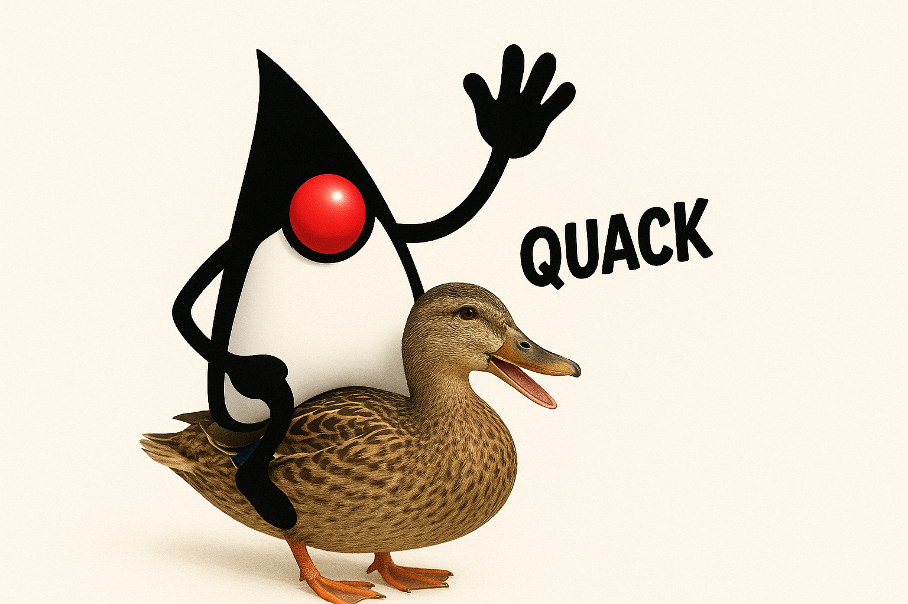

JFR Query
=========



Working on JFR files using SQL. Essentially transforming JFR files into a DuckDB database
and then using [DuckDB](https://duckdb.org/) to query it, with support for all JFR views.

Previously, we tried to use the JFR query language directly, but it is quite limited.

The purpose of this project is to ease the pain of exploring JFR files and finding interesting
patterns in them.

_If you are looking for the tool based on the JFR internal language, you can find it at
[jfr-query-experiments](https://github.com/parttimenerd/jfr-query-experiments)_

Try it out
----------

Download the [latest release](  https://github.com/parttimenerd/jfr-query/releases/download/snapshot/query.jar) and run it: `java -jar query.jar`

Or use [jbang](https://www.jbang.dev/):

```shell
jbang jfr-query@parttimenerd/jfr-query
```

Build
-----

```shell
mvn clean package
```

Main Usage
----------

Transform a JFR file into a DuckDB database file:

```shell
> java -jar target/query.jar duckdb import jfr_files/recording.jfr duckdb.db
> duckdb duckdb.db "SELECT * FROM Events";
┌───────────────────────────────┬───────┐
│             name              │ count │
│            varchar            │ int32 │
├───────────────────────────────┼───────┤
│ GCPhaseParallel               │ 69426 │
│ ObjectAllocationSample        │  6273 │
```

Use `duckdb -ui duckdb.db` to get a web-based UI to explore the database.

Directly query a JFR file (implicitly creating a DuckDB file, disable via `--no-cache`):

```
> java -jar target/query.jar query jfr_files/metal.jfr "hot-methods" 
Method                                                                                                   Samples Percent
-------------------------------------------------------------------------------------------------------- ------- -------
java.util.concurrent.ForkJoinPool.deactivate(ForkJoinPool.WorkQueue, int)                                   1066   8.09%
scala.collection.immutable.RedBlackTree$.lookup(RedBlackTree.Tree, Object, Ordering)                         695   5.27%
akka.actor.dungeon.Children.initChild(ActorRef)                                                              678   5.14%
scala.collection.immutable.RedBlackTree$.upd(RedBlackTree.Tree, Object, Object, boolean, Ordering)           453   3.44%
akka.actor.dungeon.Children.reserveChild(String)                                                             379   2.88%
```

View names are directly replaced by `SELECT * FROM <view name>`, so `hot-methods` is
`SELECT * FROM hot-methods`.

The full list of views is available via the `views` command the full list of macros `macros`.

All Commands
------------
```shell
> java -jar target/query.jar 
Usage: query.jar [-hV] [COMMAND]
Querying JFR recordings with DuckDB
  -h, --help      Show this help message and exit.
  -V, --version   Print version information and exit.
Commands:
  import   Import a JFR recording into a DuckDB database
  query    Execute a SQL query or view on the JFR DuckDB database and print the
             results.
  macros   List available SQL macros (views) for JFR analysis.
  views    List available SQL views for JFR analysis.
  context  Create a description of the tables, macros and views for generating
             SQL queries using AI
  help     Display help information about the specified command.
```

Limitations
-----------

- Stack traces are stored a fixed size (10 frames by default) and only have methods in their frames
   - so no line number, bytecode index or the type of the frame
   - this saves a lot of space and makes queries faster
- Only basic support for JFR specific datatypes, as we have to map them to DuckDB types


License
-------
GPL-2.0, Copyright 2017 - 2025 SAP SE or an SAP affiliate company and contributors.