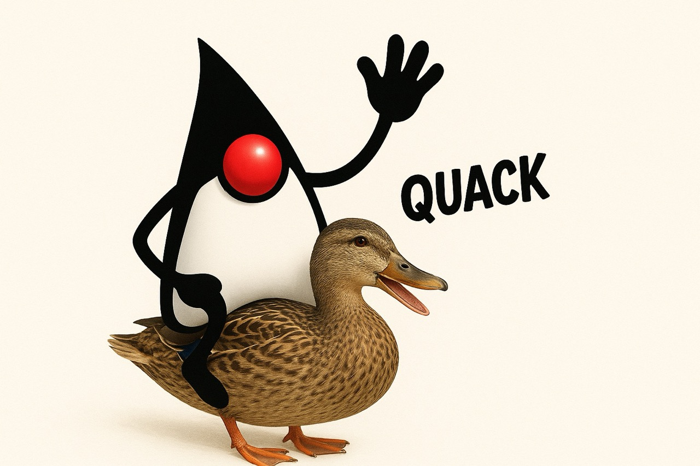

# JFR Query



Query Java Flight Recorder files with SQL — load a `.jfr` recording into DuckDB, write queries,
and visualise the results as interactive charts in a notebook UI.

**[→ Live web app](https://parttimenerd.github.io/jfr-query/) · [Documentation](https://parttimenerd.github.io/jfr-query/docs/)**

> **Early prototype.** The database schema may change at any point.

---

## What it does

JFR recordings are rich but hard to explore. JFR Query converts a recording into a DuckDB
database and lets you write plain SQL against it — plus a full set of built-in views so you can
ask questions like "what are the hottest methods?" or "how long did each GC phase take?" without
knowing the raw event schema.

The web UI wraps that into a notebook where each cell can be a SQL query, a prose paragraph, or a
chart — all live-linked so changing a query instantly updates every downstream chart and scalar.

---

## Quick start

Download the [latest release](https://github.com/parttimenerd/jfr-query/releases/download/snapshot/query.jar)
or run with [jbang](https://www.jbang.dev/):

```shell
jbang jfr-query@parttimenerd/jfr-query
```

**Start the notebook UI:**

```shell
java -jar query.jar serve myrecording.jfr
# → open http://localhost:4244
```

**Run a query directly from the terminal:**

```shell
java -jar query.jar query myrecording.jfr "hot-methods"
```

```
Method                                                              Samples  Percent
------------------------------------------------------------------- -------  -------
java.util.concurrent.ForkJoinPool.deactivate(...)                     1066    8.09%
scala.collection.immutable.RedBlackTree$.lookup(...)                   695    5.27%
akka.actor.dungeon.Children.initChild(ActorRef)                        678    5.14%
```

View names expand to `SELECT * FROM <view>`, so `hot-methods` is shorthand for the built-in view.
Run `java -jar query.jar views` to list all views, `macros` to list SQL macros.

---

## Features

### Notebook-style analysis

Compose SQL queries, prose, and charts in a single document. Cells share data through named
aliases — one cell can feed multiple charts, and inline `${SELECT …}` expressions embed query
results directly in text.


### 12 chart types

| | |
|---|---|
|  |  |
| Line, area, scatter — time-series and correlation | Interactive flamegraph with % parent / % total |
|  |  |
| Bar (grouped, stacked, horizontal) and bar+line | 2D heatmap for cross-dimensional intensity |
|  |  |
| Pie and donut charts | Histogram with optional log-scale bins |

Also: `BOX_PLOT`, `GANTT`, `RANGE` (confidence bands), `TABLE`.
See the [Plot DSL reference](https://parttimenerd.github.io/jfr-query/docs/reference/plot-dsl/) for full syntax.

### Variable controls

Parameterise queries with sliders, dropdowns, and text inputs. Every chart and inline scalar
re-evaluates automatically when a variable changes.

### Built-in templates

The UI ships with ready-made notebooks for GC analysis, heap allocation, threading, and
exceptions. Open them from the **New from template** button. Point `--templates-dir` at your
own folder to add team-shared templates:

```shell
java -jar query.jar serve --templates-dir ~/jfr-templates myrecording.jfr
```

### AI-assisted queries

Context-aware SQL completions powered by Google Gemini or OpenAI — the assistant knows your
views, macros, and loaded schema.

---

## CLI reference

```
Usage: query.jar [-hV] [COMMAND]

Commands:
  import   Import a JFR recording into a DuckDB database file
  query    Run a SQL query or built-in view on a JFR recording
  serve    Start the notebook web UI
  macros   List available SQL macros
  views    List available SQL views
  context  Dump table/view/macro descriptions for AI prompt injection
  help     Display help for a command
```

**Import once, query many times:**

```shell
java -jar query.jar import myrecording.jfr mydb.db
duckdb mydb.db "SELECT * FROM hot_methods"
# or: duckdb -ui mydb.db   (browser-based DuckDB UI)
```

**Flags for `query`:**

| Flag | Meaning |
|------|---------|
| `--csv` | Output as CSV |
| `-o FILE` / `--output FILE` | Write results to a file |
| `-n` / `--no-cache` | Skip writing the `.db` cache file |

**Flags for `serve`:**

| Flag | Meaning |
|------|---------|
| `-p PORT` / `--port PORT` | Listen port (default 4244) |
| `--no-open` | Don't auto-open the browser |
| `--templates-dir DIR` | Extra template directory |

---

## Building from source

```shell
mvn clean package
```

---

## Known limitations

- Stack traces are stored at a fixed depth (10 frames by default) — no line numbers, bytecode
  indices, or frame types. This keeps the database compact and queries fast.
- JFR-specific datatypes are mapped to the closest DuckDB equivalent; some precision may be lost.

---

## License

GPL-2.0 — Copyright 2017–2025 SAP SE or an SAP affiliate company and contributors.
