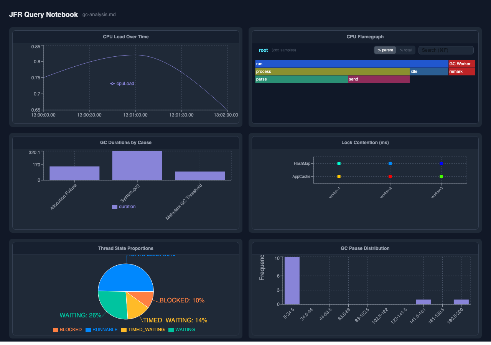

# JFR Query



Analyse Java Flight Recorder files with SQL. JFR Query converts a `.jfr` recording into a
[DuckDB](https://duckdb.org/) database and lets you query it — either from the command line
or through a notebook-style web UI where every cell can be a SQL query, a chart, or prose.

**[→ Open the live web app](https://parttimenerd.github.io/jfr-query/)**

---

## Features

- **Notebook-style analysis** — compose SQL cells, prose, and charts in one document; inline
  `${SELECT …}` expressions embed query results directly in text
- **12 chart types** — line, bar, scatter, heatmap, flamegraph, histogram, box plot, area,
  pie, Gantt, range, and table — all with interactive tooltips
- **Built-in templates** — ready-made analyses for GC, heap allocation, threading, and
  exceptions; open from the **New from template** button
- **Variable controls** — parameterise queries with sliders, dropdowns, and text inputs; every
  chart re-evaluates when a variable changes
- **Works offline** — drop a `.jfr` file directly on the web app; the entire pipeline
  (JFR parsing + DuckDB queries) runs in the browser via WebAssembly

## Quick Start

```shell
# Start the notebook UI
java -jar query.jar serve myrecording.jfr
# Open http://localhost:4244
```

See [Getting Started](getting-started.md) for download options and how to use the
[live web app](https://parttimenerd.github.io/jfr-query/) without installing anything.

## How it works

JFR events are mapped to DuckDB tables: each event type becomes a table, nested structs
become either inlined columns or joined lookup tables, and stack traces are stored as flat
arrays of method IDs with convenience top-frame columns for fast queries. A library of
built-in SQL views and macros hides the join complexity for common analyses.

The web app runs the same Java importer compiled to WebAssembly via GraalVM, so dropping a
`.jfr` file on the browser page runs the full import pipeline locally — no server required.

- [JFR to DuckDB Mapping](jfr-to-duckdb.md) — table schema, struct handling, stack traces
- [Browser Architecture](browser-architecture.md) — WASM pipeline, chunk-parallel parsing, performance

## Documentation

| | |
|---|---|
| [Getting Started](getting-started.md) | Install, first query, web UI |
| [CLI Commands](cli.md) | `import`, `query`, `serve`, `views`, `macros` |
| [Web UI & Notebooks](web-ui.md) | Cells, variables, live coupling |
| [Notebook Format](notebook-format.md) | Markdown format, syntax reference |
| [Plot DSL](plot-dsl.md) | All chart types with examples |
| [Variables](variables.md) | Variable scoping and controls |
| [Built-in Views & Macros](views-macros.md) | SQL library reference |
| [JFR to DuckDB Mapping](jfr-to-duckdb.md) | How JFR becomes tables |
| [Browser Architecture](browser-architecture.md) | WASM pipeline internals |
