# Plot DSL

Plots are declared in fenced `plot` code blocks:

````
```plot
LINE_CHART(x=timestamp, y=duration_ms)
  ON recent_pauses
  TITLE "Recent GC pauses"
  AXIS_Y LABEL "ms" TYPE LOG
```
````

A plot expression consists of:

1. A **plot type** with **inner arguments** in parentheses.
2. Zero or more **tail clauses**.
3. Optionally combined with other plots using **composite operators**.

## Plot types

| Canonical | Aliases | Renders |
|-----------|---------|---------|
| `LINE_CHART` | `LINE` | Line chart with one series per `color` group. |
| `BAR_CHART` | `BAR` | Vertical bar chart. |
| `SCATTER_PLOT` | `SCATTER` | Scatter plot with optional `size` and `color`. |
| `HEATMAP` | — | 2D binned heatmap with `x`, `y`, and `value` (intensity). |
| `HISTOGRAM` | — | Frequency histogram over `x`. Supports `bins` (count) and `logBins: true` for log-scale bucketing. |
| `BOX_PLOT` | `BOX` | Box-and-whisker per `x` category. |
| `PIE_CHART` | `PIE` | Pie chart with `category` and `value` columns. |
| `FLAMEGRAPH` | `FLAME` | Flamegraph of stack frames — `frames` (frame list column) and `value` (weight column). |
| `TABLE` | — | Rendered results table. |
| `AREA_CHART` | `AREA` | Stacked / overlaid filled areas. |
| `GANTT` | — | Gantt bars with `start`, `end`, and `lane` (row category). Optional `task` (bar label). |
| `RANGE` | — | Range/interval band with `x`, `low`, `high`. Optional `center` line and `color`. |
| `TREEMAP` | — | Hierarchical treemap with `path` (one or more columns) and `value` (numeric weight). |
| `WATERFALL` | — | Waterfall/bridge chart with `category` and `value`; positive segments go up, negative down. |
| `VIOLIN_PLOT` | — | Kernel-density distribution shape with optional `category` split and configurable `bins`. |
| `SUNBURST` | — | Sunburst drill-down chart with `path` (one or more columns, or a delimited single column) and `value`. |
| `SANKEY` | — | Sankey flow diagram with `source`, `target`, and `value` columns. |
| `CROSSTAB` | — | Pivot table with heat-map cell coloring. Aggregates `value` by two categorical dimensions (`row` / `col`). |
| `BIG_NUMBER` | — | Large stat card showing a single scalar value with optional label and comparison delta. |

Aliases are accepted anywhere the canonical name is. `LINE(x=t, y=v)` is equivalent to `LINE_CHART(x=t, y=v)`.
`PIE_CHART` also accepts the older names `name` / `labels` / `values` for backwards compatibility; prefer `category` / `value`.

---

### LINE_CHART

Lines over time — ideal for CPU, memory, GC activity, or any metric that changes continuously. Supports zoom, pan, dual Y-axis, and reference lines.

**Example 1 — A simple time-series chart showing total CPU usage**

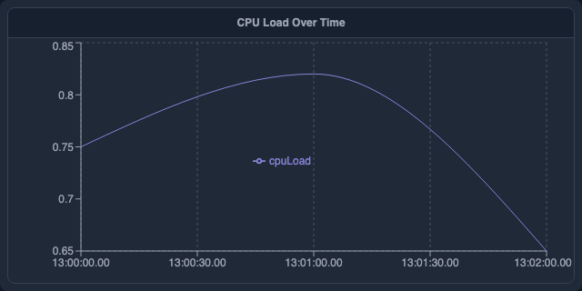

````
```plot
LINE_CHART(x: "timestamp", y: ["cpuLoad"])
  TITLE "CPU Load Over Time"
  AXIS_Y LABEL "CPU Load" DOMAIN [0, 1]
```
````

**Example 2 — An interactively zoomable chart linked to global variables**

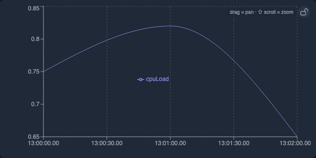

````
```plot
LINE_CHART(x: "timestamp", y: ["heapUsed"])
  TITLE "Heap Used (Zoomable)"
  LINK_X($start, $end)
  AXIS_Y LABEL "Bytes"
```
````

**Example 3 — Dot/points style (no connecting line)**

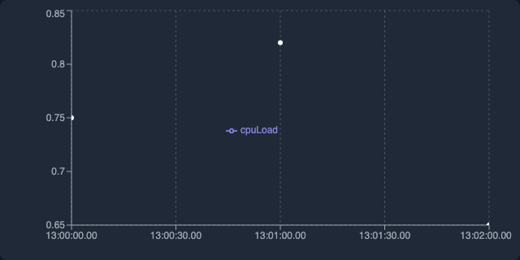

````
```plot
LINE_CHART(x: "timestamp", y: ["callCount"], lineType: "dots")
  TITLE "Method Call Frequency"
```
````

**Example 4 — Multi-series comparing CPU metrics**

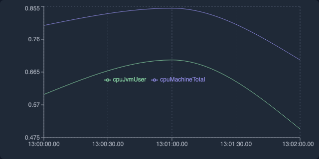

````
```plot
LINE_CHART(x: "timestamp", y: ["totalCpu", "jvmCpu"])
  TITLE "Total CPU vs JVM User CPU"
  AXIS_Y LABEL "CPU Load" DOMAIN [0, 1]
```
````

**Example 5 — Allocation rate with threshold reference line**

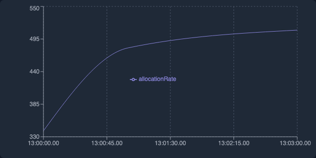

````
```plot
LINE_CHART(x: "timestamp", y: ["allocRate"], connectNulls: true)
  TITLE "Allocation Rate"
  AXIS_Y LABEL "MB/s"
```
````

**Example 6 — Dual Y-axis: heap usage vs. GC throughput**

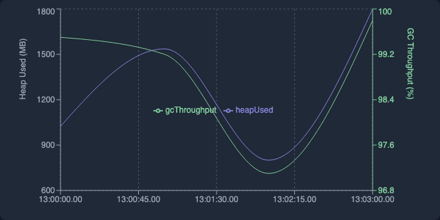

````
```plot
LINE_CHART(x: "timestamp", y: ["heapUsed"], y2: ["gcThroughput"])
  TITLE "Heap Used vs GC Throughput"
  AXIS_Y LABEL "Bytes"
```
````

---

### BAR_CHART

Bars for comparing values across categories — e.g. GC causes, top methods, pause counts per thread. Supports grouped, stacked, horizontal, and mixed bar+line.

**Example 1 — Simple bar chart by category**

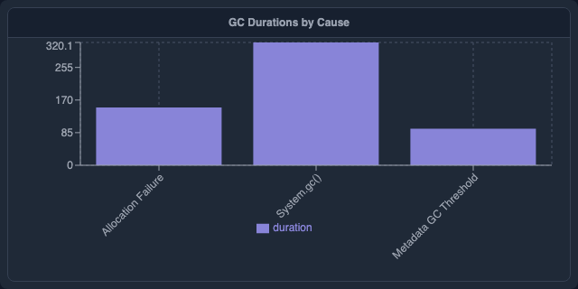

````
```plot
BAR_CHART(x: "cause", y: ["duration"])
  TITLE "GC Duration by Cause"
  AXIS_Y LABEL "ms"
```
````

**Example 2 — Grouped (side-by-side) bars**

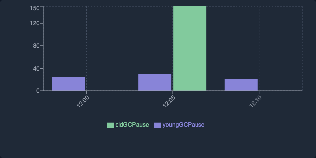

````
```plot
BAR_CHART(x: "cause", y: ["youngGen", "oldGen"], layout: "grouped")
  TITLE "Young vs Old Gen GC Pauses"
  AXIS_Y LABEL "ms"
```
````

**Example 3 — Stacked bar chart**

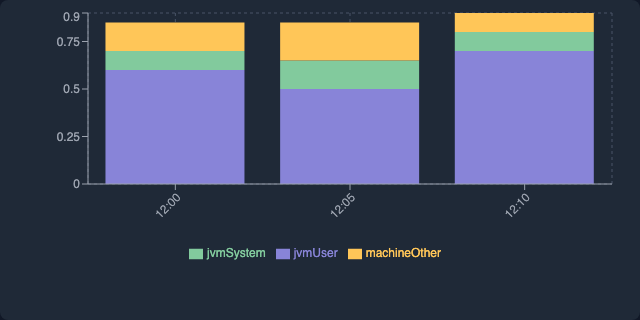

````
```plot
BAR_CHART(x: "timestamp", y: ["userCpu", "systemCpu", "ioCpu"], layout: "stacked")
  TITLE "CPU Usage Breakdown"
  AXIS_Y LABEL "CPU Fraction"
```
````

**Example 4 — Bar with line overlay**

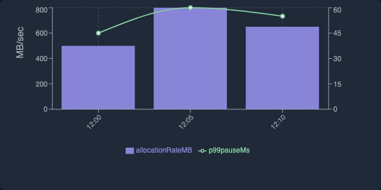

````
```plot
BAR_CHART(x: "timestamp", y: ["allocRate"], lineY: ["p99Pause"])
  TITLE "Allocation Rate with P99 Pause Line"
```
````

**Example 5 — Horizontal bar chart**

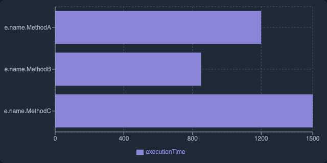

````
```plot
BAR_CHART(x: "method", y: ["duration"], horizontal: true)
  TITLE "Top Methods by Duration"
  AXIS_Y LABEL "ms"
```
````

---

### PIE_CHART

Shows how a total breaks down into parts — best for 3–7 categories. Use `BAR_CHART` if you need precise comparisons.

**Example 1 — Thread state breakdown**

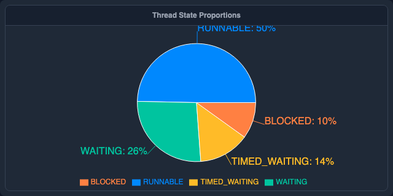

````
```plot
PIE_CHART(category: "state", value: "count")
  TITLE "Thread State Breakdown"
```
````

**Example 2 — Donut chart with outer labels**

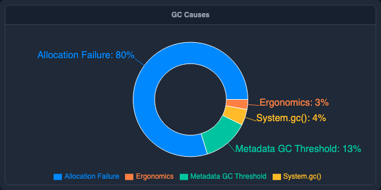

````
```plot
PIE_CHART(category: "cause", value: "count", innerRadius: 0.5)
  TITLE "GC Cause Breakdown"
```
````

**Example 3 — Memory pool split**

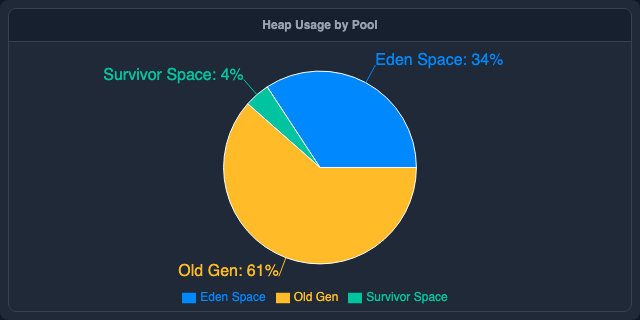

````
```plot
PIE_CHART(category: "pool", value: "usedMb")
  TITLE "Memory Pool Usage"
```
````

---

### SCATTER_PLOT

Plots individual data points by two numeric axes — great for spotting correlations (e.g. pause duration vs. bytes reclaimed). Add a third numeric column as `size` for bubble charts.

**Example 1 — Memory reclaimed vs. pause duration**

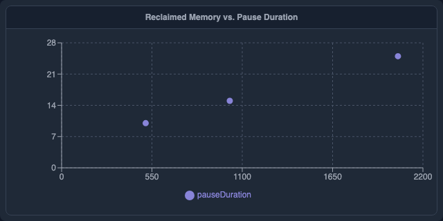

````
```plot
SCATTER_PLOT(x: "reclaimedMb", y: "duration")
  TITLE "GC Duration vs Memory Reclaimed"
  AXIS_X LABEL "MB Reclaimed"
  AXIS_Y LABEL "ms"
```
````

**Example 2 — Zoomable/pannable scatter**

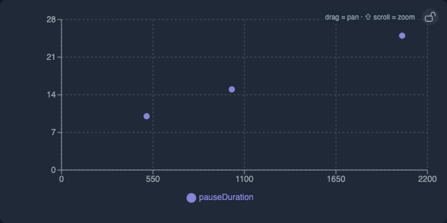

````
```plot
SCATTER_PLOT(x: "heapUsed", y: "allocRate")
  TITLE "Heap Used vs Allocation Rate"
  LINK_X($zoom_start, $zoom_end)
```
````

**Example 3 — Bubble chart (size + color)**

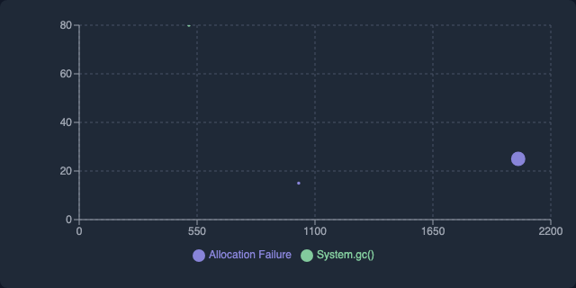

````
```plot
SCATTER_PLOT(x: "reclaimedMb", y: "duration", size: "youngGenSize", color: "cause")
  TITLE "GC Events by Cause"
```
````

---

### HEATMAP

Two-dimensional color grid — great for showing intensity across two categorical dimensions (e.g., thread × time, class × method).

**Example 1 — Lock contention by thread and lock**

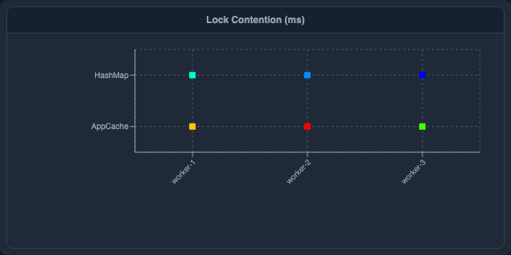

````
```plot
HEATMAP(x: "lock", y: "thread", value: "waitMs")
  TITLE "Lock Contention (ms)"
```
````

**Example 2 — CPU load by hour and day of week**

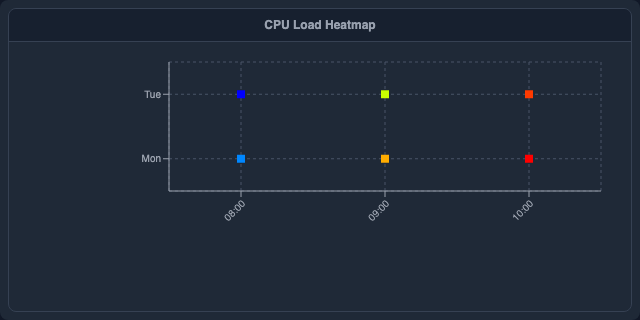

````
```plot
HEATMAP(x: "hour", y: "dayOfWeek", value: "avgCpu")
  TITLE "CPU Load by Hour and Day"
```
````

**Example 3 — Allocation rate per class and GC phase**

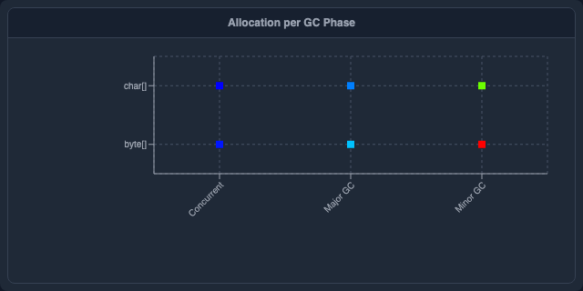

````
```plot
HEATMAP(x: "gcPhase", y: "className", value: "allocBytes")
  TITLE "Allocation Rate per Class and GC Phase"
```
````

---

### FLAMEGRAPH

Flamegraph of stack frames — interactive, zoomable. Requires `frames` (column of frame arrays) and `value` (weight column such as sample count or duration).

**Example 1 — CPU flamegraph**

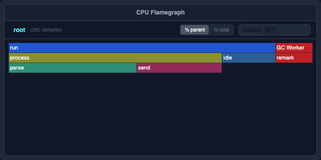

````
```plot
FLAMEGRAPH(frames: "stackFrames", value: "samples")
  TITLE "CPU Flamegraph"
  HEIGHT 400px
```
````

---

### HISTOGRAM

Frequency distribution of a single numeric column — shows how values cluster. Use `logBins: true` for data spanning many orders of magnitude (e.g., pause durations from µs to seconds).

**Example 1 — GC pause duration distribution**

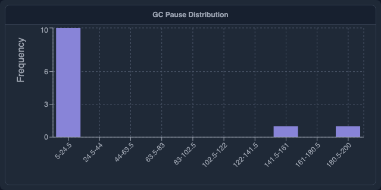

````
```plot
HISTOGRAM(x: "duration", bins: 10)
  TITLE "GC Pause Distribution"
```
````

**Example 2 — Log-scale bins for allocation sizes**

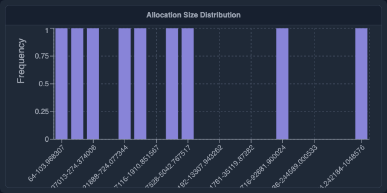

````
```plot
HISTOGRAM(x: "allocationSize", bins: 20, logBins: true)
  TITLE "Allocation Size Distribution"
```
````

---

### BOX_PLOT

Distribution summary (min, Q1, median, Q3, max) — good for comparing spread across categories like GC pauses per cause or latency per endpoint.

**Example 1 — Single distribution of GC pauses**

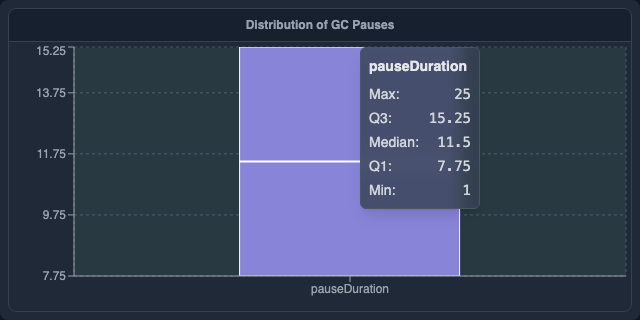

````
```plot
BOX_PLOT(value: "duration")
  TITLE "Distribution of GC Pauses"
  AXIS_Y LABEL "ms"
```
````

**Example 2 — Multiple boxes comparing GC types**

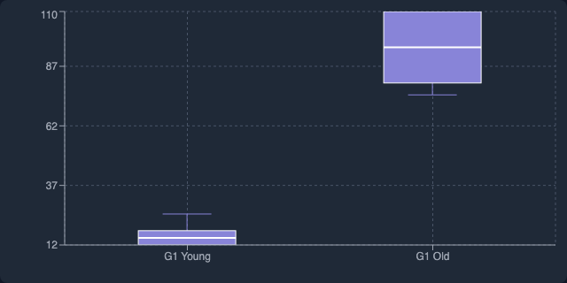

````
```plot
BOX_PLOT(value: "duration", category: "gcType")
  TITLE "Pause Duration by GC Type"
  AXIS_Y LABEL "ms"
```
````

---

### AREA_CHART

Filled area chart — ideal for visualizing cumulative or proportional data over time, such as heap usage breakdown or allocation rates. Supports stacked or overlapping areas.

**Example 1 — Simple heap area**

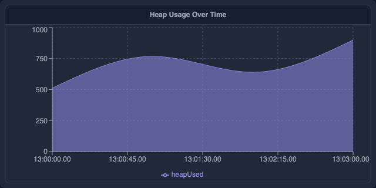

````
```plot
AREA_CHART(x: "timestamp", y: ["heapUsed"])
  TITLE "Heap Used Over Time"
  AXIS_Y LABEL "MB"
```
````

**Example 2 — Stacked memory regions**

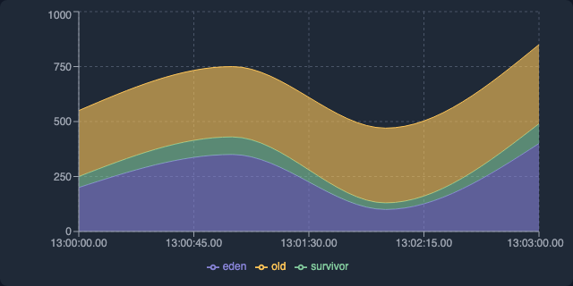

````
```plot
AREA_CHART(x: "timestamp", y: ["eden", "survivor", "tenured"], layout: "stacked")
  TITLE "Memory Regions Over Time"
  AXIS_Y LABEL "MB"
```
````

---

### GANTT

Horizontal Gantt chart showing time ranges per category — ideal for thread activity timelines, GC pause periods, or any start→end interval data.

**Example 1 — GC pause intervals per phase**

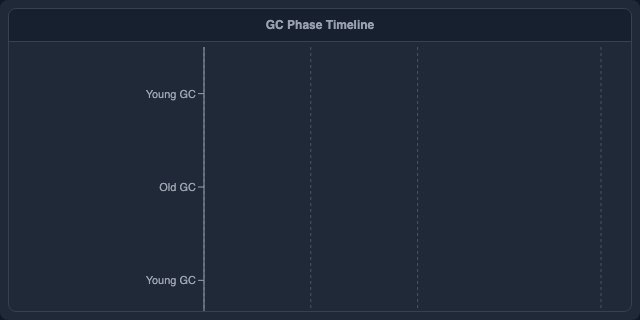

````
```plot
GANTT(start: "startTime", end: "endTime", lane: "phase")
  TITLE "GC Phase Timeline"
```
````

**Example 2 — Thread activity colored by state**

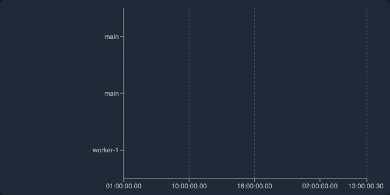

````
```plot
GANTT(start: "startTime", end: "endTime", lane: "thread", color: "state", task: "phase")
  TITLE "Thread Activity"
```
````

---

### RANGE

Confidence interval / error band chart — shaded area between a low and high bound with an optional center line. Useful for showing p5–p95 latency bands, GC pause ranges, or CPU confidence intervals.

**Example 1 — P5–P95 GC pause latency band**

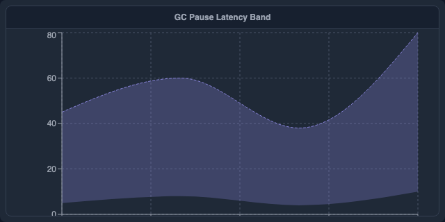

````
```plot
RANGE(x: "timestamp", low: "p5", high: "p95")
  TITLE "GC Pause Latency Band (P5–P95)"
  AXIS_Y LABEL "ms"
```
````

**Example 2 — CPU usage spread with median center line**

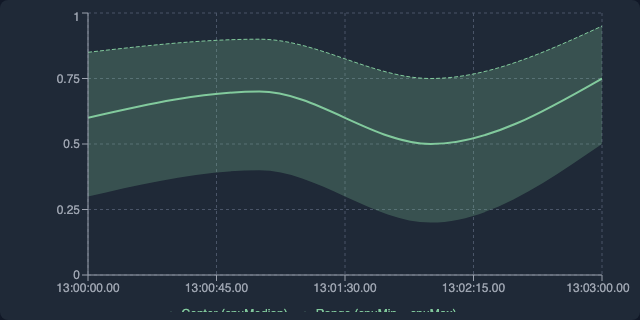

````
```plot
RANGE(x: "timestamp", low: "minCpu", high: "maxCpu", center: "medianCpu")
  TITLE "CPU Usage Spread"
  AXIS_Y LABEL "CPU Load"
```
````

---

### TREEMAP

Hierarchical area chart where each rectangle's area is proportional to its value. Use a list of columns as the `path` to build multi-level hierarchies (e.g., package → class), or use a single delimiter-separated column.

**Example 1 — Package-level memory allocation**

````
```plot
TREEMAP(path: ["package", "className"], value: "allocBytes")
  TITLE "Allocation by Package and Class"
```
````

**Example 2 — Single-column slash-delimited path**

````
```plot
TREEMAP(path: "fullClassName", value: "samples", delimiter: "/")
  TITLE "CPU Samples by Class"
```
````

---

### WATERFALL

Waterfall (bridge) chart — each bar starts where the previous one ended. Positive values go up, negative values go down. Ideal for showing cumulative effects (e.g., memory deltas, GC reclaim/overhead breakdown).

**Example 1 — GC memory delta breakdown**

````
```plot
WATERFALL(category: "phase", value: "deltaBytes")
  TITLE "GC Memory Deltas"
  AXIS_Y LABEL "Bytes"
```
````

---

### VIOLIN_PLOT

Kernel-density estimate of a numeric distribution — wider sections show where data is more concentrated. Optional `category` column draws one violin per group side by side.

**Example 1 — GC pause duration distribution**

````
```plot
VIOLIN_PLOT(value: "pauseMs")
  TITLE "GC Pause Distribution"
  AXIS_Y LABEL "ms"
```
````

**Example 2 — Pause duration split by GC type**

````
```plot
VIOLIN_PLOT(value: "pauseMs", category: "gcType", bins: 30)
  TITLE "Pause Duration by GC Type"
  AXIS_Y LABEL "ms"
```
````

Supports `BRUSH $var` to write `$var.selection` = the category label on click.

---

### SUNBURST

Interactive sunburst drill-down chart. Clicking an inner arc zooms in; the breadcrumb trail lets you navigate back. Use a list of columns as the path to describe hierarchy levels, or a single string column with a `delimiter` separator.

**Example 1 — Package → class hierarchy**

````
```plot
SUNBURST(path: ["package", "className"], value: "samples")
  TITLE "CPU Samples"
```
````

**Example 2 — Slash-delimited call path**

````
```plot
SUNBURST(path: "callPath", value: "samples", delimiter: "/")
  TITLE "Hot Paths"
```
````

Supports `BRUSH $var` to write `$var.selection` = the node name on click.

---

### SANKEY

Sankey flow diagram showing how a quantity flows from `source` nodes through `target` nodes. Clicking a node focuses the chart on that node and its immediate neighbours; click again to reset.

**Example 1 — Method call flow**

````
```plot
SANKEY(source: "caller", target: "callee", value: "samples")
  TITLE "Hot Call Paths"
```
````

**Example 2 — Thread-to-lock allocation flow**

````
```plot
SANKEY(source: "thread", target: "lock", value: "waitMs")
  TITLE "Thread → Lock Wait Time"
```
````

Supports `BRUSH $var` to write `$var.selection` = the node name on click.

---

### CROSSTAB

Pivot table with per-cell heat-map coloring (blue intensity = relative magnitude). Aggregates a numeric `value` column by two categorical dimensions: `row` and `col`. The `agg` parameter selects the aggregation function (`SUM`, `AVG`, `COUNT`, `MAX`, `MIN`; default `SUM`).

**Example 1 — GC pause by cause and phase (average)**

````
```plot
CROSSTAB(row: "cause", col: "phase", value: "pauseMs", agg: "AVG")
  TITLE "Avg Pause by Cause and Phase"
```
````

**Example 2 — Thread × lock contention count**

````
```plot
CROSSTAB(row: "thread", col: "lock", value: "samples", agg: "COUNT")
  TITLE "Contention Count"
```
````

Supports two-variable `BRUSH $rowVar $colVar` to write `$rowVar.selection` = row label and `$colVar.selection` = column label on cell click.

---

Sortable, filterable table with CSV export — the default when no other plot is specified. Timestamps, durations, and numbers are auto-formatted.

**Example 1 — Default table (auto-detected columns)**


````
```plot
TABLE()
  TITLE "Query Results"
```
````

**Example 2 — Selected columns with custom widths**

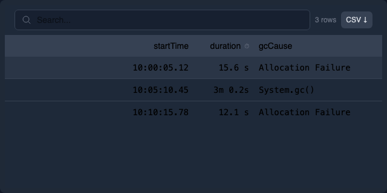

````
```plot
TABLE(headers: ["timestamp", "cause", "duration"], columnWidths: [200, 150, -1])
  TITLE "GC Events"
```
````

---

### BIG_NUMBER

Renders a single metric as a large prominent number — ideal for KPI-style summary cells. Optionally shows a label beneath the number and a delta (change vs. a baseline) with colour coding.

**Example 1 — Simple scalar**

````
```sql
-- alias avg_pause
SELECT AVG(duration_ms) AS avg_ms FROM gc
```
```plot
BIG_NUMBER(value: "avg_ms")
  TITLE "Average GC Pause"
```
````

**Example 2 — With label and delta**

````
```sql
-- alias summary
SELECT
  count(*) AS pauses,
  count(*) - $$baseline_count AS delta
FROM gc
```
```plot
BIG_NUMBER(value: "pauses", label: "Total GC Pauses", delta: "delta")
  ON summary
  TITLE "Pause Count"
```
````

**Inner arguments:**

| Argument | Type | Description |
|----------|------|-------------|
| `value` | column | Column whose value is displayed as the large number. Required. |
| `label` | string | Descriptive text shown below the number. |
| `delta` | column | Column whose value is shown as a ±change badge. Positive = green, negative = red. |
| `format` | string | d3-format string for the main value (e.g. `".1f"`, `",.0f"`). |

---

## Inner arguments

Inner arguments go inside the parentheses after the plot type. All are optional; the sensible defaults for each plot type apply when omitted.

| Argument | Applies to | Meaning |
|----------|------------|---------|
| `x` | most types | Column bound to the X axis. |
| `y` | most types | Column bound to the Y axis. May be a list `[a, b, c]` for multi-series plots. |
| `value` | HEATMAP, FLAMEGRAPH, TREEMAP, SUNBURST, SANKEY, WATERFALL, CROSSTAB, VIOLIN_PLOT | Intensity / weight column. |
| `category` | PIE_CHART, BOX_PLOT, WATERFALL, VIOLIN_PLOT | Column providing slice/group labels. |
| `label` | TABLE, BAR | Text label column. |
| `start` | GANTT | Column for the bar start time/value. |
| `end` | GANTT | Column for the bar end time/value. |
| `lane` | GANTT | Column for the row category on the Y axis. |
| `task` | GANTT | Optional text drawn inside each bar. |
| `low` | RANGE | Lower bound column for the shaded band. |
| `high` | RANGE | Upper bound column for the shaded band. |
| `center` | RANGE | Optional center-line column (e.g. median). |
| `frames` | FLAMEGRAPH | Column containing the list of stack frames. |
| `path` | TREEMAP, SUNBURST | One or more columns describing the hierarchy path, or a single delimiter-separated column. |
| `delimiter` | TREEMAP, SUNBURST | Separator character for splitting a single `path` column (default `/`). |
| `row` | CROSSTAB | Column for row labels. |
| `col` | CROSSTAB | Column for column headers. |
| `agg` | CROSSTAB | Aggregation function: `SUM` (default), `AVG`, `COUNT`, `MAX`, `MIN`. |
| `source` | SANKEY | Source node column. |
| `target` | SANKEY | Target node column. |
| `bins` | VIOLIN_PLOT, HISTOGRAM | Number of density/frequency bins (default 20). |
| `color` | most types | Column used to derive series/category colours. |
| `size` | SCATTER | Column used to derive marker size. |
| `trendline` | SCATTER_PLOT | `true` to draw a linear regression trendline over the scatter points. |
| `lineType` | LINE_CHART | Render style: `"line"` (default), `"dots"`, `"step"`, `"stepBefore"`, `"stepAfter"`. |
| `y2` | LINE_CHART, AREA_CHART | Columns to plot on a second Y-axis (right side). |
| `label` | SCATTER_PLOT | Column whose value is rendered as a text label next to each point. |
| `value` | BIG_NUMBER | Column (or literal) to display as the large number. |
| `title` | any | Inline title. Equivalent to the `TITLE` tail clause. |

Values are column names from the bound query. String literals are wrapped in double quotes.

## Tail clauses

Tail clauses come after the closing paren of the plot type and each other, in any order (unless noted).

### Titles and layout

- `TITLE "text"` — chart title. Overrides the `title=` inner argument if both are given.
- `WIDTH size` — CSS width (`400px`, `50%`, `100%`).
- `HEIGHT size` — CSS height.
- `ZOOM factor` — uniform scale factor within the current grid cell (e.g. `ZOOM 1.5`).
- `ZOOM_X factor` — scale only the X axis (stretches the chart horizontally).

### Data source

- `ON query_ref[, query_ref, ...]` — bind the plot to one or more queries. See "Query references" below. Default: the query immediately preceding the plot block.
- `DATASET name` — use a named view as data source. Equivalent to `ON name` for view-backed data.

### Sorting and limiting

- `SORT ASC` — sort bars/rows by value ascending (lowest first) before rendering.
- `SORT DESC` — sort bars/rows by value descending (highest first) — useful for top-N charts.
- `LIMIT n` — cap the rendered rows/bars to the first `n` entries (after any `SORT`). Applies to `BAR_CHART` and `TABLE`.

Example — top-10 slowest GC causes:

```plot
BAR_CHART(x: "cause", y: ["avg_ms"])
  SORT DESC
  LIMIT 10
```

### Legend

- `LEGEND HIDDEN` — hide the legend.
- `LEGEND AT RIGHT | LEFT | TOP | BOTTOM | NONE` — legend position. `NONE` is equivalent to `HIDDEN`.

### Palette

- `PALETTE "name"` — colour palette name. Built-in palettes: `category10` (D3 default), `tableau10`, `pastel1`, `dark2`, `set2`.

### Linking / brushing

- `LINK_X($start, $end, [master], [clamp])` — link the X zoom range to variables `$start` and `$end`. Optional `master` marks this plot as the driver. Optional `clamp` prevents zooming beyond the data domain.
- `LINK_Y($var)` — link Y axis zoom to a variable.
- `LINK_XY($var)` — link both X and Y axes to the same variable (useful for scatter zoom sync).
- `LINK_SCROLL "group"` — synchronise horizontal scroll position with all other plots in the same named group.
- `BRUSH $var MODE X | Y | XY` — capture user brush selection into `$var`. `$var.brush.lo` / `$var.brush.hi` hold the range for X/Y; `$var.brush.x_lo` / `$var.brush.x_hi` / `$var.brush.y_lo` / `$var.brush.y_hi` for XY.
- `BRUSH $rowVar $colVar` — two-variable form for CROSSTAB: writes the clicked row label to `$rowVar.selection` and the clicked column label to `$colVar.selection`.

### Axes

- `AXIS_X DOMAIN [min, max]` — fixed X domain.
- `AXIS_X LABEL "text"` — X axis label.
- `AXIS_X TYPE LINEAR | LOG | TIME | BAND` — axis scale type.
- `AXIS_X FORMAT "fmt"` — tick format string.
- `AXIS_Y DOMAIN [min, max]` — fixed Y domain.
- `AXIS_Y LABEL "text"` — Y axis label.
- `AXIS_Y TYPE LINEAR | LOG | TIME | BAND` — Y scale type.
- `AXIS_Y FORMAT "fmt"` — Y tick format string.

Multiple axis modifiers may be chained on a single `AXIS_Y` (or `AXIS_X`) line in any order:

```
AXIS_Y DOMAIN [0, 100] LABEL "ms" TYPE LOG
AXIS_Y TYPE LOG LABEL "ms (log scale)"
AXIS_Y LABEL "Duration" FORMAT ".2f"
```

The `FORMAT` string uses [d3-format](https://d3js.org/d3-format) syntax for numeric axes (e.g. `".2f"` = two decimal places, `",.0f"` = thousands separator, `".2s"` = SI prefix). For `TYPE TIME` axes, the format string uses `HH:mm:ss.SSS` tokens.

### Tooltips

- `TOOLTIP COLUMNS [col1, col2, ...]` — restrict the default tooltip to only the listed columns.
- `ON HOVER TOOLTIP "format"` — custom tooltip format string. Use `{columnName}` placeholders for any column in the data row, including the X-axis column.

Example:

```plot
BAR_CHART(x: "cause", y: ["avg_ms"])
  ON HOVER TOOLTIP "Cause: {cause} — avg: {avg_ms} ms"
  TOOLTIP COLUMNS [cause, avg_ms]
```

### Constants

- `LET @name = value` — declare a plot-local constant. Referenced in inner arguments and other tail clauses as `@name`.

## Composite plots

Plots can be composed:

- `A + B` — overlay `B` on top of `A` with shared axes. Type-checked: mixing incompatible plot types (e.g. `PIE + LINE`) is rejected.
- `ROW(A, B, C)` — horizontal layout of independent plots.
- `COL(A, B, C)` — vertical layout of independent plots.

`ROW` and `COL` can be nested to build grids:

```
ROW(
  COL(A, B),
  C
)
```

## Query references

Inside `ON`, plots refer to queries by:

- **1-based index** — `1`, `2` — the Nth SQL block in the enclosing cell.
- **Alias name** — `my_alias` — any SQL block with `-- alias my_alias`.
- **Cross-cell** — `cell_handle.alias_name` — an alias from another cell.

Multiple sources are comma-separated: `ON pauses_p50, pauses_p99`. Each source becomes a series in a compatible plot type.

## Examples

### Simple line

````
```plot
LINE(x=timestamp, y=duration_ms) TITLE "GC pauses"
```
````

### Overlay P50 and P99 from two queries

````
```sql
-- alias p50
SELECT ts, quantile_cont(duration_ms, 0.5) AS ms FROM gc GROUP BY ts
```
```sql
-- alias p99
SELECT ts, quantile_cont(duration_ms, 0.99) AS ms FROM gc GROUP BY ts
```
```plot
LINE(x=ts, y=ms) ON p50, p99
  AXIS_Y LABEL "ms" TYPE LOG
  LEGEND AT RIGHT
```
````

### Brushable range driving a variable

````
```plot
LINE(x=timestamp, y=duration_ms)
  BRUSH $range MODE X
  LINK_X($range.brush.lo, $range.brush.hi, master, clamp)
```
````

### Composite grid

````
```plot
ROW(
  LINE(x=t, y=heap_used) TITLE "Heap",
  COL(
    BAR(x=cause, y=count) TITLE "Causes",
    PIE(label=cause, y=count) TITLE "Share"
  )
)
```
````

### Flamegraph

````
```plot
FLAMEGRAPH(frames=stack, value=samples)
  HEIGHT 400px
```
````

## See also

- [Notebook Format](notebook-format.md)
- [Variables](variables.md)
- [Built-in Views & Macros](views-macros.md)
