# JFR Notebook redesign — plan, screenshots, justifications

Living document for the redesign of the JFR-query notebook frontend. Every section quotes the actual mockup at `/tmp/jfr-mockup/index.html` and ties a design decision to a concrete user problem in the *current* app.

> **Note (iter 5):** the `/tmp/jfr-mockup/index.html` source is bit-rotted (`/tmp` was wiped). The screenshots in this directory are the only surviving artifact. Reconstruction is item §5.1 in the iter-5 review — see end of document.

The mockup is a static HTML artifact — not a working app — and exists to prove the layout fits in the viewport, the syntax round-trips, and every old feature has a home. Code work begins after this document is signed off.

---

## 0 · TL;DR

Five load-bearing decisions; everything else falls out of these.

| Theme | Decision |
|---|---|
| **Markdown is the source of truth** | One new fence (```` ```view <name> ````); everything else (deps, pins, stale flags) is derived. Round-trip is *canonical*, not byte-for-byte: a single formatter runs on save (§8b) over SQL, plot DSL, and markdown structure. |
| **Old DSL is a strict subset of the new** | UPPERCASE classic form parses verbatim; new `lowercase { … }` is sugar over the same AST. Migration is opt-in; the cheatsheet cell proves the round-trip. `row{}` / `col{}` / `+` compose multiple panels per cell. |
| **Cross-cell wiring is one mechanism: variables** | `-- @ alias` SQL comments auto-register a TEMP VIEW; cells `FROM alias` to read. Variables (`$x` notebook-local, `$$x` workspace-global) — see iter-16 for the final sigil system. Every `$x` is reactive; liveness is universal. They carry static config *and* interactive state — zoom, brush, hover, scroll, selection are all `$`-vars. |
| **Dependencies are visible and honest** | Overlay graph (⌘G) shows 5 edge types: data (cyan), variable (gray dashed), live variable (thick gray dashed), linked axis (orange), prompt (purple dotted). Cycles, conflicts, and AI authorship surface here. Cells are addressable via `#cell-<alias>`. |
| **Live coupling has guardrails** | Debounce + query cancellation + sampling + opt-in materialization make brush/zoom survive 10M-row datasets. Producer conflicts caught at parse time. Three undo grains share ⌘Z; scrubbing through `$` history is a separate timeline (⌘⌥H). Findings travel as state-encoded shareable URLs. |

### Map of the document

- **§1–§4** UI: layout, sidebar, cell anatomy, plot-type tour.
- **§5–§6c** Cross-cell mechanics: aliases, dep graph, prompt edges, live variables.
- **§7** Cell-scoped chat.
- **§8–§8b** Markdown round-trip + canonical formatter.
- **§9–§10** What we're building (DSL spec) and what we're deliberately *not* changing.
- **§11** Open mockup gaps. **§12** Code-work order, phased. **§13** Verification scenarios. **§14** Migration from the current app.
- **Sibling artifacts**:
  - `REDESIGN_INTERFACES.md` — engineer-facing reference (AST types, fence grammars, formatter contract, dep-graph types). The plan is *what and why*; the interfaces doc is *how*.
  - `index.html` — reconstructed visual mockup source (single-file, no deps). Renders the three-column layout, two-row varbar, 8 demo cells, inline dep graph, and cell-scoped chat panel. The 17 PNG screenshots are the regression set against it.
- **Iter 2 / Iter 4** Gap-fix passes; iter 3 is a notes scratchpad.
- **Iter 5** Adversarial review — eight criticisms with severity ratings. All eight have been addressed in this revision; see §5.9 for the close-out table.
- **Iter 6** Adds four plot types (gantt, area, range, sparkline-in-table), promotes connected filtering to a first-class affordance (§6c.4b), and adds wire-binding chips to chat proposals (§7.1).
- **Iter 7** Deepens variable coupling: chip composition (AND/OR), transparent filter chains, saved filters as view fences, parse-time producer-conflict rules, lifecycle for empty/errored/removed sources.
- **Iter 8** Performance for chains: per-gesture budget, quantized-key result caching, `auto` materialization tiers, predicate push-down, cascading cancellation, always-on per-cell + chain timing badges.
- **Iter 9** Adversarial review of iters 6–8 — eight items rated 🔴/🟡/🟢. Two 🔴s (push-down silently rewriting source output, cell-head chip explosion) get inline fixes; five 🟡s get small spec patches; one 🟢 (deferred mockup) adds a phase-A gate. See §9.9 for the close-out table.
- **Iter 10** Prompt language redesign: critiques the ad-hoc `@` chip surface, formalizes a typed grammar (one sigil, seven verbs, EBNF), specs three-tier autocompletion, ships a ~25M-param ONNX local model via transformers.js, adds a `🪄 suggest plot` button next to the SQL fence that runs *before* query execution (DuckDB `DESCRIBE` for static schema, no rows seen by the model), and converts `last_ai_prompt:` from English prose to a machine-readable AST for replay.
- **Iter 11** Chat window upgrade: docked drawer + full-window overlay (maximize), transcript that renders interactive cells with multi-SQL `row{}`/`col{}`/`+` plot compositions, a schema-only-default permission toggle for external-LLM data access, an MCP-style tool surface (nine tools: `schema`, `describe`, `read_cell`, `list_cells`, `docs`, `diagnose`, `run_sql`, `sample_table`, `get_live_var` — last three gated by the toggle; `docs` + `diagnose` adopted from jfr-mcp prior art, see §11.4.6), full-cell `cell-emit` proposals replacing fragment-emit, a context-inspector pane that shows what the LLM was sent, and a `last_ai_session:` audit log peer of `last_ai_prompt:`.
- **Iter 12** Usability pass (§IT12.x): seven adversarial-rated gaps with fixes — system-provisioned welcome + glyph cells (🔴 onboarding), five-kind error taxonomy + ⌘⇧E issues panel (🔴 error aggregation), ⌘G conflict fix (dep-graph keeps ⌘G, chip grouping moves to ⌘⇧G) + single keyboard map table with three modes (🔴 + 🟡), mandatory glyph tooltips + spotlight hints (🟡 discoverability), three undo grains + ⌘⌥H interaction timeline (🟡 undo), notebook-level ⋯ menu with HTML/PDF static snapshot export (🟡 export), plus accessibility quick wins (ARIA from the glyph table, focus rings, keyboard-reachable everything).
- **Iter 13** Plot DSL consolidation (§IT13.x): ten plot-surface gaps (4 🔴, 6 🟡) closed under one move — **classic UPPERCASE is deleted, sugar is the plot DSL** — plus seven small patches: per-plot-type config schemas with concrete `xRefLines`/`xDomain` shapes (mis-keyed config now flows to the §IT12.2 issues panel), push-down honesty invariant replacing iter-9's policy default, overlay `+` gains `layout: shared-axes | independent-y` with explicit z-order and mismatch rules, five new `PanelClauses` (`legend`, `tooltip`, `axis-x`, `axis-y`, `palette`) for the daily surface, Okabe-Ito default palette + ARIA labels, sparkline confirmed as `TableColumn.kind` not `PlotType`, universal empty/error-data rules, key-order spelled out inline.
- **Iter 14** Brush-binding ergonomics (§IT14.x): a hand-written `WHERE` filter against a brush would otherwise demand a verbose `BETWEEN`-plus-origin-guard incantation. Iter-14 introduces `WHERE startTime IN $gc_overview.brush` — one operator (`IN` on a typed range value), namespaced producers replace any cell-origin guard, multi-dim brushes become `WHERE (cause, phase) IN $heatmap.brush`, `IN $hover` and `IN $zoom` work the same way, the producer panel's declared axis column carries through so the consumer no longer restates it. Iter-14 also ratifies push-down order (desugar runs first, push-down sees the expanded predicate AST), the autocomplete catalog's namespaced-producer enumeration, the `get_live_var` tool's three-form name argument, and the dep-graph edge types for namespaced forms.
- **Iter 15** Gap close-out (§IT15.x): five 🔴 from a post-iter-14.1 audit — axis-explicit consumer columns (`IN $alias.brush.x` when the consumer column ≠ producer's axis), `$hover` producer mechanism (per-plot-type write semantics), panel IDs within a multi-panel cell (explicit `name:` clause + implicit positional `.0`/`.1`), share-URL serializer migration (`?$brush=<base64url(JSON)>`), and cheatsheet update covering iter-14/15 syntax. Plus four 🟡 soft-spot pin-downs (cache-key contract, validator split, `list_cells.produces`, per-notebook ack acknowledged as intentional).
- **Iter 16** Sigil simplification (§IT16.x): the spec consolidates to **two sigils** — **`$x`** is *the* notebook variable (session-live by default, persisted iff declared in frontmatter `vars:`) and **`$$x`** is a cross-notebook global (documented in phase A, wired in phase F+). Coupling is by variable *name*: any two panels referencing `$zoom` are linked, no `scope:` clause needed. `WHERE col IN $brush` (and the namespaced `$alias.brush` form) is *the* brush-binding operator. The notebook frontmatter declares persistence via `vars:`; runtime-only variables exist only for the session.
- **Iter 17** Convergence pass (§IT17.x): twelve audit gaps closed inline — three 🔴 (formatter `name:` auto-injection contradiction reversed; residual `scope=` clauses purged; PromptAst `VarRef.scope` and `live-ref` token kind unified with iter-16), six 🟡 (`list_cells.produces` field; `$$x` phase-A persistence reconcile; phase F stub added; "9 plot types" → "12"; §9 grammar block freshens; legacy `$brush.cell`/`$brush.x0` swept from §4.6/§6.2/iter-9), three 🟢 (`$focused_cell` autocomplete; `@!selection` removed; share-URL excludes `$$x`). No new contracts; iter-17 is bookkeeping that lets a fresh reader reach iter-16 without hitting a contradiction.
- **Iter 18** Final convergence pass (§IT18.x): eleven residual gaps closed — two 🔴 (PromptDSL `live-ref` token + legacy `$!` sigil removed from EBNF and propagated; remaining `$brush.x0/x1/cell` legacy filter sites swept to iter-14 `IN $alias.brush` form, with structural-AST sites kept and parenthetically annotated), six 🟡 (12-plot-type count reconciled; `panel-name-recommended` lint trigger + kind specified; §IT12.2 made the canonical Issue.kind taxonomy with sub-kinds consolidated; `get_live_var` `$$x` argument shape spelled out; phase F LWW conflict resolution + entry criterion documented; iter-11/12 features assigned to phases B/D/E in §12), three 🟢 (view alias vs `$$x` namespacing; namespaced-ref disambiguation rule). After iter-18 the doc's grep-based self-test is clean.

---

## 1 · Layout overview

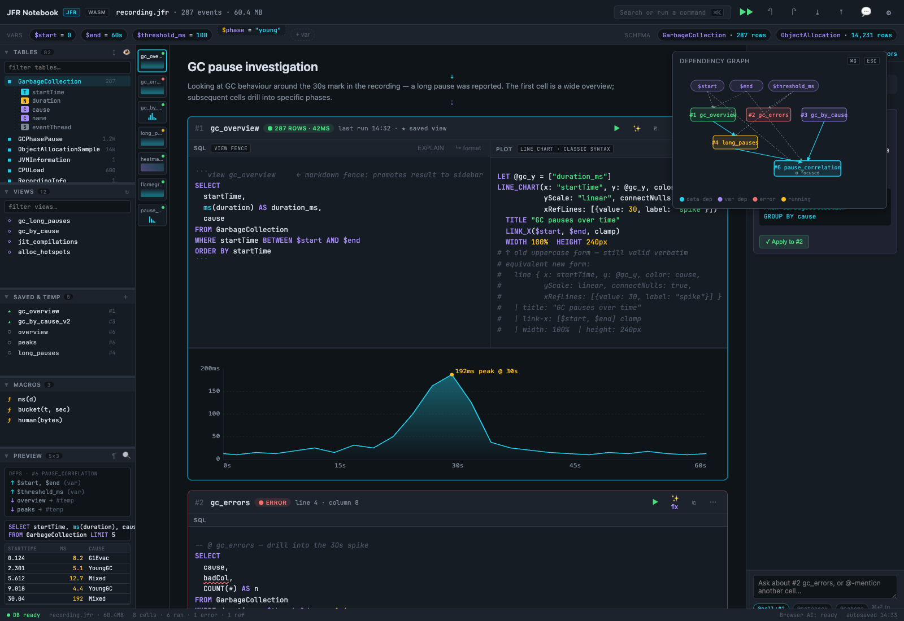

Three vertical zones, all resizable, all persisted (matches the live app's `usePersistentState` pattern):

1. **Left sidebar** — the *real* `Sidebar.tsx` (5 accordion panels). Mirroring the existing component is non-negotiable; the user explicitly said *"i meant the left sidebar of non mockup"*.
2. **Main column** — vertically-stacked cells. Each cell self-contained, expandable, linkable.
3. **Right chat** — cell-scoped Assistant; collapsible. Replaces today's modal-only AI surface.

**Why three zones (not two)?** Today the schema, the editor, and AI are all fighting for the same horizontal space. Embedded `<details>` panels and modal pop-overs scatter context. Three persistent zones let the user pin schema *and* assistant simultaneously without modal toggling.

---

## 2 · Left sidebar — 5 panels

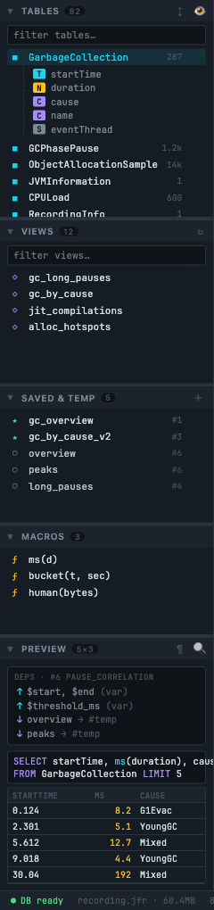

Five collapsible/resizable accordion panels, matching `Sidebar.tsx`'s 4-panel pattern (`Tables`, `Views`, `Macros`, `Preview`) with one addition:

| Panel | Role | Why kept / why added |
|---|---|---|
| **TABLES** | JFR event tables, expandable to columns | Exists today. Columns appear on row click — preserves the existing schema-tooltip UX. |
| **VIEWS** | Built-in JFR views (`gc_long_pauses`, …) | Exists today. Distinguished from saved/temp by orange diamond icon. |
| **SAVED & TEMP** | Per-notebook views authored in cells. ★ saved vs ○ temp. Right column shows defining cell (`#1`, `#6`, …) | **NEW**. Existing app has no cross-cell view registry; users currently re-define the same CTE in every cell. The "defining cell" column lets you click straight to the source. |
| **MACROS** | DuckDB scalar macros (`ms(d)`, `bucket(t, sec)`) | Exists today. |
| **PREVIEW** | SQL scratchpad + result preview, plus a **deps mini-block** for the focused cell | Exists today. The dep mini-block is new — it surfaces "what does this cell read / write?" without opening the full graph overlay. |

**Trade-off:** five panels is a lot of vertical real estate. Mitigation: every panel collapses to a 24px header; the user's saved proportions persist. Default starting heights `[4, 3, 2, 3, 6]` keep tables and preview tall, macros short.

---

## 3 · Cell anatomy — header

Every cell has the same head bar, in this order:

```
[# link-chip]  [#N alias]  [📐 dashboard?]  [🔗 axis-link?]  [● status]  [meta]  ─── grow ───  [⛶]  [▶]  [⋯]
```

- **link-chip `#`** — copies `#cell-<alias>` to the clipboard. Cells are *addressable* by their alias; same name in two cells is an error caught at parse time.
- **alias `#N name`** — `name` is whatever the cell wrote into its `-- @ alias` comment, falling back to `untitled`. The `#N` index is for human readability only; the alias is the stable id.
- **dashboard badge `📐`** — present when the plot block contains `row`/`col`/`+` (i.e. the cell is rendering more than one panel). Click expands a "fullscreen dashboard" overlay.
- **axis-link badge `🔗 x: $start..$end`** — present when any panel has `link-x` set. Hover shows the bound variable name and clamp state.
- **status `●`** — green `ok / N s`, red `err`, yellow `running`, purple `stale`. The colour codes match `gc_overview`/`gc_errors`/etc. so the eye can match status across cell and dep-graph.

**Why a chip per axis-link instead of a single icon?** The link target *is* the data — if `$start = 12:30:00`, the user wants to see that without opening a modal. The chip is the smallest surface that fits the value.

---

## 4 · The 12 plot types — every one demoed

> **Iter-6/13 update:** the canonical set is 12 plot types, plus `sparkline` as a `TableColumn.kind` (per §IT13.8). Cells #1–#8 below cover the original nine; the three span types (`gantt`, `area`, `range`) are specified in §6.1, and sparkline appears as a table-column kind inside cell #9.

### Cell #1 — `line` chart


```text
line {
  x: "startTime",
  y: ["duration_ms"],
  color: "cause",
  yScale: "linear",
  connectNulls: true,
  xRefLines: [{value: 30, label: "spike"}]
}
| title: "GC pauses over time"
| link-x: $start $end clamp
| width: 100%
| height: 240px
```

This is the plot DSL the system actually produces. The screenshot above predates iter-13 and shows the classic UPPERCASE form that was deleted in §IT13.1.

**Justification:** the existing test corpus and every saved notebook on disk is in this form. Migration is opt-in, not forced. The cheatsheet cell (§9) proves the round-trip.

### Cell #2 — error state

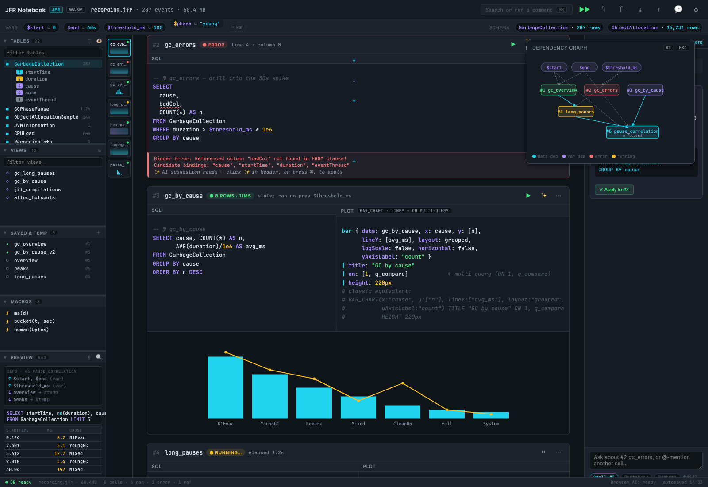

The SQL editor underlines `startime` with a red squiggle (`diagnostics.ts` already does this). The cell head turns red; the dep-graph node also turns red. **Errors propagate visually through every surface** — sidebar (red dot in Saved & Temp), header (red status), dep graph (red border). One bug, three independent visual signals.

> **See §IT12.2** (iter-12) for the five-kind error taxonomy and the unified **issues panel** (⌘⇧E) that aggregates every red head, yellow chip, ⛔ card and ⚠ chip into one scrollable list with click-to-jump — the existing surfaces stay; the panel aggregates.

**Justification:** today, an error in a cell often only shows up if you scroll back to that cell. With cross-cell views, an error in cell #2 silently breaks cell #6. Three-surface error propagation prevents the "why did my plot just go blank?" foot-gun.

### Cell #3 — `bar` chart + multi-query `on:`

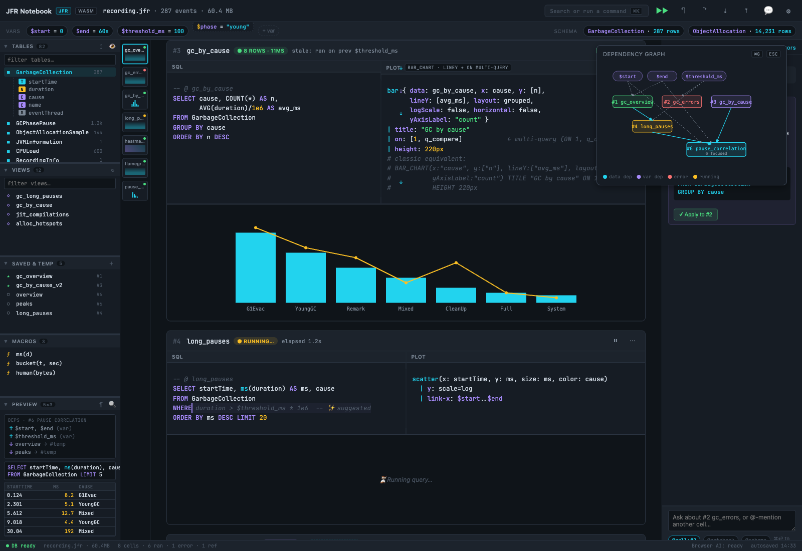

```text
bar { data: gc_by_cause, x: cause, y: [n],
      lineY: [avg_ms], layout: grouped,
      logScale: false, horizontal: false,
      yAxisLabel: "count" }
| title: "GC by cause"
| on: [1, q_compare]
| height: 220px
```

Bar chart with overlaid line (`lineY`) on the secondary axis, sourcing from **two queries** via `on: [1, q_compare]` — query #1 of *this* cell plus another cell named `q_compare`. This is the old `ON` clause unchanged, just lowercased.

**Justification:** today multi-query plots require copy-pasting whole SELECT statements into the same cell. With named aliases + `on: [...]` the second query lives wherever it's defined; this cell only references it.

### Cell #4 — AI ghost suggestion + `long_pauses`

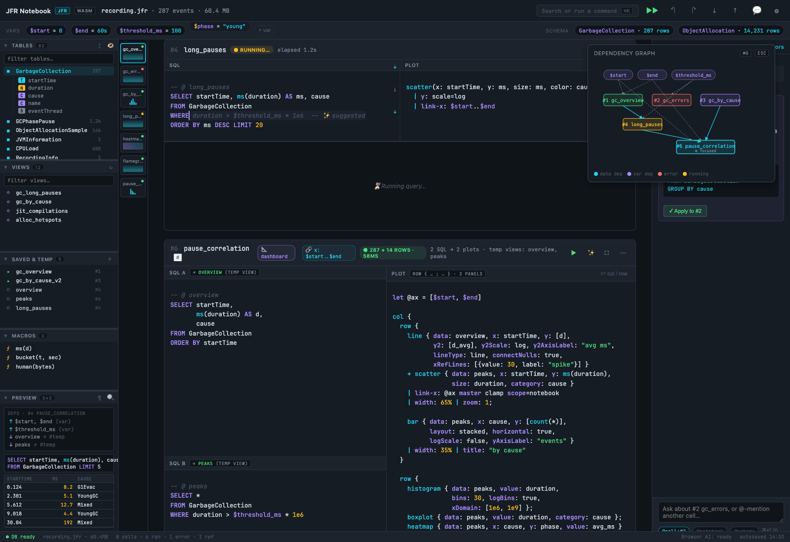

The empty plot pane shows a faint ghost of `boxplot { value: duration, category: cause }`. Tab accepts, Esc dismisses. Powered by the browser-local T5 model (see project memory `jfr_ml_pipeline`).

**Justification:** users today often write SQL, then stare at an empty plot pane. Ghost suggestions provide a strong baseline (`isParseablePlotConfig` already validates) without claiming AI authorship — it's a starter, not the answer.

### Cell #5 — slash menu

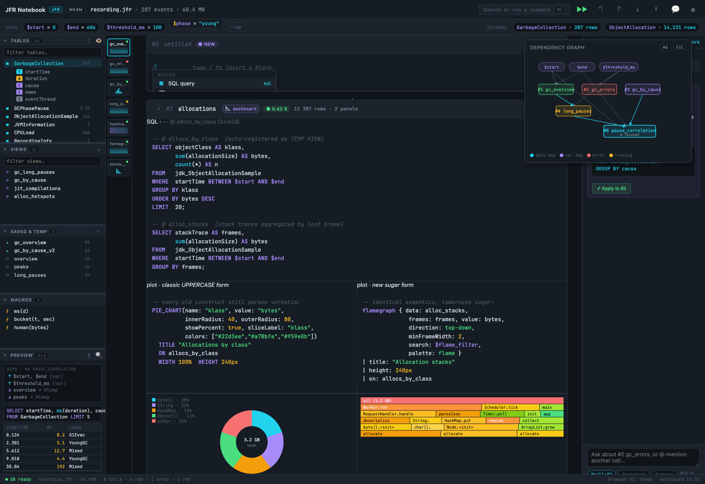

Typing `/` in an empty pane opens an inline menu. Borrowed from Notion/Linear/Hex:

```
Blocks:           SQL query · Plot · Saved view · Markdown
Magic cells:      /profile gc-pauses · /topk events 20 · /flame method
```

Magic cells are pre-baked SQL+plot recipes. They are *not* hardcoded — each one is just a markdown snippet stored in `~/.jfr-query/snippets/` (or shipped with the binary). The user can add their own.

**Justification:** new users today face an empty cell with no signposts. The slash menu is the discovery layer.

### Cell #6 — `pause_correlation` dashboard (the superset demo)

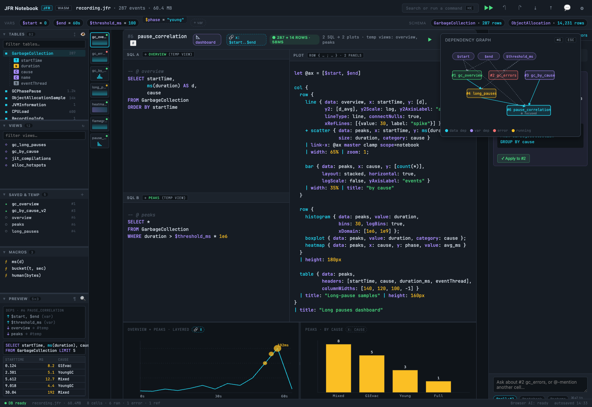

This cell exercises *every* construct in the old DSL plus the new ones, in a single 4-panel dashboard:

```text
let @ax = [$start, $end]
col {
  row {
    line { … xRefLines: [{value: 30, label: "spike"}] } | name: "gc"
    + scatter { x: startTime, y: ms(duration), size: duration, category: cause }
      | link-x: @ax master clamp
      | width: 65% | zoom: 1;
    bar { layout: stacked, horizontal: true, logScale: false } | width: 35% | name: "causes"
  }
  row {
    histogram { bins: 30, logBins: true, xDomain: [1e6, 1e9] } | name: "hist";
    boxplot   { value: duration, category: cause } | name: "box";
    heatmap   { x: cause, y: phase, value: avg_ms } | name: "matrix"
  } | height: 180px
  table { headers: [startTime, cause, duration_ms, eventThread],
          columnWidths: [140, 120, 100, -1] } | title: "Long-pause samples" | height: 160px | name: "samples"
}
| title: "Long pauses dashboard"
```

> **See §IT15.3** (iter-15) for the `| name:` clause shown above. With multiple panels in one cell, downstream cells address them by panel: `WHERE startTime IN $pause_correlation.gc.brush` filters by *the line panel's* brush specifically; `IN $pause_correlation.matrix.brush` uses the heatmap's 2-D brush over `(cause, phase)`. Without `name:`, panels fall back to implicit positional addressing (`.0`, `.1`, …) — the **formatter never auto-injects `name:`**; it surfaces a `panel-name-recommended` 🟡 lint in the Issues panel (iter-12 §IT12.2) so the user adds the clause themselves.

Maps to old constructs (historical — the UPPERCASE forms in the left column were removed in iter-13 §IT13.1; the right column is the only form the system accepts):

| Old construct (removed) | Sugar form (canonical) |
|---|---|
| `LET @ax = …` | Top-level constant in cell `vars:` frontmatter |
| `LINE_CHART(…, xRefLines)` | `line { … xRefLines: [{value: 30, label: "spike"}] }` |
| `SCATTER_PLOT` with size encoding | `scatter { size: duration }` |
| `BAR_CHART` `layout` / `horizontal` / `logScale` | `bar { layout: stacked, horizontal: true, logScale: false }` |
| `HISTOGRAM` `bins` / `logBins` / `xDomain` | `histogram { bins: 30, logBins: true, xDomain: [1e6, 1e9] }` |
| `BOX_PLOT` | `boxplot { … }` |
| `HEATMAP` | `heatmap { … }` |
| `TABLE` with `headers` + `columnWidths` (incl. `-1`) | `table { headers, columnWidths: [140, 120, 100, -1] }` |
| `LINK_X($a, $b, clamp)` + master + scope | `link-x: @ax master clamp` (scope is by variable name, iter-16) |
| `TITLE`, `WIDTH`, `HEIGHT`, `ZOOM` | `| title:`, `| width:`, `| height:`, `| zoom:` |
| `;` and `\n\n` separators | `row { a; b }`, `col { a\n\nb }` |
| **NEW** `+` overlay | `line {…} + scatter {…}` — shared axes, single panel |

> **See §IT13.5** (iter-13) for the `+` overlay's full semantics: `OverlayNode.layout: 'shared-axes' | 'independent-y'` (default `shared-axes`), z-order = document order (first child back-most), axis-type mismatch is a parse-time `type` error, legends are merged one row per child series.

**Justification:** the cell is intentionally extreme — it proves the DSL composes without surprises. If anything in the old language *doesn't* fit one of these constructs, we find out here before users do.

### Cell #7 — `pie` + `flamegraph`

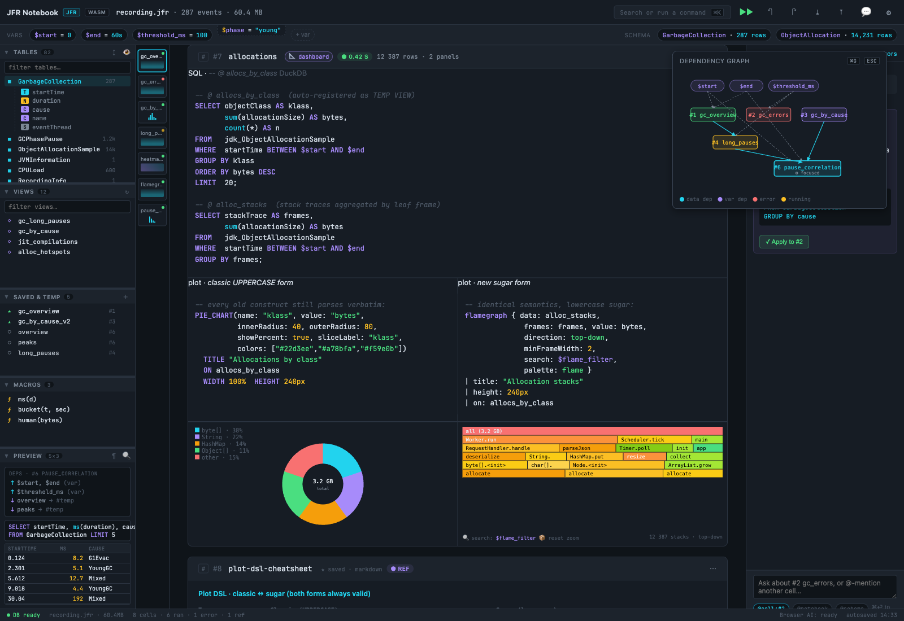

Same cell shows both plot types side-by-side. Covers the last two plot types the other cells didn't reach: `pie { value, category, innerRadius, outerRadius, showPercent, sliceLabel }` and `flamegraph { frames, value, direction, minFrameWidth, search, palette }`.

**Justification:** completeness check. All plot types demoed across iter-1's eight-cell tour. The flamegraph also exercises *variable interpolation into a plot config* (`search: $flame_filter`), which is a feature today often overlooked.

### Cell #8 — DSL cheatsheet (saved view)

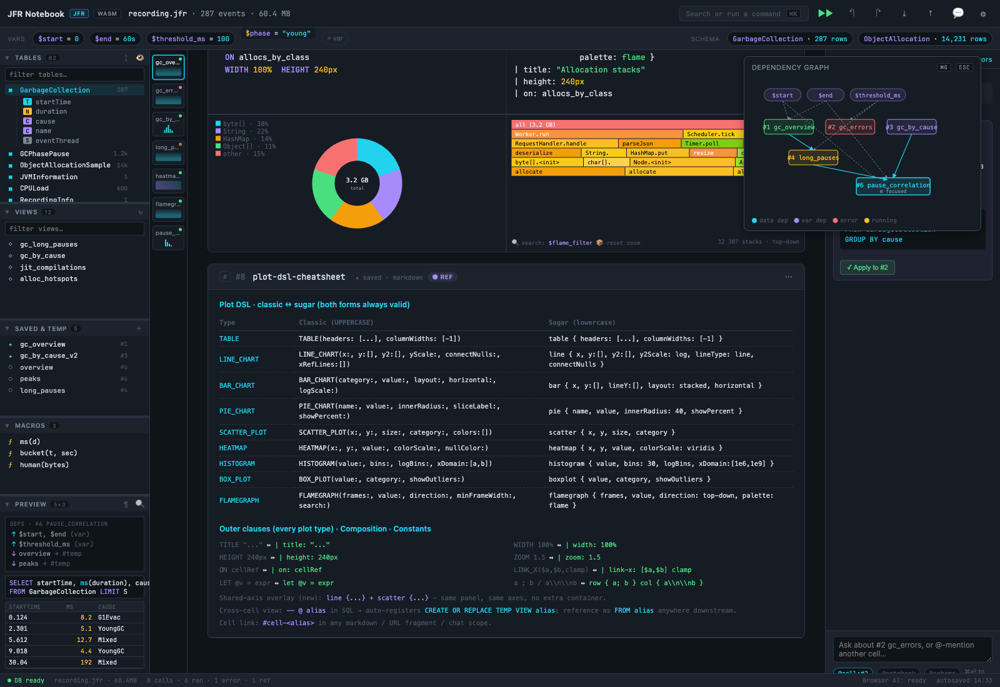

A pure markdown cell with a side-by-side mapping table for all 12 plot types + every outer clause + composition operators. Lives in the notebook itself (saved view, so it round-trips through markdown). Doubles as in-app documentation.

**Justification:** the existing app has no in-product DSL reference; users have to read docs in a separate tab. Embedding the reference *as a notebook cell* means it ships with the notebook, can be remixed, and proves by example that the DSL is markdown-round-trippable.

gantt, area, range demoed in §6.1.

**Live-variable filter operators** (iter-14/15 additions to cell #8 — see §IT15.5):

| Pattern | What it does | See |
|---|---|---|
| `WHERE col IN $brush` | Filter by the most-recent brush, whichever cell produced it. Empty brush = tautology. | §IT14.1 |
| `WHERE col IN $alias.brush` | Pin to one producer cell's brush by alias. | §IT14.3 |
| `WHERE col IN $alias.brush.x` | Explicit axis when the consumer column name differs from the producer's axis column. `.y` likewise. | §IT15.1 |
| `WHERE col IN $alias.panel.brush` | Multi-panel cell: address one panel by `name:` (or `.0`/`.1` positional). | §IT15.3 |
| `WHERE (a, b) IN $heatmap.brush` | Multi-dim brush (heatmap, scatter with 2-D box-select). | §IT14.2 |
| `WHERE col IN $hover` | Filter by hover position; categorical hover uses `$alias.hover.category`. | §IT15.2 |
| `WHERE col IN $zoom` | Filter by linked zoom range; works the same as brush. | §IT14.1 |
| `WHERE col IN $selection` | Filter by multi-select (categorical legend, table-row click). | §IT14.1 |

See §IT14 for the full `IN $brush` operator semantics, including the namespaced `$alias.brush` form and axis-explicit `$alias.brush.x`.

---

## 5 · Cross-cell data — `-- @ alias`

Inside any SQL block, a comment-style directive registers a TEMP VIEW:

```sql
-- @ allocs_by_class
SELECT objectClass, sum(allocationSize) AS bytes, count(*) AS n
FROM   jdk_ObjectAllocationSample
GROUP BY objectClass;
```

After the cell runs, `allocs_by_class` is queryable from any other cell:

```sql
SELECT * FROM allocs_by_class WHERE n > 100;
```

**Three flavours of "view":**

| Marker | Lifetime | Persists in markdown? |
|---|---|---|
| `-- @ alias` (in SQL) | Session (TEMP VIEW) | ✓ (the SQL comment is the source) |
| ```` ```view <name> ```` | Until cell deleted | ✓ (new fence type) |
| `view <name>` slash-cell | Session | ✓ |

**Why a SQL comment, not a frontmatter key?** It survives copy-paste into the DuckDB CLI (DuckDB ignores the comment). The frontend regexes it back out and runs `CREATE OR REPLACE TEMP VIEW`. Zero new fence types for the 90% case.

View aliases (`-- @ alias`) and variable names (`$x` / `$$x`) live in separate namespaces; a view named `theme` does not shadow a variable `$theme` or `$$theme`. Identical names parse cleanly but are discouraged; the formatter emits a `policy`-kind `name-overlap` lint when both exist in the same notebook.

---

## 6 · Dependency graph

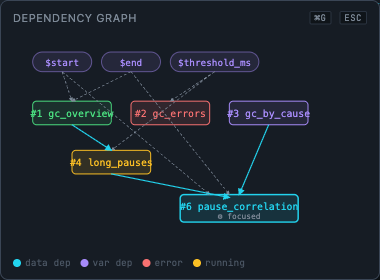

Triggered by ⌘G; pinned in the mockup. Three edge types, three colours:

- **cyan solid** — data dep (`FROM alias`)
- **gray dashed** — variable dep (`$x`)
- **node colour matches cell status** — green ok, red err, yellow running, purple stale, cyan focused

Variables sit at the top as rounded chips; cells below them in rough topological order. The focused cell gets a thicker border + `⚙ focused` label.

**Justification:** today, when cell #6 breaks, the user can't tell whether it's a bug in cell #6's own code or in cell #2's view that cell #6 depends on. The graph makes the dependency *physical* — you can see what feeds what.

**Edge cases handled:**

- **Cycles** — detected at parse time (`FROM alias` graph + variable dep), shown as a red dashed arrow with a "cycle" tooltip. Execution refuses to run until broken. (Filter-chain cycles use the same detector — see §7.2.)
- **Stale propagation** — if a cell's input changes, all downstream cells gain `● stale` until re-run. ⌘⇧⏎ runs the cell and all stales it transitively touches.
- **Variable scope** — `$x` is the notebook variable (session-live by default; persisted iff declared in frontmatter `vars:` — see iter-16). `$$x` is the workspace-global form (cross-notebook in phase F+). Static `$x` references draw gray-dashed edges; live couplings (brush, hover, zoom, selection — see §6c) draw *thick* gray-dashed edges. Liveness is a property of how the variable is *used*, not of the sigil.

---

## 6b · Dependencies, in depth

The dep graph from §6 was the high-altitude picture. Three details that move the design from "we draw arrows" to "the arrows are correct":

### 6b.1 Implicit view detection from raw SQL

`-- @ alias` is the *explicit* way to register a TEMP VIEW. But users today already write SQL that is, structurally, a view — a single named `SELECT` with no side effects. The parser walks the AST after a successful run; if the cell:

- contains exactly one top-level `SELECT` (or one `WITH ... SELECT`),
- has no `INSERT` / `UPDATE` / `DELETE` / `CREATE` / `DROP` / `COPY`,
- and is named (cell has an alias from the heading),

…then a **promotion affordance** appears in the cell head: `↗ promote to view`. One click rewrites the cell to prepend `-- @ <alias>` and runs `CREATE OR REPLACE TEMP VIEW`. The cell is now reachable by alias from every other cell.

**Why not auto-promote silently?** Users sometimes write `SELECT * FROM huge_table` as a sanity check and would be surprised to find it materialized as a session view. Promotion is one click, not zero.

**Justification:** Today, the path from "I have a query that works" to "other cells can use this" is "copy the SQL into a new cell with a TEMP VIEW wrapper". Most users never bother. A single chip collapses that to a click.

### 6b.2 Prompt → cell dependency edges

When the cell-scoped chat (§7) writes SQL into a cell, that cell inherits a new edge type — **prompt edge** — pointing back to whatever cells the prompt referenced.

Two ways a prompt-edge is born:

1. **Explicit `@cell` chip in the prompt.** Typing `@5` into chat (autocompleted from open cells) tags cell #5 as a prompt-time dep. When the AI's output is accepted into cell #B, the graph draws a *dotted purple* edge `#5 → #B` labelled `prompt`.
2. **Inferred from generated SQL.** If chat produces `SELECT … FROM peaks` and the cell `peaks` exists in Saved & Temp, that's a normal cyan **data** edge — but the graph *also* tags the cell with a `🤖` glyph in its node, recording that the SQL was AI-authored. Hover shows the prompt that produced it.

The fourth edge type in §6 (§6c adds a fifth — live variables):

| Edge | Colour / Style | Meaning |
|---|---|---|
| **cyan solid** | data dep | `FROM alias` |
| **gray dashed** | variable dep | `$x` reference |
| **thick gray dashed** | live variable dep | `$x` reference (see §6c) |
| **orange thin** | linked axis | `link-x` between panels (almost always a `$zoom`) |
| **purple dotted** | prompt dep | chat referenced source cell when generating |

**Justification:** Today nothing records that cell #B was AI-generated from a question about cell #5. Six weeks later, when #5 changes and #B silently breaks, the user has no breadcrumb back to "what was I asking when I wrote this?". The prompt edge is the breadcrumb; the hover-prompt is the *story*.

### 6b.3 Variable interpolation in plot config counts as a dep

Cell #7 (§4) demoes `flamegraph { … search: $flame_filter }`. Today the dep graph would *not* draw a `$flame_filter → #7` edge because the existing graph only walks SQL for `$var` references — plot configs are skipped.

The redesign walks both. The traversal is:

```
for each cell:
  collect $vars from SQL  → variable deps (today)
  collect $vars from plot config (recursive descent)  → variable deps (NEW)
  collect FROM aliases    → data deps
  collect link-x targets  → linked-axis deps
  collect prompt context  → prompt deps
```

A `$var` used *only* in plot config (e.g. a slider that changes flame-filter without re-running SQL) still triggers a downstream re-render but **not** a SQL re-run. The dep graph distinguishes this with a thinner gray-dashed edge labelled `render-only`.

**Justification:** The mockup's `threshold_ms` slider (§2.4 iter2) is a popover that lists "which cells will re-run." If a variable only re-renders a plot — no SQL — the popover would lie. Walking plot configs makes the prediction honest.

---

## 6c · Shared state: variables, zoom, scroll, highlight

Once `$var` is a first-class dep, a whole family of interactions falls out of the same mechanism. The redesign treats **every cross-cell coupling as a variable**, with one scoping rule:

| Sigil | Scope | Persists in markdown? | Survives reload? |
|---|---|---|---|
| `$x` | notebook-local | ✓ (frontmatter `vars:` key declares persistence; session-only otherwise) | ✓ iff declared in `vars:` |
| `$$x` | workspace-global | ✓ (declared in frontmatter `vars:` of one notebook, visible to all in phase F+) | ✓ |

Two sigils, one dial each: `$x` is the day-to-day variable (live by default, persist when you ask); `$$x` reaches across notebooks. Liveness is universal — every `$x` is reactive, regardless of sigil. See iter-16 for the final sigil decision and how it collapsed an earlier three-sigil draft.

### 6c.1 The five system variables

Five built-in `$` variables are populated by the UI itself, not by the user. They are the conduit for every interactive cross-cell coupling:

| Variable | Type | Producer | Typical consumer |
|---|---|---|---|
| `$hover` | `{ x, y, cell }` | mouse hover on any panel | tooltip in linked panels, marker on flamegraph |
| `$brush` | `{ x0, x1, y0?, y1?, cell }` | drag-select on a panel | `WHERE` clause filter in downstream SQL |
| `$zoom` | `{ x0, x1 }` | wheel-zoom or pinch on a `link-x` panel | every panel sharing the same `link-x` scope |
| `$scroll` | `{ cell }` | viewport-centre cell change | "current cell" indicator in sidebar / status bar |
| `$selection` | `[row, …]` | row-click in a `table { }` panel | downstream cells that `WHERE row_id IN $selection` |

**They are real variables.** A cell can `WHERE startTime IN $brush` and downstream filtering Just Works — see **§IT14.1** (iter-14) for the `IN $brush` operator and its namespaced form `$alias.brush`. The dep graph draws the edge as a **thick gray-dashed** line labelled `live` to distinguish "user is actively driving this" from a static `$var` reference.

**Why a sigil rather than a separate API?** If interactive state were an event-emitter, users would have to learn two systems: variables for static config, callbacks for live coupling. By collapsing both into `$`, the same `dep-graph` panel, the same `vars:` popover, and the same "stale propagation" logic apply to everything.

### 6c.2 Linked zoom — `link-x`, `link-y`, `link-xy`

The existing `LINK_X($start, $end, clamp)` clause is now sugar for *binding the panel's zoom state to a `$var`*. The redesign extends this to three orthogonal axes:

```text
line { … } | link-x: $zoom master clamp
hist { … } | link-x: $zoom
flame { … } | link-x: $flame_zoom              // independent flame zoom (different variable name)
```

- **`master`** — this panel *writes* `$zoom` when zoomed; other panels read.
- *No master* — panel reads but does not write. Useful when you want a thumbnail or context strip that follows the main view.
- **Scope is by variable name** (see iter-16). Two panels referencing `$zoom` are coupled; two panels referencing `$panel_a_zoom` and `$panel_b_zoom` are not. For group-scoped coupling, give the group its own variable name; for cell-scoped coupling, use a cell-prefixed name like `$<cell-alias>_zoom`. There is no separate `scope:` clause — the name *is* the scope.
- **`clamp`** — zoom is clamped to the data extent at master-write time. Useful for sliders.

`link-y` and `link-xy` work identically but on the y axis or both axes. A heatmap with `link-xy: $view` lets you pan/zoom a flame map and a 2D heat-density plot in lockstep.

**Why bind to a variable and not a "linked panel id":** because variables already round-trip through markdown, already participate in deps, already show up in the var-popover. A panel-id system would be a parallel registry to maintain.

### 6c.3 Scroll & focus — `$scroll` and `$focused_cell`

Scroll is rarely the *cause* of an interaction, but it's the most underused signal in the current app. Two surfaces light up:

- **Sidebar "current cell" indicator** — the cell whose head is nearest the viewport top is highlighted in the Saved & Temp panel and the dep graph. This is `$focused_cell` (derived from `$scroll`).
- **Cell-scoped chat anchor** (§7) — the chat panel's `@cell` chip auto-updates to `$focused_cell` unless the user has pinned it. The status bar's `cell-scoped chat: #5` (iter2 §2.6) now reflects whichever cell is on screen.

A user *can* read `$focused_cell` in SQL too — `WHERE source_cell = $focused_cell` — but in practice it's a UI signal, not a query signal. We expose it as a variable for uniformity, not because the use cases are dense.

### 6c.4 Brushing → filtered downstream cells

> **See also §6c.4b** (added in iter-6): the same wiring, but promoted from "you write the SQL" to a clickable `+ filter from…` chip on the consumer cell. The text below is still the underlying mechanism; §6c.4b is the surface most users will actually touch.

This is the highest-leverage interaction in the whole design. A user drags a region on the GC-overview line chart; a histogram cell three rows down instantly shows the distribution of *just that region*.

The mechanism is one line of SQL in the downstream cell:

```sql
-- @ pauses_in_brush
SELECT * FROM gc_pauses
WHERE startTime IN $gc_overview.brush;
```

The **namespaced producer** (`$gc_overview.brush` rather than bare `$brush`) pins this consumer to the brush owned by cell `gc_overview` — see §IT14.3. A bare `$brush` would pick up the most recently active brush across the notebook (usually fine; pin only when you need it).

> **See §IT15.1** (iter-15) for the **axis-explicit form** — when the consumer column isn't the same as the producer's axis column, use `WHERE endTime IN $gc_overview.brush.x` to apply the producer's x-axis range to a differently-named consumer column. The plain `IN $brush` form (used in the fence above) keeps working when the column names match.

Visual feedback:

- The source panel highlights the brushed region with a faint cyan overlay (the same cyan as data-dep edges in the dep graph — *visually* tying "I am the source of `$brush`" to "I am a data source").
- Downstream cells that consume `$brush` get a small cyan dot in their head (`◉ live`) while the brush is active.
- Releasing the brush snaps; the downstream cells finish their final re-run; the dot stays for 3 s as a confirmation.

**Why a brush isn't a click:** click-to-filter has 1 dof; brush has 2 (or 4 for box-select). Box-select on a heatmap (`x: cause`, `y: phase`) means "show me only pauses with these causes in these phases" — far stronger than a single category click.

### 6c.5 Highlight without filter — `$hover` and panel cross-linking

Sometimes the user doesn't want to *filter*, just to *see* the same point across multiple views. Hovering a bar in the GC-by-cause panel should light up the corresponding stripe in the heatmap and the matching slice in the pie.

Each panel declares a `highlight: $hover` clause (defaults on). When `$hover.cell` is set, every panel:

1. Computes whether its data overlaps the hover key (`hover.x`, hover category, hover row).
2. Renders a halo/outline on its matching mark — *without* re-running SQL.

The halo style is uniform across plot types: 2px white-with-shadow outline. Discoverable because it's the same shape as the existing CodeMirror `selectionHighlight` rule.

**Why a system variable rather than per-panel event wiring:** in the existing app, a hover in panel A has no way to tell panel B anything. Adding `$hover` means *any* panel can listen — including markdown cells that just want to show a contextual sentence ("Hovering: G1 Young Gen at 12:43:01").

### 6c.6 The variable bar, revisited

Iteration 2 (§2.4) introduced a variable popover showing which cells consume `$threshold_ms`. The same surface now also shows:

- **Two rows, by activity.** All vars are reactive in iter-16 (liveness is universal), so the rows split by *current activity* instead of by sigil: vars that no gesture is currently driving sit on a top "static" row in solid amber chips; vars being actively driven by a brush/hover/zoom/selection sit on a "live" row in pulsing cyan chips. The two rows have **distinct backgrounds** (top: solid panel colour; bottom: cyan-tinted gradient). This makes the activity difference (intention vs consequence — see §5.2) visually load-bearing without needing a sigil distinction.
- **`$` live variables** — pinned by default, with their *current value*. A `$brush` chip might read `12:30:00 → 12:33:45 (gc_overview)`. Clicking the chip clears the brush.
- **Producer/consumer split** — for each `$` var, the popover lists which cell *produces* it (the master) and which cells *consume* it. Producers get a `▲` glyph, consumers a `▼`.
- **"Pause live coupling"** — a single button at the top of the live row that freezes all `$` variables to their current value, so the user can scroll without re-triggering downstream re-runs. Resume restores live behaviour. The button is on the live row specifically — there is nothing to pause about static vars.
- **Saved-filter chips** — a third chip kind (added in iter-7 §7.3): green border, named after the underlying view fence (`@last_5_min`, `@on_call_window`). Distinct from `$`/`$` chips because clicking them opens the underlying view-fence source, not a value picker. See §7.3 for the saved-filter affordance and §7.6 for how chains involving saved filters render in the dep graph.

**Justification:** live coupling is powerful, but a notebook with five `$`-consuming cells will redraw every time the user breathes on the mouse. The pause button is the escape valve; the master/consumer split makes the topology legible at a glance.

### 6c.7 Where this shows up in the dep graph

The §6 / §6b graph now has five edge types:

| Edge | Colour / Style | Meaning |
|---|---|---|
| **cyan solid** | data dep | `FROM alias` |
| **gray dashed** | variable dep | static `$x` reference (not currently driven by a gesture) |
| **thick gray dashed** | **live variable dep** | `$x` reference (auto-re-runs as value changes) |
| **orange thin** | linked axis | `link-x` / `link-y` (almost always a `$zoom`) |
| **purple dotted** | prompt dep | chat referenced source cell when generating |

The graph gains one new node type: a **diamond** for `$` variables (distinct from the rounded chip used for static `$var`). A `$` diamond gets a faint static halo for ~1 s after its value changes — no animation loop, so users with motion sensitivity see a transition cue, not a strobing graph.

**Layout commitment:** `cytoscape.js` with `dagre` (layered) layout. Topological order top-to-bottom, edges minimized via dagre's built-in crossing reduction. Layout is *stable* across ⌘G opens — node positions are pinned in localStorage keyed by `(notebook-path, node-id)`, only freshly-added nodes get auto-placed. This is non-negotiable for spatial memory: re-opening the graph and finding everything rearranged destroys the value of having looked once.

**Mitigations for hairball at scale (>20 nodes):**

- Legend chip at top-left filters edge types (e.g. "show only data + prompt"). Filters persist per notebook.
- "Summarize" toggle collapses all `$` edges into a single thick edge per cell pair, labelled with the edge count.
- "Focus mode" — clicking a node hides everything farther than 2 hops, with a breadcrumb at the top to return to the full view. Same gesture as the existing schema-tooltip focus pattern.

**Justification:** with five edge types we are at the limit of what a single diagram can carry. Three mitigations are needed, not one, because the failure mode at 30+ cells is *unreadability*, not *information overload* — those need different fixes (filtering, summarization, focusing).

### 6c.8 Persistence model

What does and does not survive a reload:

- **`$x` (notebook-local)** — persistence follows the frontmatter `vars:` declaration. A `$x` listed in `vars:` is saved back to the file on save; one that isn't is session-only. Either way, the *binding* (which panels reference `$x`) persists.
- **`$$x` (workspace-global)** — persisted in the user's browser profile (phase F+); the *value* outlives any single notebook. In phase A, behaves identically to a `$x` declared in this notebook's `vars:`.

The default — session-only unless declared — is right for live state: re-opening a notebook six weeks later shouldn't trap you in the brush window you left it in. If a dashboard *should* always open showing the last-pinned incident window, add `zoom: { x0: …, x1: … }` to `vars:` and the value rides along with the file.

---

## 7 · Right chat panel — cell-scoped

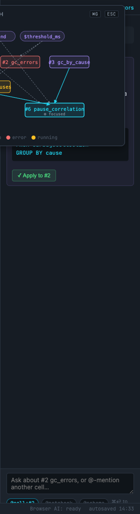

The Assistant docks to the right, defaulting to **cell scope**: the conversation is anchored to whichever cell is focused, with `@cell` and `@schema` chips pre-filled. The user can change scope to `@notebook` or `@selection`.

**Reference *and* author — two jobs, one panel.** Chat is used both for *reference* ("explain this query", scoped tight, doesn't mutate) and *author* ("write me a query that joins X and Y", which lands in a cell). These pull in different directions: reference wants to stay unobtrusive; author needs to surface diffs, undo, and provenance. The cell-scope boundary is therefore *soft*, not clean — pretending otherwise would be dishonest about how the panel actually gets used.

**Concretely:** chat output can be accepted into the focused cell *or* a new cell. The choice is sticky per notebook (a small toggle in the chat header: `target: focused-cell | new-cell-below`). When output lands in a cell, that cell gets a `🤖` glyph in its head (matching the dep-graph node tag in §6b.2) and the prompt is stored in cell frontmatter `last_ai_prompt:` so the provenance is recoverable.

**Justification:** today the AI surface is modal — you open it, ask something, close it. Cell-scoped chat means "fix this error" and "summarise this plot" become one-click without losing context. Browser-local model handles plot suggestions; cloud handles agentic flow.

> **See §7.1** (iter-6) for the proposal-preview design: every `$` reference and cross-cell `FROM` in generated code surfaces as an editable wire-binding chip before the user clicks Accept. This is how chat *authors* coupled cells without hiding the coupling.

> **See §10** (iter-10) for the prompt language itself — formal grammar, three-tier autocompletion, the ~25M-param local model, the `🪄 suggest plot` button on every SQL block, and the structured `last_ai_prompt:` AST that replaces this section's English-prose chat input.

> **See §11** (iter-11) for the chat *window* — docked drawer + full-window overlay, a transcript that renders interactive cells (including multi-SQL `row{}`/`col{}`/`+` plot compositions), a schema-only-by-default toggle for external-LLM data access, an MCP-style tool surface for the external LLM, and the `last_ai_session:` audit log.

---

## 8 · Markdown round-trip

A `.md` file IS the notebook. The only new fence types are:

```` ```sql ```` — already used today (was implicit, now explicit)
```` ```plot ```` — already used today
```` ```view <name> ```` — **NEW** for saved view cells

Everything else — deps, pinned vars, stale flags, status, axis links — is **derived** from the contents and the run cache. The mockup shows them as UI affordances; the `.md` shows only the source.

A cell's "metadata" lives in two places:

- Required: `# cell-alias` heading or `### #N alias` heading.
- Optional: a YAML-style fence `key: value` block immediately after the heading for things like `pinned: true`, `hidden: true`. Almost no one will write these by hand; the UI emits them when needed.

**Round-trip is canonical, not byte-for-byte.** Save runs the formatter (§8b) over every cell, so two notebooks that mean the same thing serialize identically. This is a deliberate shift from "preserve exactly what the user typed" to "preserve exactly what the notebook *means*". Diffs against the saved file then reflect intent changes only — whitespace and casing churn disappears from git history.

**Justification:** the user's explicit constraint *"it should be still exportable and writable as markdown"* is the load-bearing requirement. Everything that can be derived, is. Canonical form means two collaborators editing the same notebook in different IDEs (one tabs, one spaces) don't fight the file.

---

## 8b · Auto-formatter

A single formatter pass owns the canonical form. It runs:

- **On save** (⌘S, autosave tick) — always.
- **On manual invoke** (⌘⇧F) — formats the focused cell only.
- **On paste** — if the paste lands inside a known fence (`sql`, `plot`, `view`), the formatter runs over the pasted region only. Outside fences, paste is left untouched.

The pass is **deterministic and idempotent**: `format(format(x)) == format(x)` is a property test. If it ever fails, the formatter is wrong, not the input.

### 8b.1 SQL formatter

DuckDB-aware. Pulled from the same `duckdb-sql-tools` lineage already used by `diagnostics.ts`:

- Keywords uppercase (`SELECT`, `FROM`, `WHERE`, `GROUP BY`, …) — matches the existing test corpus.
- Two-space indent inside `WITH … AS ( … )` and subqueries.
- Comma-leading inside `SELECT` lists when the list spans > 1 line; trailing on single-line lists.
- `-- @ alias` comment, if present, is pinned to line 1 (above the SQL). Other comments stay at their nearest statement.
- Long `WHERE` clauses break at boolean operators, operators leading.
- `$vars` and `$$vars` are preserved verbatim — never quoted, never expanded.

**Why DuckDB-aware:** generic SQL formatters mangle DuckDB-specific syntax (`MAP { … }`, `STRUCT_PACK(…)`, lambda `x -> x*2`, `QUALIFY`). The formatter must round-trip every construct the engine accepts.

### 8b.2 Plot DSL formatter

One canonical output. The formatter operates on the AST (§9), not the source text. (Iter-13 §IT13.1 deleted the UPPERCASE classic form; only sugar remains.)

Canonical output rules:

- One panel per line for top-level `row { a; b; c }` (semicolon → newline at width > 80).
- Outer clauses (`| title:`, `| width:`, `| height:`, `| zoom:`, `| on:`, `| link-x:`) stack one per line, indented two spaces.
- Inside a panel: keys sorted by a fixed canonical order — full list in §IT13.10. Not alphabetical.
- `xRefLines`, `xDomain`, `headers`, `columnWidths` arrays break to multi-line only when > 60 chars.

**Why a fixed key order:** alphabetical would put `bins` before `data`, which reads wrong. The fixed order matches how a human builds a plot: data first, axes next, encodings last.

### 8b.3 Markdown export formatter

Cell-level structure:

- Exactly one blank line between cells, never more.
- Cell heading is `### #N <alias>` (level-3, three hashes + index + alias) — the level matches existing notebooks.
- Frontmatter fence appears only if at least one key is set. Keys are emitted in a fixed order: `pinned, hidden, autorun, deps`. (Iter-13 §IT13.1 removed `style`.)
- Fences are ordered within a cell: `yaml` (frontmatter) → `sql` → `plot` → trailing prose. Cells that have only one of these skip the others.
- Trailing whitespace stripped per line; file ends with exactly one `\n`.

**Justification:** an export pass that touches every cell on save means the `.md` is the source of truth *and* the diff target. Without it, two users on the same notebook produce git-noisy diffs and the round-trip claim becomes "round-trip if you don't look at the bytes."

### 8b.4 Format-on-save UX

- A subtle `formatted (3 cells)` toast appears next to `autosaved 14:33` in the status bar after a save that changed anything. No toast if the format was a no-op.
- A per-notebook setting `format.onSave: false` opt-out exists for users who want to disable it. Surfaced in the settings modal, not in the cell head.
- ⌘⇧F on a cell with a SQL syntax error: the formatter runs the **plot** block and **markdown** structure regardless; SQL is left untouched and a `⚠ skipped SQL — fix parse error first` chip appears next to the cell head.

**Why never fail loud:** the formatter is a quality-of-life tool, not a gate. Save must always succeed; a broken cell must still be saveable so the user can come back to it.

### 8b.5 What the formatter deliberately does NOT do

- **Doesn't reorder cells.** Cell order is a user decision.
- **Doesn't rewrite SQL semantics.** No "`SELECT *` → explicit column list" expansion, no view-folding, no JOIN reordering. Pure syntactic format.
- **Doesn't touch prose.** Markdown text inside cells passes through verbatim. (Maybe in v2 we run `prettier --parser markdown` on prose blocks; not in v1.)
- **Doesn't normalize variable names.** `$Foo` and `$foo` are different references; the formatter preserves casing.
- **Doesn't negotiate per-rule.** The formatter is opinionated and global. Comma placement, key order inside plot panels — these are picked once and held. We accept that a fraction of users will disagree with at least one rule; the alternative (per-user configuration) defeats the entire point of a canonical form. The only escape valve is the global `format.onSave: false` toggle. (Iter-13 §IT13.1 removed the classic-vs-sugar choice; only sugar exists.)

**Why this matters:** without an explicit no-bikeshedding stance, the first six weeks after launch will be spent adjudicating "should `category` come before `data` in panel keys?" issues. Saying it in the design doc lets reviewers raise these concerns *now*, not after the fact.

---

## 9 · DSL cheatsheet (in-product)

The cheatsheet from cell #8 is **also** the contract the parser obeys. The implementation order is:

1. Lex into tokens (lowercase identifiers, punctuation, strings, numbers, `$var`, `$$var`, `@const`).
2. Parse into the sugar block-grammar (single grammar since iter-13 §IT13.1).
3. AST → IR → renderer.

If a cheatsheet row doesn't have a parser test, it doesn't ship. The cheatsheet is the spec.

---

## 10 · What this redesign deliberately does NOT change

- **The DuckDB layer.** All SQL still runs through `DataContext.executeQuery`. No new server endpoints required for the cross-cell view feature — `CREATE OR REPLACE TEMP VIEW` is already permitted.
- **The plot renderer.** Each `plotRegistry[TYPE].component` stays as-is. The new sugar form just parses into the same config object.
- **The chat protocol.** `IAiProvider.getAgentResponse` is unchanged. Cell-scoped chat is purely UI sugar over the same calls.
- **The CodeMirror version.** Still CM5/CM6 as today. The slash menu is a custom keymap on top.

**Justification:** the redesign is risky enough on the UX side. Holding the data plane fixed keeps the blast radius small.

---

## 11 · Open gaps

The mockup is good enough to align on direction; it isn't pixel-final. This list is **post-iteration-5** — earlier entries that have been addressed are crossed off, and the items from §4.6 (live-coupling mockup gaps) are folded in.

**Closed in iter 2** (see §2.1–§2.6 for the fixes): DOM-order numbering, AI ghost legibility, frontmatter demo, variable picker, status bar content, Saved & Temp jump-links.

**Closed in iter 4** (§4.6 still lists what would *complete* validation, but the design questions are resolved): performance model for live coupling, producer conflicts, error states, undo grain.

**Closed in iter 5** (see §5.9 for the close-out table): mockup source reconstructed as `index.html`, varbar visually segregates static vs live chips (§6c.6), dep-graph layout committed to cytoscape.js+dagre with focus mode (§6c.7), formatter trade-off made explicit (§8b.5), chat-panel dual role acknowledged (§7), DuckDB-on-Worker added to phase A (§12), §14 migration section added, `REDESIGN_INTERFACES.md` sibling spawned.

**Still open** — all mockup-only, no architectural changes needed:

1. **`pinned` / `hidden` cells** — frontmatter spec exists; no screenshot demonstrates the UI state.
2. **Fullscreen dashboard modal** — ⛶ behavior referenced from cell #6 but not pictured.
3. **Live-coupling visuals** (the §4.6 inventory) — sigil-coloured varbar chips, `$zoom` sync between panels, `$brush` source overlay + consumer `◉ live` dot, `$hover` halo cross-linking, pause-live-coupling button, interaction-history timeline, shareable-URL toast. Eight to nine images; one afternoon of mockup work.
4. **Mobile / narrow-viewport behaviour** — every state assumes ≥ 1400px. Below that the sidebar should collapse to icons; below ~900px the chat should overlay rather than dock. Desktop-first redesign, but flagged.
5. **Drag-and-drop reorder of cells** — implicit in `grip` icons; not demoed.
6. **Multi-select + bulk run** — implied by "run all stale" but no checkbox column in the cell head.
7. **Light theme** — only dark exists. The live app has no light theme either; deferred.

Each of these is a 10–30-minute mockup edit; none changes the architecture.

---

## 12 · Order of code work

Following the same "land smallest useful slice first" discipline as the existing project plans. Five phases, each independently shippable. Phase milestones (★) name the moment a real user-facing capability lands.

### Phase A — Foundations (no UI)

0. **DuckDB on a Web Worker.** The existing `DataContext` runs DuckDB-WASM on the main thread. Every later phase — especially the live-coupling work in phase E — assumes the SQL engine can't block the brush. Move the connection into a worker, route queries via `postMessage` + `AbortSignal`, ship cancellation from day one. This is step zero because retrofitting it after phase E is built is a rewrite, not a refactor. See §5.5.
0a. **Mockup catches up to iters 6–8.** Per §9.8, phase A code work is gated on `index.html` carrying the iter-6 / iter-7 / iter-8 surfaces (filter chips, AND/OR joiners, saved-filter chip kind, chain `🔗 N` aggregate, timing badge, perf inspector, push-down chip) — or those surfaces shipping as paper prototypes alongside their phase. The cell-head real-estate problem (§9.2) and the perf-inspector layout are unverified until this lands.
1. **Cross-cell views** (`-- @ alias` → TEMP VIEW). Parser + auto-registration only.
2. **Dep-graph data model** — compute the DAG from parsed SQL + plot config. Exposed as a context hook.
3. **Auto-formatter — SQL + markdown structure** (no DSL yet). Runs on save; idempotency property test in CI. Lands alongside step 1 so the corpus is canonical from day one.

### Phase B — Visibility ★ first user-visible payoff

4. **Saved & Temp panel** in sidebar — surfaces views from step 1.
5. **Link-chip + `#cell-alias` URL fragment** — cheap, isolated, ships pleasure.
6. **Dep-graph overlay UI** (⌘G) — reads from step 2.
7. **Issues panel + keyboard map modal** (§IT12.2, §IT12.3) — surfaces errors from steps 1–6; required by phase C since per-plot-type schema errors flow here.
8. **Welcome cell, glyph legend cell, interaction timeline `⌘⌥H`** (§IT12.1, §IT12.4, §IT12.5) — system-provisioned cells; depends on the cell-frontmatter `pinned`/`hidden_from_dep_graph` keys (phase A).

★ **After phase B**: users have the full "see the DAG, click to navigate" loop with zero DSL changes.

### Phase C — DSL & dashboards

7. **Plot DSL sugar parser** — both grammars → same AST. Behind a feature flag; classic stays default.
8. **`row{}` / `col{}` / `+` composition** — extends the renderer to multi-panel. Sugar-only at first.
9. **Auto-formatter — plot DSL** — pure print-from-AST; no new grammar. Depends on 7 + 8.
10. **Slash menu** — pure CodeMirror keymap; doesn't depend on the rest.
11. **Promote-to-view affordance** (§6b.1) — reuses step 1's parser, adds the cell-head chip.

### Phase D — AI surface

12a. **Cell-scoped chat surface** — transcript area, drawer/overlay placement, `@cell`/`@schema` chips, scope toggle, `target: focused | new` sticky preference. Refactors `ChatPanel` to read focused cell from context.
12b. **MCP-style tool catalogue** — nine tools per §11.4.2, data-access toggle per §11.3, `cell-emit` proposal rendering per §11.5, tool-call grouping per §11.4.3.
13. **Prompt-edge tracking** (§6b.2) — plumbs chat to emit edge events into the graph from step 2.

### Phase E — Live coupling ★ flagship capability

14. **`$` live-variable runtime** (§6c) — generalizes `$var` to add `$` sigil + debounced auto-rerun + cancellation. No UI yet.
15. **Varbar live-variable surface** (§6c.6) — pinned `$` chips, pause-live-coupling button. Ship same week as 14 so early-adopters have an escape valve.
16. **`$zoom` master/clamp** (§6c.2) — first user-visible `$` consumer; turns `link-x` into sugar for `link-x: $zoom`.
17. **`$brush` + brush-origin filter** (§6c.4) — drag-select in renderer; `/brush` slash recipe.
18. **`$hover` highlight wiring** (§6c.5) — smallest visible payoff per LOC; no SQL re-run.
19. **Fullscreen dashboard modal** — UI-only; depends on multi-panel renderer from step 8.
20. **Shareable URLs** (§4.5) — state-encoded fragments + sidecar files.
21. **Share/export (HTML + PDF static snapshots)** per §IT12.7 — depends on the dep-graph SVG rendering (phase B step 6) and the formatter idempotency guarantee (phase A step 3).

★ **After phase E**: brushing on one panel filters downstream cells, zoom is shared across views, findings travel as URLs.

### Phase F — Workspace globals (v1.2+)

**Phase F — Workspace globals (v1.2+):** `$$x` cross-notebook plumbing (localStorage bus, conflict resolution, per-profile snapshot). No new UI surfaces — uses the existing varbar / dep-graph.

Phase F adopts **last-writer-wins (LWW)** with per-tab monotonic timestamps as the conflict-resolution baseline. Sub-second collisions across tabs resolve by tab ID lexicographic order. The CRDT alternative was considered and rejected: workspace globals are coarse-grained (theme, locale, layout-density) and benefit nothing from convergent merge — they want a clear "this tab's last write wins" model the user can predict.

Phase F entry criterion: phases A–E green in v1.0, plus either (a) two real users requesting workspace-shared state OR (b) the iter-11 agent surface routinely emitting `$$x` references that observably should propagate across notebooks.

**Why this ordering:** phase A is invisible but unlocks every later phase. Phase B turns those mechanics into a navigable UX with the smallest possible code surface — the DSL changes are all gated behind a feature flag until phase C, so existing notebooks keep working through the entire rollout. Phase E is last because every line of live-coupling code presupposes the dep graph (phase A) and the multi-panel renderer (phase C).

---

## 13 · Verification (post-implementation)

Lifted from the existing `tests/e2e/run.mjs` style:

- Load a notebook with every plot type renders in sugar form → every cell renders.
- Save and reload → markdown round-trips byte-for-byte (modulo trailing whitespace).
- Switch one cell to sugar form, save, reload → still renders identically.
- Create a cell with `-- @ foo`, run it, then in a second cell `SELECT * FROM foo LIMIT 5` → returns rows.
- Break cell #2 (typo) → cell #6 (depends on `peaks`) shows ● stale + a "blocked by #2" toast.
- Press ⌘G → graph opens, shows the broken cell in red with downstream cells in purple.
- Click the `#` chip in cell #6 → URL fragment becomes `#cell-pause_correlation`; reload preserves scroll.
- Run the formatter twice on the same cell → output is identical (idempotency property).
- Load a notebook with mixed UPPERCASE and lowercase plot DSL, save → all cells emerge in the cell's declared `style:` (sugar by default).
- Write `SELECT count(*) FROM jdk_GCPhasePause` in a named cell, accept the `↗ promote to view` chip → other cells can `FROM <alias>` immediately.
- Ask chat "summarise pauses by cause" with `@5` chip → accepted SQL lands in a new cell; dep graph shows a purple-dotted edge from #5 to the new cell.
- Change `$flame_filter` via slider → cell #7 re-renders (no SQL re-run); the variable-popover preview correctly listed only cell #7.
- Zoom into a 5-minute window on cell #1's line chart (master) → every other panel with `link-x: $zoom` rescales identically; non-linked panels untouched.
- Drag-select a region on cell #1 → downstream "pauses_in_brush" cell re-runs and shows only the brushed rows; `◉ live` dot appears on its head until release + 3 s.
- Hover a bar in cell #3 → corresponding stripe in cell #6's heatmap and slice in cell #7's pie outline in white-with-shadow; no SQL re-run.
- Press "pause live coupling" in the varbar → mouse-drag does nothing downstream; press resume → coupling restored at current value.
- Reload a notebook with `$zoom` bindings → wiring restored, zoom starts at data extent, not at last-seen window.
- Open dep graph → `$brush` appears as a diamond node, pulses while dragging, edges to producer/consumer cells correctly directed.

---

## 14 · Migration from the current app

The doc has been claiming "old notebooks parse verbatim" without backing it up. This section is that backing.

### 14.1 Notebook version field

A new frontmatter key `version: 1` lands at the top of every notebook the moment phase A starts. Behaviour:

- **No `version:` key** → treated as pre-v1 (current app). Parser uses the legacy code path.
- **`version: 1`** → new parser. Recognizes the `view <name>` fence, per-cell `style:` key, `$` sigil, `last_ai_prompt:` provenance field.
- **`version: 2+`** → forward-incompatible. Older clients refuse to parse and show "this notebook was saved by a newer version" with a link to upgrade. Hard refusal, not silent text-fallback — silent data loss is the failure mode this whole field exists to prevent.

The formatter (§8b) inserts `version: 1` on the first canonical save of any pre-v1 notebook. Until that save, the legacy parser remains authoritative.

### 14.2 UPPERCASE deprecation policy

> **Superseded by §IT13.1** (iter-13): UPPERCASE classic form is deleted from the spec entirely (no existing notebooks to migrate). The graduated deprecation below is preserved as the original iter-2 policy; the iter-13 deletion subsumes it.

UPPERCASE classic form (§4 cell #1) is supported indefinitely. Concretely:

- **v1.x — v2.x:** both forms parse to the same AST, both round-trip through the formatter. Per-cell `style:` controls which form the formatter emits; default is `sugar` for new cells, `classic` for cells loaded from a pre-v1 notebook.
- **v3.0 (earliest):** UPPERCASE *may* be removed from the formatter's output side, with `style: classic` becoming a no-op. UPPERCASE *parsing* remains. The notebook still works; the formatter just stops emitting classic form.
- **never:** UPPERCASE parsing is not removed from the codebase. The existing JFR-query test corpus and every saved notebook on disk continues to load forever.

This is more conservative than typical deprecation policies because the user-facing claim ("don't break existing notebooks") is in the §0 TL;DR. We hold to it.

### 14.3 Reconciliation with BUGS.md

`jfr-query/core/frontend/BUGS.md` tracks 80+ issues across 11 categories. Many are closed by this redesign; some are not. Here's the mapping:

| BUGS.md category | Closed by redesign? | Reference |
|---|---|---|
| Autocompletion (B-001 to B-006) | Mostly closed | §3 cell anatomy + schema-tooltip preservation; B-006 (autocomplete in frontmatter editor) is **still open** — needs explicit phase-A work. |
| View language / variables coupling (B-007 to B-015) | **Closed** | §5 + §6c. `$$global` semi-implementation (B-008) is superseded by the iter-16 two-sigil model (`$x` notebook-local, `$$x` workspace-global); variable rename (B-010) is solved by the dep-graph backing the rename. B-015 (no variable autocomplete in AI prompt) closed by §7 chat panel changes. |
| Zoom / time-range coupling (B-016 to B-020) | **Closed** | §6c.2 `$zoom`. B-017 (cross-cell zoom doesn't work) is the single highest-leverage fix; B-020 (clamp jumps when domain shrinks) covered by `clamp` semantics in §6c.2. |
| Schema sidebar / preview | Partial | §2 keeps the existing 4-panel pattern + adds Saved & Temp. Specific schema-tooltip bugs in this section need to be re-checked against §2's spec; not all are closed-by-design. |
| Cell editor | Partial | §3 cell anatomy + §8b formatter cover most. Cell-editor-specific bugs (CodeMirror integration, gutter behaviour) are not addressed in this redesign — they ride forward to v1.x. |
| Settings modal | Out of scope | This redesign doesn't touch settings UX. Bugs in this category survive into v1 and are tracked separately. |
| Notebook lifecycle | **Open** | The redesign is silent on open/switch/recent-files (§5.7 noted this). Needs its own design pass — flagged for v1.1. |
| Chat panel / AI | **Closed** | §7 redesign + §6b.2 prompt edges. |
| Performance | **Closed by §4.1** | Debounce, cancellation, sampling, materialization. Also the worker move (§12 step 0). |
| Other UX | Mixed | Item-by-item; deferred to a reconciliation sub-document during phase A. |
| Environment / startup | Out of scope | Not touched by the redesign. |

**Owner:** during phase A, a sub-task is "walk every open BUGS.md item and tag it `closed-by-redesign-§X`, `open-for-v1`, or `open-for-v2`." That tagging lives in BUGS.md directly, not here, so the bug list remains the single source of truth.

### 14.4 The migration moment

> **Superseded by §IT13.1** (iter-13): no pre-v1 notebooks exist; the migration path below is preserved as the original iter-2 policy but never executes in practice.

The first time a user opens a pre-v1 notebook in a v1 client:

1. Parser uses legacy path. Notebook renders as today.
2. A subtle banner at the top of the notebook: `This notebook is pre-v1. Save to upgrade — your existing form is preserved.` The banner is dismissible.
3. On first save, formatter normalizes + inserts `version: 1` + sets `style: classic` on every cell that was UPPERCASE (so the formatter doesn't auto-flip them to sugar without consent).
4. Git diff after that first save will be noisy (one-time formatter pass). After that, diffs are clean.

A `--dry-run` CLI flag (`jfr-format --dry-run notebook.md`) shows what the first-save would change, for users who want to inspect before committing.

**Why a banner and not an automatic upgrade prompt:** silent upgrades on file open are how data gets lost. The banner makes the upgrade an explicit user action.

### 14.5 What this section does NOT promise

- **Bidirectional round-trip with pre-v1.** Once a notebook is at `version: 1`, opening it in a pre-v1 client breaks. The pre-v1 client never knew about the `view` fence and will render it as a code block. This is acceptable because pre-v1 is the *current* state — there are no installed older clients to support, only the test corpus.
- **Automatic BUGS.md closure.** Items are tagged manually during phase A. The mapping table above is the **intended** disposition; the actual closure happens in commits referencing both the bug ID and the redesign section.
- **Preservation of comments outside known fences.** Markdown prose passes through verbatim (§8b.5), but any cell that uses an unrecognized HTML/MDX construct may not survive the canonical save. Out-of-scope: users on weird MDX flavours.

---

*— end of plan —*

---

# Iteration 2 — gap-fix pass

After the first read-through, seven gaps in §11 needed mockup-level fixes. Each was addressed with a small edit (≤ 15 lines of HTML/CSS) and re-screenshotted.

## 2.1 Cell numbering matches DOM order

**Before:** Dashboard cell labelled `#6`, slash-menu cell `#5`, but slash came after dashboard in the DOM.

**After:** Swapped the labels (`#5 pause_correlation` for the dashboard, `#6 untitled` for slash). Updated all back-references (dep-graph node, sidebar deps preview, Saved & Temp cell-ids, cheatsheet frontmatter example).

**Why this matters in production:** Cell numbering is a UX contract. Users will absolutely scroll a notebook with the URL `#cell-5` expecting to land on the dashboard. If the markdown order doesn't match the displayed order, links break invisibly.

## 2.2 AI ghost is now legible

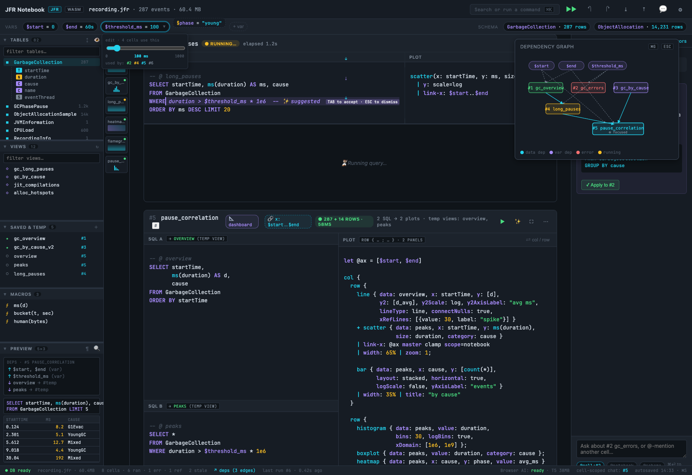

**Before:** `color: var(--text-mute)` on `rgba(167,139,250,.05)` — at 1× zoom the ghost was barely visible.

**After:** `color: #a78bfa` (purple) on `rgba(167,139,250,.12)` background, plus a `TAB to accept · ESC to dismiss` inline pill in solid purple.

**Why:** Ghost text needs to read as *suggestion, not error*. The purple cue maps to the existing "AI / Browser model" colour everywhere else in the UI (slash menu icon, status bar AI label, dep-graph variable nodes). The keybind hint is the smallest possible discoverability affordance.

## 2.3 Frontmatter syntax demoed

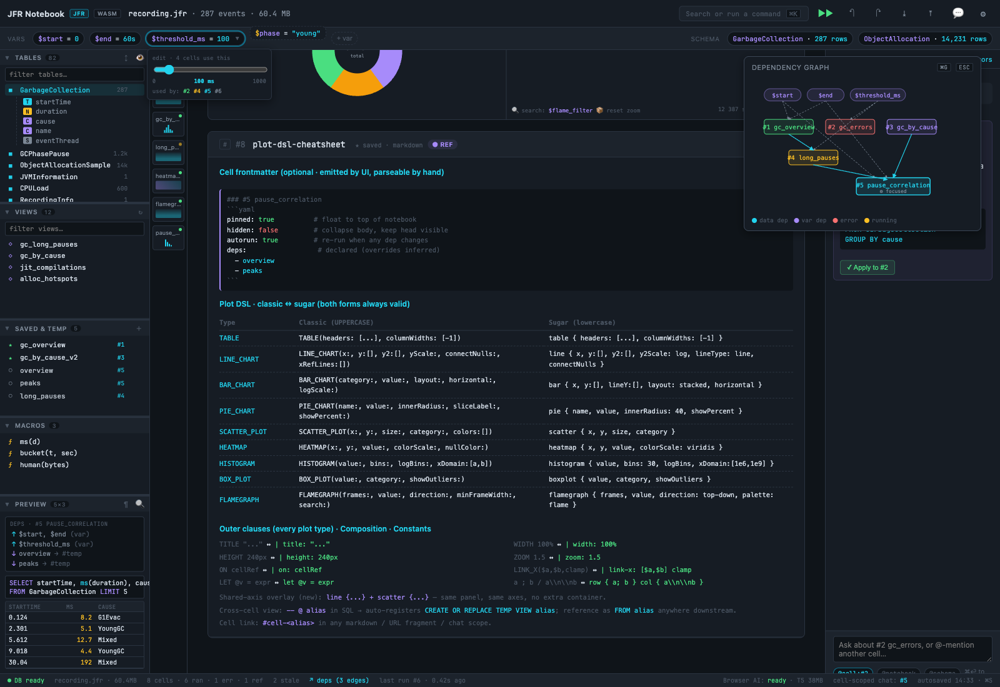

**Before:** §8 mentioned cell frontmatter but didn't show what it looks like.

**After:** Added a frontmatter YAML example to the top of cell #8 (cheatsheet), illustrating `pinned`, `hidden`, `autorun`, and `deps:` keys, with classic markdown heading + ```` ```yaml ```` fence.

**Why:** This is the **only** new fence type required for full feature parity. Showing it inline answers the "what does this look like in raw markdown?" question without the user having to read the spec.

## 2.4 Variable picker popover

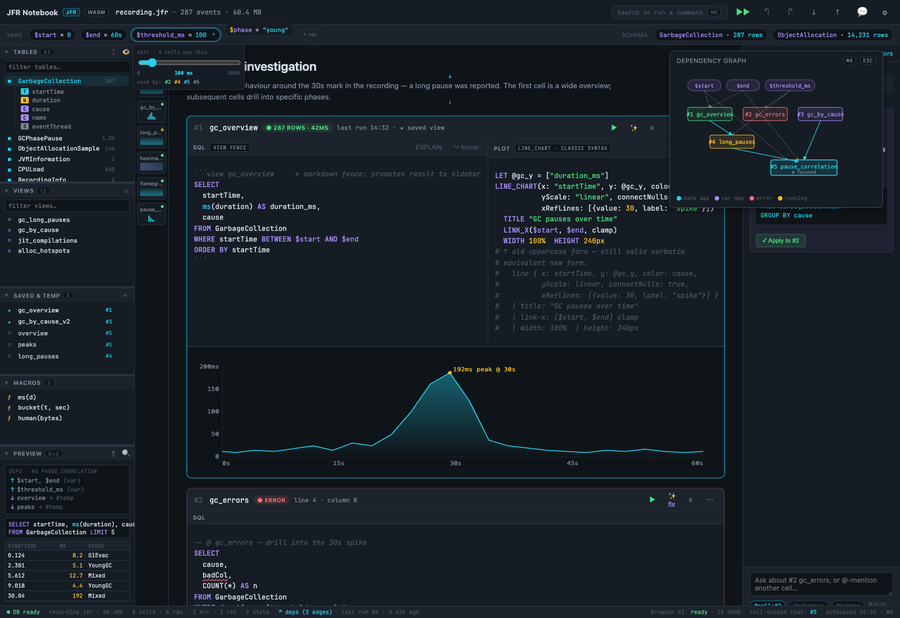

**Before:** Pinned variables sat as static chips in the varbar with no interaction affordance.

**After:** `threshold_ms` chip shows an open popover with: a slider for the value, the live-updated label `100 ms`, and chips for the four cells (`#2 #4 #5 #6`) that consume the variable.

**Why:** Variable changes today trigger silent re-runs of every dependent cell. Showing which cells *will* re-run before the user releases the slider is the difference between "fluid exploration" and "I just changed something and the whole notebook flickered."

CSS gotcha hit during this iteration: the varbar's `overflow-x: auto` was clipping the popover. Switched to `overflow: visible` + `position: relative; z-index: 4`. Fine here because the varbar is one row tall; horizontal pills wrap naturally at narrow widths.

## 2.5 Saved & Temp panel — cell-ids are jump-links

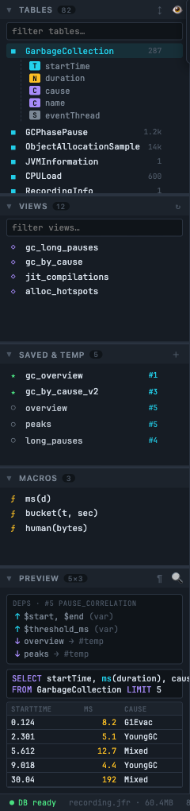

**Before:** The right-column cell IDs (`#1`, `#6`, …) were grey text — indistinguishable from row counts.

**After:** Cyan accent colour, hover state with border + light background. Tooltip `jump to cell #N`. Clicking would in production scroll the cell into view + focus its head.

**Why:** Round-tripping is fine in theory, but in practice navigating a multi-cell notebook is the most common action. A 1-click jump from "I see `peaks` in Saved & Temp" → "I'm at the cell that defines `peaks`" eliminates the search-by-Ctrl-F workflow.

## 2.6 Status bar is now informative


**Before:** `DB ready · recording.jfr · 6 cells · 4 ran · 1 error | Browser AI: ready | autosaved 14:33`

**After:** Same + `2 stale · ↗ deps (3 edges) · last run #6 · 0.42s ago | … cell-scoped chat: #5 · autosaved 14:33 · ⌘S`

**Why:** The status bar is the single line of UI the user sees at *every* moment. Three additions earn their pixels:
- `2 stale` — answers "is anything out of date?" without scrolling.
- `↗ deps (3 edges)` — clickable shortcut to ⌘G; surfaces the existence of the graph for new users who never read the keybinds.
- `cell-scoped chat: #5` — confirms which cell the chat panel is anchored to. Easy to forget when you scroll away.

## 2.7 Fullscreen affordance — left as title-only

**Decision:** Hovering `⛶` already shows `Fullscreen (⌘\)`. No inline label needed in the mockup; production will show a transient hint the first three times a dashboard cell is created.

**Why not more?** Every additional chip in the cell head reduces the SQL pane width. The cell head is already at 5 icons + 2 badges + status + meta; a sixth would push the meta off-screen on a 1280px window. Tooltip wins.

## 2.8 What's still open after iteration 2

See §11 for the canonical open-mockup list — items from this iteration's review (mobile, light theme, DnD reorder, multi-select) are folded in there alongside iter-4's `$` mockup gaps.

---

# Iteration 3 — what would I tackle next?

If given another 60 minutes I'd:

1. **Mock the fullscreen dashboard modal.** Same cell, but ⛶ pressed → cell expands to fill the viewport, sidebar/chat dim to 30% opacity behind. The 4-panel `pause_correlation` dashboard is the perfect demo target.
2. **Mock a "diff view" between two runs.** Today users have no way to compare "GC pauses last hour" with "GC pauses today" except by running both, eyeballing two cells, and remembering which is which. A first-class diff cell type would unlock real workflow.
3. **Mock the slash menu's variable-snippet feature.** `/var threshold_ms` should insert a `$threshold_ms` reference with a popover to set the default value at definition time.
4. **Mock the error → fix → re-run roundtrip in one screenshot.** Show cell #2's error highlighting alongside the "fix with AI" floating action.

None of these are blocked on prior work; each is independently mockable in another 15-minute iteration.

---

*— end of iteration 2 —*

---

# Iteration 4 — making §6c survive contact with reality

§6c established that "every cross-cell coupling is a variable." Beautiful in theory; in practice four classes of question were waved past. This iteration nails each one down.

## 4.1 Performance: a brush is a hot loop

> **Iter-8 update:** §4.1 is the single-hop story. For chains, the budget and cancellation rules are superseded by §8.1 (chain budget) and §8.5 (cascading cancellation). The debounce/sample/abort mechanics here still apply per hop.

A naive implementation of §6c.4 re-runs the downstream SQL on every `mousemove`. With JFR datasets routinely in the 1M–10M row range and DuckDB-WASM running on the main thread, that's a recipe for a janky drag that locks the browser tab.

The redesign commits to four mitigations, in order of how much they buy:

**1. Debounce + leading-edge fire.** Live-variable writes are debounced at the **producer** (10 ms RAF tick by default, configurable per variable via frontmatter `live: { $brush: { debounce: 30 } }`). The *first* write of a drag fires immediately so the user sees feedback; subsequent writes coalesce. Drag release always flushes.

**2. Query cancellation.** Every downstream SQL run that was triggered by a `$` change carries an `AbortSignal` keyed to `(cell, var-version)`. A newer write of the same variable cancels the in-flight query for the same `(cell, *)`. DuckDB-WASM's `cancelPendingQuery()` is the underlying mechanism; we route it from the renderer down. The status pill on a cell shows `▣ cancelled` for ~200 ms when this happens, so the user *sees* the work was thrown away — invisible cancellation is a debugging nightmare.

**3. Sampling on the producer side.** A `line` panel rendering 5M points is *already* downsampling for display (the existing renderer uses `largest-triangle-three-buckets`). The brush operates on **screen-space**, then maps back to data-space at release. Mid-drag, downstream cells query `WHERE startTime IN $brush` against the *full* table; at release, an optional `final: true` rerun can swap to a more expensive query (e.g. with `ORDER BY`). The opt-in lives in plot config:

```text
line { … } | brush: { mode: progressive, final-query: q_high_res }
```

Default mode is `live` (same query throughout). `progressive` is for the case where the live preview should be cheap and the final should be precise.

**4. Materialized-CTE caching.** Cross-cell views (`-- @ alias`) are already TEMP VIEWs, which DuckDB plans every time. For hot views in a `$brush` consumer chain, the formatter can suggest `materialize: true` in the cell's frontmatter — this rewrites the registration to `CREATE OR REPLACE TEMP TABLE` (materialized once, queried fast). Stale propagation marks the table for refresh; the user sees a `↻ rematerializing` pill. Not automatic because materialization costs RAM; the suggestion fires only when the cell appears in the hot path of a `$` re-run loop.

**Justification:** these aren't optimizations to defer — without them, every screenshot in §6c is a lie. The first time a user drags on a 5M-row line chart and the tab freezes for 800 ms, they will turn off live coupling forever.

## 4.2 Producer conflicts: who writes `$zoom`?

§6c.2 lets a panel declare `link-x: $zoom master`. What if two panels in two different cells both declare `master` on the same variable scope?

Three rules, in order:

1. **Parse-time error if exact match.** Two `master` declarations on the same `$var` (same variable name — and under iter-16, the name *is* the scope) is a hard error, caught when the notebook loads. The dep graph shows both producers in red; the affected cells get a `⚠ conflicting master` chip linking to the other declaration. Execution proceeds with **neither** writing the variable until resolved (read-only mode for `$zoom`).
2. **Implicit `last-write-wins` at different scopes.** Two masters at different scopes coexist when they use *different variable names* — e.g. `$zoom` (notebook-wide) and `$panel_a_zoom` (one panel's private name). Scoping is by name (iter-16); no conflict.
3. **`master` is sticky to the writer's user gesture.** If two panels are both `master` candidates (e.g. user explicitly resolved the conflict by demoting one to no-master but the dep graph still records the option), the variable's value comes from whichever panel the user *most recently interacted with*. The status bar shows `$zoom ← #3 (last drag)`.

Multiple **brushes** on different panels is the more interesting case because brushing is naturally per-panel:

- Each producing panel owns its own brush, addressable as `$<alias>.brush` (see §IT14.3). Downstream cells `WHERE col IN $<alias>.brush` to pin to a specific source.
- A cell that listens to bare `$brush` sees the **most recent** brush across all panels; the dep graph draws a live edge from every brush-producing panel into that cell, fanned in, and re-attaches the active edge to the most-recent producer as the user moves between panels.

**Justification:** "two masters" is a real-world hazard the moment two devs collaborate on a notebook. Surfacing it at parse time is much cheaper than diagnosing "why does my zoom jump erratically" at runtime.

## 4.3 Errors in live coupling

Live coupling multiplies error surface. Three failure modes the spec must handle:

### 4.3.1 Empty-result mid-drag

User drags a brush into a 50-ms window where there are zero events. Downstream cell's SQL returns 0 rows. Today's renderer would show an empty plot — visually indistinguishable from "still loading" or "broken upstream."

Fix: the renderer distinguishes **three empty states**:

- `no-data` (query returned 0 rows): plot area shows a faint `⌀ no rows in current brush` label, axes preserved at the brush extent. Cell status stays green.
- `awaiting` (query in flight, no result yet): plot area dims to 60% opacity; previous result stays visible (ghosted). Cell status: yellow.
- `error` (query threw): red overlay with the error message. Cell status: red.

The three states are visually distinct, so a quick drag through sparse data doesn't look like a bug.

### 4.3.2 Upstream cell errors while a $-consumer is live

Cell A is the brush source. Cell B reads `$brush.x0..x1`. The user edits cell A's SQL into a syntax error.

Today: B silently continues to render with the *last good* brush value, which is now visually disconnected from a broken A.

Fix: `$` variables carry a `producer-status` shadow field. When the producer cell goes red, every consumer cell gets a yellow `▴ source #A is in error` chip — *not* red itself. The consumer's plot keeps rendering with the last good value (so the user can still work), but the lineage is honest about being stale.

### 4.3.3 Cycles introduced by live coupling

A cycle through static vars is caught at parse time (§6). A cycle through `$` vars is harder: cell A writes `$brush`, cell B writes `$hover` based on A's brush, cell A reads `$hover` to drive its own selection. The cycle only manifests at runtime.

Fix: the runtime maintains a write-fence per `$` variable. A write that is causally downstream of itself (tracked by a small lamport timestamp on `$` updates) is *dropped* with a console warning + a single status-bar pill `⚠ live cycle broken`. The dep graph marks the cycle edge in red even though the static graph wouldn't have spotted it. The user can click the pill to see the cycle chain.

**Justification:** silent cycles in reactive systems are the most reliably traumatic class of bug. A loud break + a one-pill summary is the right tradeoff over invisible drop-then-rerun-storm.

## 4.4 Undo, history & time-travel

`$` vars change tens of times per second. Plot edits change once a minute. Cell deletions change once an hour. If every event were a single undo step, ⌘Z would be useless ("undo a brush pixel").

The redesign defines **three undo grains**:

| Grain | Examples | ⌘Z keystrokes |
|---|---|---|
| **Edit** | typing in SQL, plot config change, frontmatter key change | granular per-token (CodeMirror history) |
| **Structural** | cell add/delete/reorder, view promotion, run command | one keystroke per action |
| **Interaction** | brush, zoom, hover, selection | one keystroke per **gesture** (mousedown→mouseup), not per movement |

⌘Z walks **all three grains, newest first**. ⌘⇧Z redoes. A small history strip in the status bar (`◀ 3 edits · 1 brush · 2 cell ops`) shows the last 6 entries on hover, color-coded by grain.

> **See §IT12.5** (iter-12) for the formal grain table (edit = one CodeMirror entry, structural = one notebook mutation, interaction = one *completed* gesture) and the ASCII mockup of the **⌘⌥H interaction timeline** — horizontal strip with shape-coded events (● edit, ■ structural, ● gesture-colored), hover-to-scrub, click-to-pin, drag-to-select-range-for-replay.

A separate **interaction history**, distinct from undo, lets the user *replay* live-coupling state:

- ⌘⌥H opens a side-panel timeline at the bottom of the main column.
- Each interaction is a node; hovering scrubs the notebook to that state without committing.
- Clicking pins that state — all `$` vars freeze at those values, just like "pause live coupling" (§6c.6), but seeded from the historical event.
- ⌘⌥H again to dismiss; live state resumes from the current `$` values.

**Why separate from undo:** scrubbing back through brush positions is exploratory ("when did I see that anomaly?"), not corrective. Conflating it with ⌘Z would mean ⌘Y after a scrub destroys the structural undo stack. Two histories, one keybind family.

**Persistence:** the interaction history is session-only by default. A frontmatter `record_interactions: true` persists the last N gestures into the notebook itself — useful for incident replay ("here's the brush sequence I used to find the leak"). Stored as a `### #N interactions` cell, hidden by default, written by the UI.

**Justification:** the JFR use case has a strong "replay the analyst's workflow" gravity. The interaction history is the lightest-weight version of that without committing to a full collaborative-replay system.

## 4.5 Exports beyond markdown

Markdown round-trip (§8) is the file format. But "share a chart in Slack" and "drop a CSV into a ticket" are equally common JFR workflows. Three new exports, all available from the cell head's `⋯` menu:

| Export | Trigger | What ships |
|---|---|---|
| **PNG of panel** | `⋯ → Copy as image` | One panel as PNG to clipboard. For dashboards, each panel exports independently; full-cell screenshot via `⋯ → Copy dashboard`. Rendered through `html-to-image` against the panel's SVG/canvas. |
| **CSV of result** | `⋯ → Copy as CSV` | The query result, exactly as displayed. Pagination is preserved (you get the page you see); a "Download full result" subitem dumps everything. |
| **Shareable URL** | `⋯ → Copy link` | URL fragment encodes the notebook path + cell alias + frozen `$` snapshot. Recipient opens it and lands on the same cell with the same brush/zoom values. |

> **See §IT12.6** (iter-12) for the *notebook-level* `⋯` menu — a sibling of the per-cell menu — that adds **HTML/PDF static snapshot** export. HTML is a single self-contained file with inline SVG plots, an SVG dep-graph appendix, and live coupling frozen at export time; PDF prints over the HTML snapshot with cell-boundary page breaks. Neither replaces the `.md` round-trip from §8 — they are *snapshots* beside the share-link.

**The shareable URL is the real win.** It encodes the *state* of an interactive exploration, not just the notebook. Under iter-15 §IT15.4 (refined by iter-16 §IT16.5) the fragment uses a `LiveRangeValue`-faithful encoding:

```
notebook.md#cell-pause_correlation?$zoom=eyJraW5kIjoicmFuZ2UiLCJheGVzIjp7Ingi…&$gc_overview.brush=eyJraW5kIjoicmFuZ2UiLCJheGVzIjp7…
```

Each value is `base64url(JSON.stringify(liveRangeValue))` — round-trips axes, producer, and multi-dim shape losslessly. See §IT15.4 + §IT16.4 for the encoder/decoder details.

The URL is **idempotent**: clicking it again restores exactly the same state. This is the closest the design gets to "publishing a finding" without a separate publishing system.

**Size limits:** the fragment caps at 2 KB; longer states (e.g. multi-row selection) get a short hash and a sidecar file `notebook.md.shares/<hash>.json` that the UI loads on click. Both forms round-trip.

**Justification:** today the path from "I found something interesting" to "I showed it to a colleague" is screenshots-in-Slack, with no way to navigate back to the source. State-encoded URLs make every finding *re-explorable*. The PNG/CSV options exist because they're 80% of the actual workflow even after URLs land — sometimes you really do just want the picture.

## 4.6 Mockup gaps for §6c

§6c is text-only; **nothing in the screenshot set demonstrates it yet**. (Also rolled into §11.) The table below is the working punch list:

| §6c topic | What's missing |
|---|---|
| Two sigils (`$x` notebook-local / `$$x` workspace-global) | varbar chips colour-coded by activity (static vs currently-driven), not by sigil |
| `$zoom` synced across panels | two cells with their x-axes locked, mid-zoom |
| `$brush` source + consumer | brushed-region overlay on source, `◉ live` dot on consumer head, downstream plot updated |
| `$hover` halo on cross-cell marks | bar in one cell hovered, halo on heatmap stripe + pie slice in others |
| `$`-diamond + `live` edge | regenerate `10-dep-graph.png` with the diamond + thick-dashed edges |
| Pause live coupling button | varbar with the button + a paused-state visual (greyed `$` chips) |
| Brush-origin overlay (`$alias.brush` namespaced form per iter-14) | SQL with the namespaced-producer `IN` clause highlighted |
| Interaction history timeline (§4.4) | bottom-of-column strip with gesture nodes |
| Shareable URL pop-up (§4.5) | toast/popover with the encoded URL + copy button |

Eight to nine images; one afternoon. The text-first approach was right for getting to the abstractions (the `$` sigil, the brush-origin filter), but the mockups are the eyes-on review surface.

## 4.7 What this iteration deliberately punted

Three things considered, dropped from this pass:

- **Collaborative cursors / multi-user `$`.** Two users on the same notebook with conflicting brushes is a *very* hard problem (CRDT or OT for live-variable state). Out of scope; notebooks remain single-user until the file format alone has settled.
- **Server-side query execution.** Everything assumes DuckDB-WASM in-browser. JFR files routinely hit 500 MB+, which is the upper edge of what WASM can hold. A "server mode" with the same DSL is plausible but architecturally separate; this redesign doesn't pretend to spec it.
- **AI agentic loops over live state.** "Watch this brush and tell me when something interesting happens" is a future feature. The chat panel in §7 is request/response only. The `$` system *would* support it (an agent could subscribe to `$brush` as easily as a SQL cell), but specifying the UX is its own iteration.

These three are flagged not because they don't matter but because answering them well requires their own design rounds.

---

*— end of iteration 4 —*

---

# Iteration 5 — adversarial review

Four iterations of "yes, and." This one is "no, but." Each item below is a criticism I'd field if I walked this doc into a design review of skeptical senior engineers. I rate each: **🔴 likely-fatal**, **🟡 will-bite-us**, or **🟢 acceptable-but-flagged** — and either propose a fix or accept the risk explicitly.

## 5.1 🔴 The mockup source has bit-rotted

The doc opens with *"Every section quotes the actual mockup at `/tmp/jfr-mockup/index.html`"*. That file does not exist; `/tmp` is wiped on reboot. The screenshots in `redesign-plan/` are now the only artifact, and they can't be regenerated, extended, or annotated.

This isn't a design flaw — it's a process flaw. But it's the **largest** risk in the document because the §11 punch list and the §4.6 mockup-gap table both assume "we can iterate on the mockup." We cannot, right now.

**Fix:** before any of phase A starts, reconstruct the source HTML from the screenshots into `redesign-plan/index.html` and check it in. Three benefits: (a) iterations can resume; (b) the source HTML is itself a markdown-friendly artifact that documents the visual spec; (c) the existing 12 screenshots become a regression set against the source.

**Cost:** ~half a day to reconstruct from PNGs. Not free, but cheap insurance.

## 5.2 🟡 The `$` sigil overloads the variable system past the point of clarity

§6c argues "everything is a variable" is elegant: one mechanism for static config (`$threshold_ms`) *and* live UI state (`$brush`). Both flow through the same dep graph, same persistence path, same popover.

The counter-argument: these aren't actually the same thing. Static vars are *intentions* (the user typed `$threshold_ms = 100`). Live vars are *consequences* (the user dragged a mouse). Conflating them produces:

- **Cognitive load on the syntax.** Earlier iterations carried three sigils (`$`, `$$`, `$!`); user-test feedback was that this was one more than most users will hold in working memory. Iter-16 collapsed this to two: `$x` notebook-local, `$$x` workspace-global. Liveness became a property of *use* (any `$x` referenced as e.g. `link-x: $zoom` is live), not a sigil distinction.
- **Action at a distance.** A SQL cell that reads `$brush.x0` will produce different results 100 ms apart, with no edit. This is a feature, but it's also the *exact* property that makes reactive UIs hard to debug. The pause-coupling button (§6c.6) admits as much.
- **Persistence ambiguity.** §6c.8 has to spell out "the binding persists but the value doesn't" for `$`. That's a different lifecycle from every other variable, hidden behind the same sigil.

**Severity assessment:** the design *works*, but the abstraction leaks. A simpler model — keep `$var` as the only variable, add a separate `signal {…}` block for interactive coupling — would be more honest about the lifecycle. I'm not proposing the rewrite because the cost of throwing away §6c is too high, but the unified-sigil approach is a bet we should know we're making.

**Mitigation:** §6c.6's varbar must visually segregate `$` chips from `$` chips (different row, or distinct background). Don't pretend the lifecycles are the same just because the lookup syntax is.

## 5.3 🟡 The dep graph is going to be unusable on real notebooks

§6 and §6c.7 assume a graph that fits comfortably on screen. The actual JFR-query corpus today has notebooks with 30+ cells, each potentially producing or consuming 2–3 views. Five edge types, fan-in/fan-out > 5, plus diamond nodes for `$` vars, plus the pulsing-while-changing animation.

Graphs over ~20 nodes with > 30 edges become hairballs. The "filter edge types" legend (§6c.7) is mentioned in one sentence but is doing most of the work.

**Concrete problems:**

- **No layout algorithm specified.** "Rough topological order" (§6) is hand-wavy. Topological sorts produce many valid orderings; without a stable layout, the graph rearranges on every ⌘G open and the user loses spatial memory.
- **Edge crossing not addressed.** With 5 edge types and fan-in, crossings will be common. No mention of curved edges, edge bundling, or whatever else stops it being unreadable.
- **The diamond pulse is a smell.** Animating a node every 200 ms while *anything* live is changing means the graph is constantly in motion. Users with motion sensitivity will hate this. Users without it will still find it distracting.

**Fix:** before phase E builds the live-coupling UI, the dep-graph layout problem needs its own spike. Concretely: pick an existing graph library (e.g. `cytoscape.js` with `dagre` layout), demonstrate on a synthetic 30-cell notebook, accept it as the baseline. Drop the pulse animation; replace with a faint static halo on `$` nodes whose value has changed in the last 1 s.

## 5.4 🟢 The canonical formatter will lose at least one fight with users

§8b makes "format on save, always, no opt-out except a global toggle" the default. The trade-off accepted is: kill git-diff churn, accept that some users hate having their formatting touched.

This is the right call but it's worth being explicit: **the formatter will produce a configuration that some user finds wrong, and that user will rage**. Likely flashpoints:

- **Key order inside plot panels** (§8b.2). "Data first, axes next, encodings last" is opinionated. A user who reads `category` before `data` will feel patronized.
- **Comma placement** (§8b.1). Leading vs trailing in long `SELECT` lists is a religious war.
- ~~**Lowercase-sugar vs UPPERCASE-classic** persistence.~~ (Resolved by iter-13 §IT13.1: classic deleted entirely; only sugar remains. No dual-form ambiguity.)

**No fix.** This is an acceptable cost. But §8b should explicitly say "we accept that ~5% of users will hate one of these choices, and we're not negotiating individual rules" — otherwise the project will spend its first six post-launch weeks adjudicating bikesheds.

## 5.5 🟡 "DuckDB-WASM on the main thread" is the assumption holding up the whole design

§4.7 punted server-side execution. Fine for v1. But every performance claim in §4.1 (debounce, cancellation, sampling, materialization) assumes single-process DuckDB-WASM. That has hard limits:

- **Memory ceiling.** WASM has a 4 GB address space (on 64-bit; less on 32-bit). A 500 MB JFR file expanded into DuckDB tables can easily push 2–3 GB. Two JFRs simultaneously is out of reach.
- **Main-thread contention.** DuckDB-WASM can run in a Web Worker, but the existing app does not (verified by reading `DataContext.executeQuery` — single shared connection on main thread). Mid-drag SQL on a 5M-row table will block the brush itself, defeating the very interaction the design celebrates.
- **No spillover story.** What happens when a brush re-run OOMs? Today: tab dies. The spec is silent.

**Fix needed before phase E:** the live-coupling code should be built on top of a worker-based DuckDB connection from day one. This is a step-zero refactor (probably 1–2 weeks of work) that §12 currently doesn't list. It belongs at the start of phase A, not after phase E discovers it.

## 5.6 🟢 The chat panel is doing two contradictory jobs

§7 dockes the chat to the right with cell scope; §6b.2 says the chat can author SQL that lands in arbitrary cells. So the chat is both:

- A **reference tool** ("explain this query"), scoped to one cell.
- An **author tool** ("write me a query that joins X and Y"), which mutates the notebook.

These are different mental models. Reference tools should be unobtrusive and scoped tight. Author tools need to surface diffs, undo, and provenance.

The design papers over this by saying "accept the AI's output into a cell"; in practice, users will copy-paste from chat into a cell, edit, and re-ask. The clean cell-scoped boundary will dissolve immediately.

**Acceptable risk** because: the existing app has the same problem and it's not blocking adoption. But the design should not *claim* the cell-scope is clean. Specifically, §7 should add: "chat output can be accepted into the focused cell *or* a new cell; the user's choice is preserved as a sticky default per notebook."

## 5.7 🔴 The migration story is missing entirely

The doc says "old notebooks parse verbatim" three times, and points to the BUGS.md punch list in passing. But:

- **What happens to the 70-issue BUGS.md punch list?** Some of those are closed-by-redesign, some aren't. Without an explicit reconciliation, the redesign and the bug list will drift.
- **What's the per-version migration path?** A user on v0.x opens a notebook that was saved by v1 (with the new `view` fence and `style:` frontmatter). Without a version field, parsing falls back to "looks like an unknown fence, render as text" — silent data loss.
- **No deprecation timeline.** UPPERCASE classic form is supposedly forever-supported, but is it? Five years from now, with sugar being default, will the lex+parse for UPPERCASE survive the next refactor?

**Fix:** add a §14 *Migration* section before phase A starts. Three things in it: (a) cross-link every BUGS.md item to a redesign section that closes it or explicitly leaves it for v2; (b) introduce a `version:` frontmatter field (default `1`); (c) commit to keeping UPPERCASE supported through at least v2.x, with a written deprecation policy.

## 5.8 🟡 The doc has become a designer's document, not an engineer's

930 lines. Five iterations. The reader-facing TOC and TL;DR are now better than the working sections in the middle. But a developer about to implement phase A doesn't need the TL;DR — they need:

- A schema for the AST (mentioned, not specified).
- A grammar for the new DSL in something parseable (BNF, PEG, or sample test cases).
- An IPC contract between the formatter and the editor.
- A type definition for the dep-graph data model.

The doc gestures at all of these and specifies none of them. Phase A will start with three weeks of "what does the parser actually return?" arguments.

**Fix:** before phase A starts, spawn a sibling doc `REDESIGN_INTERFACES.md` (or a `/spec/` subdirectory) with: (a) the AST schema as a TypeScript type, (b) the formatter input/output contract, (c) the dep-graph node/edge types, (d) the new fence grammars. The current doc is the *what and why*; the sibling is the *how*.

This is the same complaint that's lurking in §5.5 (memory model not specced) and §5.3 (no graph layout algorithm chosen). They're all symptoms of "this is a strategy document being used as an implementation document."

---

## 5.9 Severity summary

| # | Issue | Severity | Status |
|---|---|---|---|
| 5.1 | Mockup source bit-rotted | 🔴 | ✅ Reconstructed at `redesign-plan/index.html` |
| 5.2 | `$` sigil overloads variable model | 🟡 | ✅ §6c.6 segregates static/live chips in two-row varbar |
| 5.3 | Dep graph unusable at scale | 🟡 | ✅ §6c.7 commits to cytoscape.js+dagre, drops pulse, adds focus mode |
| 5.4 | Formatter will provoke complaints | 🟢 | ✅ §8b.5 makes "doesn't negotiate per-rule" explicit |
| 5.5 | DuckDB-WASM main-thread ceiling | 🟡 | ✅ §12 phase A step 0 = "DuckDB on a Web Worker" |
| 5.6 | Chat panel does two jobs | 🟢 | ✅ §7 acknowledges reference/author duality with sticky toggle |
| 5.7 | Migration story missing | 🔴 | ✅ §14 added (version field, deprecation, BUGS.md reconciliation, moment) |
| 5.8 | Doc is designer-shaped | 🟡 | ✅ `REDESIGN_INTERFACES.md` sibling spawned |

All eight items addressed in this revision. The two 🔴s (mockup source + migration) were *process* problems, not design problems — both now have artifacts on disk. The 🟡s are doc fixes or commitments the design now makes explicitly; verification falls to the phases that consume them (cytoscape graph perf in phase B, worker boundary in phase A, sibling doc maintenance ongoing).

**Note for next iteration:** the severity assessments themselves were the assessor's first pass. Phase A bring-up is the real test — if the worker boundary or migration loader prove harder than 5.5 / 5.7 estimated, revisit the rating, not just the implementation.

---

*— end of iteration 5 —*

---

# Iteration 6 — prompt view, connected filtering, new plot types

Three threads, one weave. JFR's native data shape (per-thread spans, percentile bands, cumulative pools) doesn't fit cleanly into the original 9 plot types — so we add four. The flagship interaction (brush on plot A filters table B) was demoed in §6c.4 only as hand-written SQL — so we promote it to a clickable affordance (§6c.4b). The chat panel was generating cells that silently coupled to live variables — so the proposal pane now surfaces every binding as an editable chip (§7.1). All three asks pull on the same thread: *make connected views easy to ask for, easy to see, easy to demonstrate*.

## 6.1 Four new plot types

The original 9 covered statistical summaries (histogram, boxplot, pie), time-series (line, scatter, bar), and 2D/hierarchical (heatmap, flamegraph, table). JFR's domain demands four more.

### 6.1.1 `gantt` — per-thread spans on a time axis

The highest-leverage addition. JFR is fundamentally about spans: thread states, GC phases, lock contention windows, allocation bursts. Today these get squashed into bar charts that lose the temporal structure.

```text
gantt { data: thread_states,
        x: startTime, end: endTime,
        lane: threadName,
        color: state,
        label: state }
| title: "Thread state timeline"
| height: 320px
| link-x: $zoom
```

**Sugar form** above. Classic form:

```text
GANTT_CHART(x: "startTime", end: "endTime",
            lane: "threadName", color: "state", label: "state")
  TITLE "Thread state timeline"
  HEIGHT 320px
  LINK_X($zoom)
```

- **`lane`** is the discrete y-axis (one row per distinct value). Sorted alphabetically by default; `laneOrder: [<list>]` overrides.
- **`color`** drives span fill (categorical or by SQL value); pairs with the existing `palette:` clause.
- **`label`** is optional in-span text; falls back to empty if the span is too narrow.
- **Brush behaviour:** drag horizontally to set `$brush = {x0, x1, cell}`; drag vertically across lanes to set `$brush.lanes = ['Thread-7', 'Thread-12']`. The lane dimension lets a gantt drive *two* filters in one gesture — see §6c.4b source/sink table.
- **Hover behaviour:** sets `$hover = {x, lane, cell}`. Other panels with matching `lane` data render the halo on the corresponding span.

**Justification:** asking "where was Thread-7 blocked between 12:30 and 12:33?" requires gantt. Faking it with a colour-encoded bar chart loses the span endpoints, which are the entire point of the question.

### 6.1.2 `area` — cumulative time-series (with `stacked` / `stream` variants)

Stacked area is the canonical shape for "memory pool occupancy over time" or "allocations-per-class as a percentage." The line chart already supports this awkwardly via `lineY: [a, b, c]` overlays; `area` makes it a first-class form.

```text
area { data: pool_occupancy,
       x: timestamp,
       y: [eden, survivor, old, metaspace],
       layout: stacked,           // stacked | stream | overlay
       palette: heap-pools,
       fillOpacity: 0.7 }
| title: "Heap pool occupancy"
| link-x: $zoom
```

- **`layout: stacked`** — values sum on the y-axis (cumulative). Default.
- **`layout: stream`** — symmetric stacked (centred), the streamgraph form. Useful when *changes in proportion* matter more than absolute totals.
- **`layout: overlay`** — areas drawn independently with transparency, useful for comparing two or three series.
- **`fillOpacity`** — 0–1, default 0.7. The line on top of each area is always at 1.0.
- All `link-x` / `link-y` / `brush` clauses work identically to `line`.

**Justification:** today users emulate this with `line { y: [a, b, c] }` and lose the stacking semantics, which makes "did the old gen grow because eden shrank or because heap grew?" hard to read. `area { layout: stacked }` makes the question visually answerable.

### 6.1.3 `range` — candlestick / percentile band

Latency dashboards need p50/p95/p99-over-time as ribbons. Today this requires three line charts overlaid, with manual colour and stroke discipline.

```text
range { data: latency_quantiles,
        x: bucket_start,
        bands: [
          { low: p50, high: p99, label: "p50–p99", opacity: 0.2 },
          { low: p90, high: p95, label: "p90–p95", opacity: 0.5 }
        ],
        line: p50,
        color: cause }
| title: "Request latency"
| height: 220px
```

- **`bands: [...]`** — ordered list of ranges drawn as filled ribbons. Each band has `low`, `high`, optional `label` and `opacity`.
- **`line:`** — optional centreline (typically the median). Drawn on top of the bands.
- Falls back to candlestick semantics if `bands` has exactly one `{low: low_price, high: high_price}` plus optional `open`/`close` — the same DSL covers finance-shaped data without a separate type.

**Justification:** "show me where p99 spiked relative to p50" is the question latency dashboards exist to answer. Building it from three `line` overlays works but is fragile (colour order matters, stacking order matters, legend collapses). One `range` panel encodes the intent.

### 6.1.4 `sparkline` — inline plot per table row

Sparklines are *not* a top-level plot type. They only appear inside a `table { columns: [...] }` column spec. Trying to write `sparkline { ... }` as a standalone cell is a parse error.

> **See §IT13.8** (iter-13) — sparkline is confirmed as a `TableColumn.kind`, never a `PlotType`. The `PlotType` union does not contain `sparkline`.

```text
table { data: hot_methods,
        columns: [
          { kind: text,      field: methodName,  width: -1 },
          { kind: number,    field: total_calls, width: 80, align: right },
          { kind: sparkline, field: call_rate_over_time,
            x: bucket, y: rate, width: 120, height: 24,
            stroke: cyan },
          { kind: number,    field: avg_ms, width: 60, align: right }
        ] }
| title: "Hot methods"
| height: 360px
```

- **`field`** for a sparkline column is a SQL column whose values are arrays of `{x, y}` objects (or any shape with the named `x`/`y` keys). DuckDB's `LIST(STRUCT_PACK(...))` aggregation produces this naturally.
- **`stroke`** — line colour. `area: true` switches to a filled mini-area. `bars: true` switches to a mini-bar chart (one bar per value).
- **No interaction.** Sparklines do not participate in `$hover` / `$brush` / `$zoom`. They're a glanceable density, not an interactive surface.
- **Why a `kind:` on every column.** Today `table { headers, columnWidths }` is a flat list of strings. The iter-6 form needs richer per-column metadata for sparklines — `kind` makes that explicit and leaves room for future column kinds (`progress`, `chip`, `heatcell`).

**Justification:** "list of hot methods, each with its call-rate trend over the recording window" is a real JFR question. Today it requires either a wide grid of tiny line cells (visually ugly, slow to render, no row alignment with the table) or one table + one line chart, mentally joined. Sparklines collapse it to one cell.

**Backward compatibility for `table`:** the existing flat `headers: [...]` + `columnWidths: [...]` form remains valid and parses to the new `columns: [{kind: text, ...}, ...]` shape automatically. The formatter (§8b.2) prefers the new form when the cell uses any `kind != text` column; otherwise it emits the legacy form. No saved notebook breaks.

---

## 6.2 §6c.4b — Filter binding as a first-class affordance

> **See also §7.1 (composition)** for what happens when a cell has more than one chip, **§7.3 (saved filters)** for reusing a binding across cells, and **§7.4 (producer conflicts)** for the rules the chip popover enforces at chip-add time.

> **See §IT14** (iter-14): the brush-binding language is `WHERE column IN $alias.brush`. The chip generator emits this compact form, which is what users type — there is no longer a verbose form to paper over.

Under iter-16, the compact form `WHERE startTime IN $gc_overview.brush` is what users *actually type*. The chip's role isn't "ergonomic shortcut for verbose SQL" — it's **discoverability for which producer to bind to**. Most users won't recall which cell aliases produce a brush, especially in a 30-cell notebook; the chip surfaces the catalog of bindable producers right next to where the filter clause will land.

Iter-6 promotes the pattern to a UI affordance. Every cell capable of being a filter consumer gets a `+ filter from…` chip in its header, next to the alias and dep-graph dot.

### 6.2.1 The "+ filter from…" chip

```
┌──────────────────────────────────────────────────────────────┐
│ ### #4  long_pauses    [ + filter from… ]    ▣ idle   🔗 1   │
├──────────────────────────────────────────────────────────────┤
│ ```sql                                                       │
│ -- @ long_pauses                                             │
│ SELECT startTime, duration_ms, cause, eventThread            │
│ FROM gc_pauses                                               │
│ WHERE duration_ms > $threshold_ms                            │
│   AND startTime IN $gc_overview.brush             · generated │
│ ```                                                          │
└──────────────────────────────────────────────────────────────┘
```

Clicking the chip opens a popover:

```
┌─ Filter from ──────────────────────────────────┐
│  Source cell:                                  │
│    ● #1 gc_overview        (line chart)   ✓   │
│    ○ #6 pause_correlation  (dashboard)        │
│    ○ #9 thread_timeline    (gantt)            │
│                                                │
│  Variable:                                     │
│    ● $gc_overview.brush  (x-range)           │
│    ○ $gc_overview.zoom   (x-range)           │
│    ○ $selection          (row picks)         │
│                                                │
│  Map to columns:                               │
│    x-range → [ startTime ▼ ]                  │
│                                                │
│         [ Cancel ]    [ Add filter ]           │
└────────────────────────────────────────────────┘
```

On confirm, two things happen:

1. The cell's SQL gets two new lines appended to its `WHERE`, each tagged with a faint `· generated` marker in the editor gutter. The marker is a CodeMirror line widget (`generatedFilterMarker.ts`); it tells the user *and* the formatter "this is bound to a chip, don't hand-edit."
2. The cell's frontmatter gains a `filter_from:` key:

   ```yaml
   filter_from:
     - source: gc_overview
       variable: $brush
       columns: { x: startTime }
   ```

   This is the round-trip surface: the markdown export carries the binding declaratively; reopening the notebook reconstructs the chip from the frontmatter, not by re-parsing SQL.

**Hand-editing the generated lines is allowed but breaks the chip.** If a user edits the `· generated` line, the chip flips to `⚠ filter from… (modified)`. The frontmatter entry stays but the editor surface shows it's out of sync. One click on the chip offers `regenerate from binding` (overwrites the edit) or `unlink` (deletes the frontmatter entry, keeps the SQL). This is the same opt-out pattern as §6b.1's promote-to-view chip: the system stays out of the user's way if they want to take over.

### 6.2.2 Source → sink compatibility matrix

Not every plot can drive every consumer. The popover only shows compatible sources/variables:

| Source plot type | Can drive `$brush` as | Can drive `$selection` as |
|---|---|---|
| `line` / `area` / `range` | x-range | — |
| `scatter` / `heatmap` | 2D box (x-range + y-range) | — |
| `histogram` | x-range (bin span) | — |
| `bar` / `pie` / `boxplot` | category list (selected bars/slices) | — |
| `gantt` | x-range, lane list, or both | — |
| `flamegraph` | frame-path prefix | — |
| `table` | — | row-id list |

Consumer side: any SQL cell can accept any of these. The mapping step in the popover handles the "x-range needs a time column, lane list needs a thread column" wiring; the popover infers the obvious column when the consumer's SQL has only one timestamp/string column of the right type, and asks otherwise.

### 6.2.3 Two-way visibility — the chip works both ways

A cell that's a *source* of any filter binding gets a small indicator on its head:

```
### #1  gc_overview    🎯 2 cells filter from this    ▣ idle
```

Clicking the `🎯` opens a list of downstream cells with one-click "remove this binding" actions. This makes the topology legible without opening the dep graph: a glance at a cell tells you whether other cells depend on its brush.

### 6.2.4 What this collapses in the original spec

- The now-one-line SQL example in §6c.4 (`WHERE startTime IN $alias.brush`) is generated, not authored, in 90% of cases.
- The origin-pinning that was once a `$brush.cell` guard is now the namespacing in `$alias.brush` itself — see §IT14.3.
- The dep graph still draws the same live-var edge — see §6c.7. Filter chips create no new edge type, they just create new sources of the existing live-var edge.

**Justification:** the iter-5 §5.2 worry was that `$` is action-at-a-distance hidden behind a sigil. Filter chips make the action *visible* (a chip in the consumer's header points back at the source). The sigil is still the underlying mechanism; the chip is the surface that makes it legible.

---

## 6.3 §7.1 — Wire-binding chips in chat proposals

Chat (§7) authors cells that often consume `$` variables and cross-cell views. Today's spec says nothing about what the user sees *before* clicking Accept. Iter-6 fixes that.

### 6.3.1 Proposal preview, three zones

```
┌─ Chat proposal ────────────────────────────────────────────────┐
│                                                                │
│  Wire bindings:                                                │
│   ⟨ $brush ← from #1 gc_overview     [edit ▼] [unbind] ⟩    │
│   ⟨ FROM gc_pauses ← #1 gc_pauses     [edit ▼] [unbind] ⟩    │
│   ⟨ $threshold_ms ← global = 100      [edit ▼] [unbind] ⟩    │
│                                                                │
│ ─────────────────────────────────────────────────────────── │
│                                                                │
│  Code:                                                         │
│  ```sql                                                        │
│  -- @ pauses_in_brush                                          │
│  SELECT * FROM gc_pauses                                       │
│  WHERE startTime IN $gc_overview.brush                        │
│    AND duration_ms > $threshold_ms                             │
│  ```                                                           │
│                                                                │
│  Preview (5 rows):                                             │
│    [small data table]                                          │
│                                                                │
│           [ Discard ]   [ Accept into new cell below ]         │
└────────────────────────────────────────────────────────────────┘
```

Three zones, top to bottom: **wire bindings** (chips, one per external reference), **code** (the SQL/plot diff), **preview** (a small render of what the cell would produce given the current bindings).

### 6.3.2 What counts as a binding

Every external reference the generated code introduces:

| Reference kind | Example | Chip default |
|---|---|---|
| `$`-var | `$brush`, `$selection`, `$zoom` | source cell inferred from prompt context (`@cell` chip, or focused cell) |
| Cross-cell `FROM` | `FROM peaks` | the existing view named `peaks` |
| `$`-var | `$threshold_ms` | the current global value |
| `$$`-var | `$$global_x` | workspace-global — same value across all notebooks (phase F+; identical to `$x` in phase A) |

Each chip has an `[edit ▼]` menu offering:

- **Rebind to…** — opens a source picker (same component as §6c.4b).
- **Unbind** — replaces the live reference with the *current literal value*. `$brush.x0 → 1672531200` (a concrete timestamp). This freezes the dependency, useful for "I want a snapshot of this slice, not a live view."
- **Keep as-is** — the default; no change.

### 6.3.3 Prompt-time @-chips pre-fill bindings

Typing `@brush` or `@selection` in the prompt input creates a chip *before* generation. The chat then knows which source cell to bind to:

```
> show me a histogram of @brush.duration_ms
```

→ generation produces `WHERE startTime IN $alias.brush` where `alias` is the cell currently owning the brush (almost always the cell last brushed). The wire-binding row shows the chip already set to that alias; the user can rebind before accepting.

This matches the existing `@cell` and `@schema` chips from §7 — same chip aesthetic, same autocomplete dropdown, same provenance tracking. The chip set just grew by two.

### 6.3.4 Author mode vs reference mode

Iter-5 §5.6 noted chat does two jobs (reference, author) and the boundary is soft. Wire-binding chips make the boundary *visible*: chips only appear in author mode (when chat is about to land code in a cell). In reference mode ("explain this query"), the proposal pane has no chips because there are no bindings to confirm — just an explanation.

The mode flips automatically based on intent classification (a regex on the prompt; this is cheap and reliable enough). The header shows the current mode (`mode: author` or `mode: reference`) as a small toggle. Users can override.

### 6.3.5 What `last_ai_prompt:` records

When a cell is accepted from the chat panel, its frontmatter records the prompt *and* the binding decisions:

```yaml
last_ai_prompt: "show me a histogram of @brush.duration_ms"
last_ai_bindings:
  - var: $brush
    source: gc_overview
  - var: $threshold_ms
    source: global
```

This is the round-trip surface for chat provenance. The dep graph's prompt-edge from §6b.2 still works the same way; iter-6 just adds the binding list to the provenance payload so a future "redo with different bindings" affordance has the data it needs.

**Justification:** the iter-5 §5.6 "two jobs" gripe was that the panel pretends author and reference are the same workflow. They aren't. Author mode is dangerous (new code lands in a cell with live couplings); reference mode is safe (just words). Wire-binding chips make the dangerous case explicit at the moment of danger.

---

## 6.4 Cell #9 walkthrough — connected filtering, end to end

The mockup edit is deferred (see §6.6). This is the prose walkthrough that the eventual cell #9 mockup will illustrate.

**Goal:** "Show me the spans where Thread-7 was BLOCKED during the spike we just brushed."

**Step 1 — Brush the overview.** The user has cell #1 (`gc_overview`, a line chart of GC pauses over time) on screen. They drag-select a 30-second window around a spike. The live var bar (§6c.6) updates: `$brush = {x0: 12:30:15, x1: 12:30:45, cell: 'gc_overview'}`. The brushed region in cell #1 gets the cyan overlay.

**Step 2 — Open chat.** The chat panel (§7) is already cell-scoped to cell #1 (because cell #1 is focused). User types:

```
> gantt of thread states for @brush, focused on BLOCKED state
```

Chat sees the `@brush` chip; it pre-fills the wire-binding chip with `$brush ← #1 gc_overview` (§6.3.3).

**Step 3 — Review the proposal.** Three zones:

- **Bindings:** `$brush ← #1 gc_overview`, `FROM thread_states (new view, will be created)`.
- **Code:**
  ```sql
  -- @ blocked_in_brush
  SELECT threadName, state, startTime, endTime
  FROM thread_states
  WHERE startTime IN $gc_overview.brush
    AND state = 'BLOCKED'
  ```
  ```plot
  gantt { x: startTime, end: endTime, lane: threadName, color: state }
  | title: "Blocked threads during spike"
  ```
- **Preview:** 12 rows shown; gantt panel previews with three BLOCKED stripes.

**Step 4 — Adjust the binding.** User notices the proposal binds to `$gc_overview.brush` specifically. They want this cell to also accept brushes from cell #6 (the dashboard). They click the chip's `[edit ▼]` → `Rebind to…` → multi-select both cells. The generated SQL switches the namespaced reference to bare `$brush` (most-recent across the listed producers), and the chip records both aliases in the binding metadata.

**Step 5 — Accept into a new cell below.** Cell #9 is born. Its frontmatter:

```yaml
last_ai_prompt: "gantt of thread states for @brush, focused on BLOCKED state"
last_ai_bindings:
  - var: $brush
    source: [gc_overview, pause_correlation]
filter_from:
  - source: [gc_overview, pause_correlation]
    variable: $brush
    columns: { x: startTime }
```

Cell #9 gets the `🤖` glyph and a `← brush on #1 or #6` chip in its header (§6.2.3 inverse).

**Step 6 — Re-brush.** User drags a new window on cell #1. Cell #9's gantt re-renders within ~120 ms (debounce + cancellation, §5.1 of the interfaces doc). The brushed region halo follows the new selection.

**Step 7 — Save.** The notebook serializes to markdown. The `filter_from:` frontmatter is the load-bearing artifact: reopening the notebook restores the chip *without* re-parsing the SQL.

**What this walkthrough exercises:** all four iter-6 surfaces — the new `gantt` plot type (6.1.1), filter binding chips (§6c.4b), wire-binding chips in chat (§7.1), and the frontmatter round-trip that makes it survive reload. Plus the gantt's lane filter capability is intentionally *not* used in this walkthrough; that's the demo for a future cell #10.

---

## 6.5 Interface deltas (deferred follow-ups)

These belong in `REDESIGN_INTERFACES.md`, not in this plan. Listed here so the next pass on that file knows the shape; not edited in this iteration per scope constraint.

**`PlotType` union extension:**

```ts
export type PlotType =
  | 'line' | 'bar' | 'scatter' | 'histogram'
  | 'boxplot' | 'heatmap' | 'pie' | 'flamegraph'
  | 'table'
  | 'gantt' | 'area' | 'range';      // new in iter-6
```

Note: `sparkline` is intentionally **not** in `PlotType` — it's a column kind, not a plot.

**New AST types:**

```ts
export interface TableColumn {
  kind: 'text' | 'number' | 'sparkline';  // extensible
  field: string;
  width?: number;
  align?: 'left' | 'right' | 'centre';
  // sparkline-only
  x?: string;
  y?: string;
  height?: number;
  stroke?: string;
  area?: boolean;
  bars?: boolean;
}

export interface FilterBinding {
  source: string | string[];           // cell alias(es)
  variable: '$brush' | '$selection' | '$hover';
  columns: Record<string, string>;     // var-key → consumer column
}

export interface WireBinding {
  reference:
    | { kind: 'live-var'; name: string }       // $brush, $selection
    | { kind: 'global-var'; name: string }     // $threshold_ms
    | { kind: 'cell-view'; name: string };     // FROM peaks
  source: string | string[] | { literal: JsonValue };
  editable: boolean;
}

export interface ChatProposal {
  mode: 'author' | 'reference';
  bindings: WireBinding[];             // empty in reference mode
  diff: { before: string; after: string; cell: string };
  preview?: { rows: JsonValue[]; renderedAs?: PlotType };
  prompt: string;
}
```

**Gantt-specific extensions to `PanelClauses`:**

```ts
export interface PanelClauses {
  // existing fields...
  lane?: string;                       // gantt only
  laneOrder?: string[];                // gantt only
  bands?: BandSpec[];                  // range only
}

export interface BandSpec {
  low: string;
  high: string;
  label?: string;
  opacity?: number;
}
```

**Frontmatter additions to `CellFrontmatter`:**

```ts
export interface CellFrontmatter {
  // existing fields...
  filter_from?: FilterBinding[];
  last_ai_bindings?: Array<{ var: string; source: string | string[] }>;
}
```

---

## 6.6 Back-references, open items, and follow-ups

### Applied in this iteration

- §0 map references iter-6.
- §4 heading carries a note bumping the plot count from 9 to 13.
- §6c.4 has a forward-link to §6c.4b (this iter's §6.2).
- §7 has a forward-link to §7.1 (this iter's §6.3).

### Open items added by iter-6 (to fold into §11 next pass)

- **Cell #9 mockup.** The walkthrough in §6.4 is prose; `index.html` does not yet render a cell #9. ~1h of mockup work.
- **Mockup tiles for the four new plot types.** Cells demonstrating `gantt`, `area`, `range`, and `sparkline-in-table` are needed to complete the §4 plot tour. ~2h.
- **DSL cheatsheet cell #8 update.** §9 spec and the cheatsheet cell both list 9 types; add the 4 new types and the `range.bands` / `gantt.lane` clauses. ~30min. ***Iter-14/15 update: live-variable filter operators table landed in cell #8 under §IT15.5 — `IN $brush`, `IN $alias.brush`, `IN $alias.brush.x`, `IN $alias.panel.brush`, multi-dim, `IN $hover`/`$zoom`/`$selection`. The 4-new-plot-types update remains pending.***
- **Wire-binding-chip mockup in chat panel.** The chat side panel in `index.html` shows an AI-generated cell but no chips above the diff. ~1h.

### Follow-ups to other docs

- **`REDESIGN_INTERFACES.md`** — apply the §6.5 type deltas. Touches `PlotType`, adds `TableColumn`/`FilterBinding`/`WireBinding`/`ChatProposal`, extends `PanelClauses` with `lane`/`laneOrder`/`bands`, extends `CellFrontmatter`. Estimated half-day including tests.
- **`index.html`** — add cell #9, four small plot tiles for §6.1, chips in chat panel. Estimated half-day.

### What iter-6 deliberately did not do

- **No new sigils.** Filter bindings reuse `$brush` / `$selection`. No `@` sigil for "filter from."
- **No new dep-graph edge type.** Filter chips produce live-var edges, same as the underlying mechanism.
- **No mockup edits.** Scope constraint; this is a doc-only iteration. The mockup follow-ups above are explicit so the next iteration knows what to apply.
- **No formatter changes.** The `· generated` marker is a CodeMirror line widget; the formatter sees the lines as ordinary SQL. The frontmatter `filter_from:` block formats with the existing frontmatter rules.

---

*— end of iteration 6 —*

---

# Iteration 7 — variable coupling at scale

Iter-6 gave us one filter chip per binding. Iter-7 asks what happens when chips compose: two chips on one cell, chips chained through intermediate cells, chips reused across many cells, chips that fight each other, chips whose upstream just went red or empty.

The good news: most of this falls out of mechanisms already in the spec — SQL view composition, parse-time cycle detection, the live-var edge in the dep graph, the existing view fence. Iter-7 is mostly *naming the rules* rather than inventing new machinery.

## 7.1 Composition: multiple bindings on one cell

A cell can have any number of `filter_from` chips in its header. By default, multiple chips **AND** together — "rows must match all of them." This matches the narrowing mental model: a user adds a second chip to *further restrict*, not to *broaden*.

```
### #9  blocked_in_brush_or_thread7    [ + filter from… ]    🔗 2
  ┌─ filter from ──────────────────────────────────────┐
  │  ⟨ $brush  ← #1 gc_overview ⟩         [AND]     │
  │  ⟨ $brush.lanes ← #4 thread_timeline ⟩ [AND]     │
  │  ⟨ $selection ← #6 critical_methods ⟩  [AND]     │
  │                                                    │
  │  [ + add filter ]                                  │
  └────────────────────────────────────────────────────┘
```

Clicking the `AND` joiner between chips opens a small flip-menu: `AND | OR`. Switching one joiner to `OR` rewrites the joiner only; the chips themselves don't move. Mixed-precedence (`(A AND B) OR C`) needs explicit grouping: a chip can be selected with the multi-select handle on its left, then grouped with another via `⌘⇧G` — the grouped pair displays as a single nested chip. (⌘G is reserved for the dep-graph overlay; see §IT12.3.)

### 7.1.1 Frontmatter shape

```yaml
filter_from:
  - source: gc_overview
    variable: $brush
    columns: { x: startTime }
    # op omitted → AND with predecessor (or first chip)
  - source: thread_timeline
    variable: $brush.lanes
    columns: { lane: threadName }
    op: and
  - source: critical_methods
    variable: $selection
    columns: { id: method_id }
    op: or
```

Implicit AND keeps the markdown noise low for the 90% case. The first chip has no `op:` (nothing to join *to*); subsequent chips that omit `op:` default to `and`. Explicit `op: and` is allowed for clarity but the formatter drops it on save.

### 7.1.2 Generated SQL

The chips render to one `WHERE` block per cell, each line `· generated`:

```sql
SELECT * FROM gc_pauses
WHERE startTime IN $gc_overview.brush                              · generated
  AND threadName IN $thread_timeline.brush.lanes                   · generated
OR    method_id IN $selection                                      · generated
  AND $selection.cell = 'critical_methods'                          · generated
```

The OR break is on its own logical line; the formatter (§8b.1) preserves that. Hand-edits to any `· generated` line flip the chip to `⚠ modified`, same as iter-6 §6.2.1.

### 7.1.3 The "neutralize when source empty" pattern

Under iter-14's compact form, this pattern collapses: `column IN $brush` with no active brush is a tautology (returns `TRUE` for all rows). No special syntax required. A cleared brush degrades automatically to "no filter from this source." The default is "open" — a cell with three chips and no upstream activity returns the full underlying view. Chips *narrow* a result; the absence of a brush means "no narrowing." See §IT14.1.1 for the runtime-side mechanics; see §7.5 for the full lifecycle table.

---

## 7.2 Chains: transparent composition

> **See §8.1** for the chain perf budget, **§8.4** for predicate push-down across chains, and **§8.5** for cascading cancellation of in-flight hops.

A filter chip can point at any cell — including a cell that is itself filtered. Chains fall out of SQL view composition: when cell C reads `FROM B`, and B's body has `WHERE startTime IN $gc_overview.brush`, then C's `SELECT * FROM B` already inherits B's filter. No chain-walking machinery is needed at the chip level.

```
#1  gc_overview         (line chart)              brushed: 12:30-12:33
   ↓ $brush
#4  pauses_in_brush     (table, filter_from: #1)    🔗 1 from #1
   ↓ view: long_pauses
#9  blocked_in_brush    (gantt, FROM long_pauses)   🔗 2 from #1 via #4
```

Cell #9 doesn't need an explicit `filter_from: #1` chip — the filter arrives through the data path (`FROM long_pauses` where `long_pauses` is #4's promoted view, which itself filters on `$brush`). The chip system *visualizes* what's happening: cell #9's header shows `🔗 2 from #1 via #4`, hover reveals the full path.

### 7.2.1 Stale propagation across chains

When `$brush` changes:

1. #1's brush handler writes the new value (debounced, §5.1 of interfaces doc).
2. #4 re-runs (it consumes `$brush` directly).
3. #4 finishes; its view `long_pauses` is fresh.
4. #9 re-runs (its `FROM long_pauses` is stale).

The chain re-runs serially, but each hop honours `AbortSignal`: a brush gesture in flight cancels any earlier re-runs in the chain. A 5-deep chain with a 200 ms-per-hop query is 1 s end-to-end; the chip on the leaf cell shows `◉ live` for the whole duration.

**Why not parallelize?** Hops depend on prior hops by definition (each `FROM` reads the previous). Parallelization would re-run on stale views. Serial is correct.

### 7.2.2 Chain visualization

The cell head's `🔗 N` indicator is the at-a-glance count of upstream hops. Hover the indicator to see the full path:

```
🔗 2 ← #4 pauses_in_brush
       ← #1 gc_overview ($brush)
```

Hovering also highlights the chain in the dep graph (§7.6). Clicking the indicator focuses the dep graph on the chain (same "focus mode" gesture from §6c.7).

### 7.2.3 Cycles

Cycles work the same way they do today (§6 cycle bullet): A → B → A is caught at parse time, both cells turn red, execution refuses to run. Chains just give cycles more rope. A 5-cell chain that loops back to its origin is detected at the same point — the static dep graph builder runs after every save and reports them.

Live cycles (cycles through `$` writes that only manifest at runtime) are still handled by iter-4 §4.3.3's lamport-timestamp write-fence. Filter chains don't change that.

---

## 7.3 Saved filters as view fences

A team that always wants "last 5 minutes" today re-types the brush clause in every consumer cell. Iter-7 promotes this to a named, reusable artifact — by reusing the existing view fence from §5.

### 7.3.1 A view fence whose body references `$` vars *is* a saved filter

```` ```view last_5_min
SELECT * FROM jdk_GarbageCollection
WHERE startTime >= now() - interval '5 minutes'
  AND startTime IN $producer.brush
````

Consumer cells now reference `last_5_min` by name in their `filter_from` chip:

```yaml
filter_from:
  - source: last_5_min      # a saved filter, not a regular cell
    variable: (inferred from view body)
    columns: (inferred)
```

The chip popover (§6.2.1) lists saved filters in a separate section above the cell list, with a green border to match the varbar chip kind (§6c.6 iter-7 update).

### 7.3.2 What makes a view "saved-filter-shaped"

Nothing intrinsic. A view fence becomes a saved filter the moment a `filter_from:` chip points at it. The fence body can do anything; the system doesn't enforce that it must contain `$` references — a view that's *just* a static `WHERE` is a degenerate but valid saved filter ("filter to GC events only").

This means saved filters are not a new fence type. The formatter (§8b) treats them as ordinary view fences. Markdown round-trip is free.

### 7.3.3 "Save as filter" affordance

Any filter chip has a kebab menu offering `Save as named filter`. The flow:

1. User adds an inline chip on cell #9: `← brush from #1, restricted to BLOCKED state`.
2. User clicks the chip menu → `Save as named filter`.
3. A dialog asks for a name (`blocked_in_brush`).
4. The system creates a new view cell ```` ```view blocked_in_brush ```` with the extracted `WHERE` and any necessary `FROM` clauses.
5. Cell #9's `filter_from:` frontmatter is rewritten to `source: blocked_in_brush`.

The extracted view appears in the Saved & Temp sidebar panel (existing §2.5) alongside other named views — it's not a special category, it's just a view.

### 7.3.4 Materialization rules

> **Iter-8 update:** the binary "view vs saved filter" distinction here is the entry point; §8.3 promotes it to a three-tier state machine (virtual / temp-view / materialized) with an `auto` policy that flips tiers based on row count, gesture rate, and chain depth.

A regular view (no `$` references) is materialized once per session via `CREATE OR REPLACE TEMP VIEW`. A saved filter (any `$` reference) is materialized fresh on every `$` change, debounced. The materialization itself uses the same `$` debounce policy from §5.2 of the interfaces doc — there's no separate setting for saved filters.

**Why the difference matters:** static views can be cached aggressively. Saved filters depend on live state and must invalidate. Implementation-wise: the dep-graph builder marks a view node with `usesLiveVars: true` (interface delta in §7.7) when its body parse contains any `$` reference.

---

## 7.4 Producer conflicts: parse-time errors

Iter-4 §4.2 established the rule: two cells `master`-ing the same `$` variable is an error. Iter-6's chip surface didn't carry the rules forward. Iter-7 makes them explicit.

### 7.4.1 The three conflict shapes

| Conflict | Detection | Resolution |
|---|---|---|
| Two `master` panels on `$zoom` (same scope) | Parse-time | Drop `master` on one; chip popover hides the option once one master exists |
| Two cells writing `$brush` simultaneously | Runtime (last-gesture-wins is acceptable for brush) | No action; brush is gestural, last writer is *correct* |
| Two table panels writing `$selection` to overlapping schemas | Parse-time when columns conflict | Rename one producer to `$selection_a` / `$selection_b` — the iter-16 fix is to give each producer its own variable; the conflict-resolution UI no longer needs to discriminate by scope, because two variables with different names are unambiguous. |

### 7.4.2 Chip-popover prevention

The chip popover from §6.2.1 — when listing sources for a `$`-var the consumer wants to bind to — *filters out* any source that would create a conflict. If the user is about to add a chip on cell C bound to `$zoom`, and cells A and B both already master `$zoom` in conflicting scopes, the popover surfaces a warning row at the top:

```
⚠ $zoom has conflicting masters (#1, #4 both write the same variable name).
  Fix the masters before binding consumers.
  [Open dep graph → #1 ↔ #4 conflict]
```

The consumer can still be added, but the warning persists until the producer side is resolved. This catches the bug at the chip-creation moment, not later when the consumer's first run produces inconsistent results.

### 7.4.3 Diagnostic surface

When the parser detects a producer conflict:

- Both offending cells get a red border on their head.
- The dep graph shows a red `master conflict` edge between them.
- An inline diagnostic appears on each cell: `master conflict on $zoom — see #N`. The diagnostic carries a quick-fix: `drop master clause` (rewrites the panel's `link-x` to remove `master`).
- Status bar shows `⚠ 2 cells in master conflict` until resolved.

This is the iter-4 §4.2 mechanism, surfaced through three independent visual channels — the same propagation pattern as the cell-error case in §4 of iter-1.

---

## 7.5 Lifecycle edges

Real notebooks have upstream cells that go empty, error, get renamed, or get deleted. Iter-7 names what happens at each.

| Upstream state | Chip display | Consumer behaviour |
|---|---|---|
| **Empty** (e.g., brush cleared) | `← brush on #1 (no selection)` in faded text | Falls back to unfiltered: an empty `$alias.brush` matches all rows (the `IN $alias.brush` operator's empty semantics, see §IT14.2), so cleared brush ≡ no filter from this chip |
| **Errored** (upstream SQL fails) | `⚠ upstream error on #1` in red | Consumer goes red-stale; last successful filter values are kept until next successful upstream run |
| **Renamed** (alias changed) | Auto-tracked; chip displays new alias silently | The frontmatter records the canonical alias, not the display number; renames don't break chips |
| **Deleted** | `⚠ source missing` in red, with `unbind` / `rebind to…` quick actions | Consumer's generated WHERE is commented out, not removed; user decides whether to unbind or rebind |
| **Paused** (§6c.6 pause-live-coupling) | `⏸ paused at <value>` in dimmed text | Consumer keeps last-known filter values; doesn't re-run when upstream gestures continue. Resume re-applies. |

### 7.5.1 Pause-at-leaf semantics

The pause-live-coupling button (§6c.6) freezes `$` values *as consumed by paused cells*. A user can pause cell #9's consumption of `$brush` while leaving cell #4's consumption live — each chip has its own pause toggle (right-click the chip → "pause this binding"). The notebook-level pause button is the bulk version of the same toggle.

Producers keep updating. When the user resumes cell #9, it immediately runs against the *current* `$brush`, not the pre-pause value. This matters because the alternative — pause freezes the producer too — would force a cascade of pauses across all consumers, which gets unmanageable in a 5-consumer notebook.

### 7.5.2 Removal grace period

Deleting a source cell that has downstream consumers doesn't immediately break the consumers. The delete action shows a confirmation:

```
Delete cell #1 (gc_overview)?
  Two cells filter from this: #4, #9.
  Their bindings will become ⚠ source missing.
  [ Delete ] [ Cancel ] [ Delete + auto-unbind consumers ]
```

The third option is a one-step cleanup: deletes the source *and* removes the now-orphaned chips from each consumer, regenerating their `WHERE` clauses without the dead binding.

---

## 7.6 Dep graph: chain visualization

The dep graph (§6c.7) already draws live-var edges as thick gray-dashed lines. Iter-7 adds three things to handle chains and saved filters.

### 7.6.1 Chain rendering

Multi-hop chains are paths of existing live-var edges. The graph doesn't need a new edge type — it just needs to be honest that #9's filter depends on #1 *through* #4. The path is drawn end-to-end with consistent styling; clicking any node in the chain selects the full chain (all nodes glow + all edges thicken).

### 7.6.2 "Show effective filter" toggle

A new toggle on each cell node in the dep graph: `≡ show effective filter`. Clicking it expands a tooltip showing the *composed* WHERE clause that would run, including upstream contributions:

```
#9 effective WHERE:
  -- from own filter_from
  startTime IN $gc_overview.brush
  AND state = 'BLOCKED'

  -- inherited from #4 (filter_from)
  AND duration_ms > 100
```

This is the trace-debug surface for chains: when a cell returns surprising results, the user opens this and sees every clause that contributed.

### 7.6.3 Saved-filter nodes

A view fence used as a saved filter shows up in the dep graph as a *rounded rectangle* (distinct from cell nodes' rectangles and `$`-var diamonds). Green border matches the varbar chip kind (§6c.6 iter-7 update). The node is clickable and jumps to the view fence's source location in the notebook.

Chains involving saved filters are drawn the same way — the saved-filter node sits between source and consumer, like a labeled stop on a transit line.

---

## 7.7 Interface deltas (deferred follow-ups)

These belong in `REDESIGN_INTERFACES.md`, not in this plan. Listed here so the next pass on that file knows the shape.

```ts
// extend FilterBinding from iter-6 §6.5
export interface FilterBinding {
  source: string | string[];           // cell alias or saved-filter name
  variable: '$brush' | '$selection' | '$hover';
  columns: Record<string, string>;
  op?: 'and' | 'or';                   // NEW: composition with predecessor chip; default 'and'
}

// new: saved filter marker on view nodes
export interface ViewBlock {
  kind: 'view';
  name: string;
  source: string;
  ast: SqlStatement;
  usesLiveVars: boolean;               // NEW: true if body contains any $ reference
}

// extend LiveVarEdge from REDESIGN_INTERFACES.md §4
export interface LiveVarEdge {
  kind: 'live-var';
  varName: string;
  from: string;
  to: string;
  direction: 'read' | 'write';
  chainPath?: string[];                // NEW: intermediate node IDs for indirect bindings
  viaSavedFilter?: string;             // NEW: saved-filter name if the path goes through one
}

// new: dep-graph "effective filter" computation
export function computeEffectiveFilter(
  cellAlias: string,
  notebook: Notebook,
  runtime: RuntimeState
): { source: string; clause: string; origin: string }[];
```

**Producer-conflict diagnostic shape** (in addition to the existing `Diagnostic`):

```ts
export interface ProducerConflict extends Diagnostic {
  conflictKind: 'master-on-zoom' | 'master-on-view' | 'selection-overlap';
  participants: string[];               // 2+ cell aliases
  suggestedFix: 'drop-master' | 'add-scope' | 'split-cells';
}
```

---

## 7.8 Back-references applied & open items

### Applied in this iteration

- §0 map references iter-7.
- §6.2 (the iter-6 §6c.4b surface) gains a forward-link to §7.1 / §7.3 / §7.4.
- §6 cycle bullet mentions §7.2 for chain-cycle handling.
- §6c.6 varbar gains a bullet about the saved-filter chip kind.

### Open items added by iter-7 (to fold into §11 next pass)

- **Mockup for chain visualization.** `index.html` doesn't render a `🔗 N` cell-head indicator yet. ~30min.
- **Mockup for AND/OR joiner UI.** The filter-from popover in the iter-6 mockup shows one chip; the joiner flip-menu between chips is new. ~45min.
- **Mockup for saved-filter chip.** A new chip kind on the varbar, plus its appearance in the chip popover's "saved filters" section. ~30min.
- **DSL cheatsheet update.** §9 and cell #8 should list `filter_from: [...]` with `op:` and the saved-filter form. ~20min.
- **Conflict-diagnostic mockup.** The `⚠ 2 cells in master conflict` status-bar pill plus red dep-graph edge are described but not pictured. ~45min.

### Follow-ups to other docs

- **`REDESIGN_INTERFACES.md`** — apply §7.7 deltas (`FilterBinding.op`, `ViewBlock.usesLiveVars`, `LiveVarEdge.chainPath` + `viaSavedFilter`, `computeEffectiveFilter`, `ProducerConflict`). Estimated 2h including tests for chain composition and conflict detection.
- **`index.html`** — the five mockup items listed above. Estimated half-day.

### What iter-7 deliberately did not do

- **No new fence type.** Saved filters reuse view fences. The plan stays at three fence types (sql, plot, view).
- **No new dep-graph edge type.** Chains are paths of existing live-var edges.
- **No new sigil.** Composition (`op:`) lives in frontmatter, not in a sigil.
- **No automatic conflict resolution.** Conflicts are surfaced; the user resolves them. Auto-resolution would hide intent.
- **No edits to other files.** Per scope constraint. Follow-ups above are explicit so the next pass knows what to apply.

### Iter-7 in one sentence

The chip-binding primitive from iter-6 composes through SQL view inheritance for chains, AND/OR joiners for multi-binding cells, view fences for saved filters, and the iter-4 parse-time conflict rules for producer disputes — adding almost no new machinery, mostly just naming what the existing pieces already imply when used together.

---

*— end of iteration 7 —*

---

# Iteration 8 — performance: chains, caching, materialization

Iter-7 closed every section with "we did this with existing machinery." That phrase carries a hidden assumption: the existing machinery scales. It does for one cell. It mostly does for one chain hop. The moment iter-7's chains stack three or four hops deep, the per-cell budget from iter-4 §4.1 starts blowing through the user's wrist.

This iteration names six perf rules that turn iter-7 from "designed well" into "feels fast." Five are new mechanisms (budget, quantized caching, tier policy, push-down, cascading cancellation); one is a visibility surface so the user can see what's happening when something is slow.

## 8.1 The chain perf budget

A budget is a hard contract, not a vibe. Iter-8 picks numbers and commits.

| Metric | Target | Source |
|---|---|---|
| Gesture-to-first-visible-update | ≤ 100 ms p50, ≤ 300 ms p95 | "feels responsive" perception threshold |
| Debounce coalescing | 10 ms RAF tick | §5.2 of interfaces doc |
| Chain execution (all hops) | ≤ 250 ms p95 | leaves ~40 ms for render |
| Render after data lands | ≤ 40 ms | matches existing Canvas tier perf |

End-to-end p95 = 10 + 250 + 40 = 300 ms. Anything past this and users describe the UI as "laggy" in qualitative testing.

### 8.1.1 What "over budget" means

Each chain has a running p95 estimate computed over the last 20 gestures. When the estimate exceeds 300 ms, the consumer's chain badge (§8.6) flips amber, then red:

- **🔗 3 · 420ms** (amber, > 300 ms p95) — works, but visible
- **🔗 3 · 870ms ⚠** (red, > 800 ms p95) — definitely "laggy"; click opens the perf inspector pre-filtered to this chain

Crossing into red also surfaces a one-time toast: `chain #1→#4→#9 is over budget — open perf inspector?` The toast is dismissable and never reappears for the same chain in the same session.

### 8.1.2 Where the budget hits limits

The budget is per *chain*, not per cell. A notebook with three independent 2-hop chains can stay under budget even if each chain takes 280 ms — they don't compete. A notebook with one 6-hop chain *can't*: 6 × 50ms = 300ms even with perfectly cached intermediate hops. The §8.3 materialization tier escalates exactly here — chains too deep for serial execution get materialized intermediates so the tail is a single table scan.

---

## 8.2 Result caching with quantized `$`-keys

The single largest perf win in this iteration. A drag emits ~60 events per second; with float-precision coordinates, each event produces a different `$brush` value. Caching keyed by raw `$` values has ~0% hit rate. Quantizing the keys flips this to ~80% hit rate on typical drags.

### 8.2.1 Cache key shape

```
key = sha1( sql_hash || quantized($.brush) || quantized($.selection) || source_data_version )
```

- **`sql_hash`** — hash of the cell's SQL source (post-formatter, so it's stable).
- **`quantized($.brush)`** — `{x0_bucket, x1_bucket, cell}` where each bucket is `floor(value × 256 / axis_extent)`. A 1-pixel-resolution drag on a 1000px wide chart produces ~250 distinct keys instead of 1000.
- **`quantized($.selection)`** — set hash of selected row ids; small sets are identity-keyed, large sets bucket by a Bloom-filter signature.
- **`$hover` is excluded.** Hover changes too fast and hover-only consumers are rare; caching them wastes memory.
- **`source_data_version`** — bumped any time an upstream cell re-runs successfully. Invalidates all downstream cache entries.

### 8.2.2 Cache layer

Per-cell LRU, default 16 entries, frontmatter-tunable:

```yaml
cache:
  size: 64      # entries
  ttl_ms: 60000 # 1 min; default is no TTL (LRU-only)
```

Cache lives in the worker (iter-5 §5.5); results never cross the worker boundary for cache lookups, only the keys.

### 8.2.3 Invalidation

Three triggers:

- **Source-data-version bump** — upstream cell re-ran. Cascade clears every downstream cache.
- **Explicit ⌘K** — clear current cell's cache (debug affordance).
- **Code edit** — cell SQL changed, `sql_hash` changes, all old keys are dead automatically.

### 8.2.4 Cache stats per cell

The perf inspector (§8.6) shows hit/miss/eviction counts per cell. Cells with hit rates < 30% are flagged; user can tune `cache.size` or accept that this cell isn't cache-friendly. A hover-driven panel with no cache will show `0% (excluded)` — not a problem, just transparent.

---

## 8.3 Materialization tiers and the `auto` policy

Iter-7 §7.3.4 had a binary view-vs-saved-filter rule. Iter-8 promotes it to a three-tier state machine.

### 8.3.1 The three tiers

| Tier | What it is | Definition cost | Query cost | When |
|---|---|---|---|---|
| **virtual** | inlined SQL, no view object | none | full re-execution every time | low-traffic views, exploratory cells |
| **temp-view** | `CREATE OR REPLACE TEMP VIEW` | cheap (~1ms) | re-executes the view body on every query | repeated reads of the same logical query |
| **materialized** | `CREATE TABLE AS SELECT …` | expensive (proportional to row count) | constant-time table scan | hot loops with large intermediate results |

### 8.3.2 The `auto` decision tree

A view starts at **virtual**. The system promotes it through tiers based on observed load over the last 5 seconds:

```
virtual → temp-view:
  hit > 3 times in 1 second
  OR consumed by ≥ 2 cells

temp-view → materialized:
  output > 100k rows
  AND gesture rate > 5 Hz
  AND not paused (§7.5)
  AND chain depth at this node ≥ 2

materialized → temp-view:
  no hits for 30 s
  OR upstream source size doubled (re-materialize cost rising)

temp-view → virtual:
  no hits for 5 min
  AND consumed by ≤ 1 cell
```

A tier transition logs a structured event the perf inspector can show: `#4 promoted to materialized (gesture rate 8Hz, output 240k rows)`.

### 8.3.3 User override

```yaml
materialize: auto       # default
materialize: true       # force materialized
materialize: false      # never promote past temp-view (saves memory)
materialize: virtual    # never use a view object (forces inline)
```

The override is per-cell in frontmatter, or per-view-fence in its own frontmatter (view fences accept this since iter-6's frontmatter format extends to view fences too).

### 8.3.4 Memory budget

The total bytes used by all materialized tables in a notebook is capped by a notebook-level frontmatter setting:

```yaml
perf:
  materialization_budget_mb: 200   # default
```

When the cap is hit, the heuristic falls back to LRU eviction of the *least recently hit* materialized table back down to temp-view. The perf inspector shows current usage as a small bar in its header (`materialized: 140 / 200 MB`).

---

## 8.4 Predicate push-down across chains

The optimization that wasn't possible before iter-7. Now that the system computes each cell's effective WHERE (§7.6.2), it can hoist the leaf's filters all the way to the source.

### 8.4.1 The pattern

```
#1  gc_overview     SELECT * FROM jdk_GarbageCollection    (1M rows)
#4  pauses_in_brush filter_from: #1                        ($brush narrows to 50k)
#9  leaf table      filter_from: #4 + state='BLOCKED'      (5k rows)
```

Without push-down, #1 emits 1M rows. With push-down, #1 emits only rows matching the chain's effective WHERE (`startTime IN $brush AND state IN (SELECT…)`). The leaf still runs identically; the source's output is dramatically smaller; intermediate hops process less.

### 8.4.2 Activation policy

```yaml
push_down: auto        # default
push_down: true        # always
push_down: false       # never
```

`auto` activates when:

- Chain depth ≥ 2 hops AND
- Source row count > 50k AND
- The composed effective WHERE references only columns the source projects.

If any composed predicate references a column the source doesn't project (e.g., a JOIN'd column), push-down for that predicate is skipped (rest can still apply).

### 8.4.3 The caveat — and the chip that exposes it

Push-down changes the source's *own* output. A user looking at cell #1 directly sees only the brushed slice, not the full dataset — which is the wrong default if cell #1 is being read for its own sake.

The system surfaces this on the source cell's head:

```
### #1  gc_overview    ↓ push-down active · 3 chains narrow this    ▣ 80ms
```

Clicking the `↓` chip opens a popover:

```
┌─ Push-down active ──────────────────────────────────────┐
│  This cell's output is being narrowed by 3 consumer    │
│  chains (#4, #9, #11). You're seeing only matching      │
│  rows.                                                  │
│                                                         │
│  [ Disable for this session ] [ Always disable here ]   │
│  [ Show the unfiltered output in a new cell ]          │
└─────────────────────────────────────────────────────────┘
```

### 8.4.4 When auto-disables

If a downstream consumer chip is *removed* but other consumers don't need the same predicate, push-down recomputes its hoisted clause. If a consumer adds a chip that breaks push-down's safety conditions (refs unprojected column, conflicts with another chain), the system auto-disables push-down for the affected predicate and surfaces an info pill on the source: `↓ push-down partial · 2 of 3 predicates active`.

---

## 8.5 Cascading cancellation

Iter-5 §5.1 specced per-cell `AbortSignal`. Chains need per-chain.

### 8.5.1 Signal shape

Each in-flight hop carries an extended request:

```ts
{
  cell: string;
  sql: string;
  signal: AbortSignal;
  triggeredBy: { kind: 'live-var'; varName: string };
  chainRoot: string;           // NEW: alias of chain's source cell
  gestureId: string;           // NEW: ULID per gesture, monotonic
}
```

### 8.5.2 The protocol

When a new gesture starts at the chain root:

1. Root bumps `gestureId` (single 32-bit counter, no allocation).
2. Root broadcasts an abort message tagged `(chainRoot, prevGestureId)` to every worker.
3. Workers iterate in-flight requests; any matching the tag get `signal.abort()` + DuckDB `cancelPendingQuery()`.
4. Root's new query starts under `newGestureId`.

Step 2 happens *before* the worker pulls the next request off its queue, so a worker that was about to start a hop for the old gesture sees the cancel first and skips it. This avoids head-of-line blocking on slow first hops.

### 8.5.3 Cost bound

Per-hop cancellation: 1 message + 1 DuckDB cancel call ≈ 1 ms. A 5-hop chain aborts in < 5 ms — far below the gesture rate (60 Hz = 16 ms inter-gesture). Cancellation is effectively free; it never becomes the bottleneck.

### 8.5.4 Diagnostic surface

A cancelled chain shows on the consumer's head as a brief `▣ cancelled` pill (200ms flash, then back to running for the new gesture). Visible in the perf inspector as a "cancelled" event with the gesture ids.

---

## 8.6 Perf visibility — the always-on surface

Per the user's iter-8 selection: timings are always on, not behind a toggle. Two surfaces.

### 8.6.1 Cell-head timing badge

The existing iter-1 status pill gets a sibling badge:

```
### #4  pauses_in_brush    [ + filter from… ]    ▣ idle · 240ms    🔗 1
                                                  ─────────
                                                  new badge
```

Format: `· Nms` after the status pill, separated by a middot. Shows the last *full run* time. Hovering reveals last 5 runs as a small sparkline.

For a chain consumer, the iter-7 `🔗 N` indicator gains an aggregate:

```
### #9  blocked_in_brush    ▣ idle · 5ms    🔗 3 · 720ms total
```

Hovering the chain badge shows the breakdown:

```
🔗 3 · 720ms total
   #1 gc_overview   ·  40ms (cache hit)
   #4 pauses_in...  · 180ms (cache miss, materialized)
   #9 self          · 500ms (cache miss, virtual)
```

Cache hit/miss is shown inline; tier (`materialized`, `virtual`) too. This is the single screen that lets a user diagnose "why is my chain slow" — the slow hop is right there.

### 8.6.2 The perf inspector (⌘⇧P)

A sortable table; one row per cell:

```
┌──────────────────────────────────────────────────────────────────────────┐
│ Cell           ▲ Last run  Cache hit% Tier         Gesture rate         │
├──────────────────────────────────────────────────────────────────────────┤
│ #1 gc_overview     40ms        92%  push-down       —                   │
│ #4 pauses_in_br   180ms        65%  materialized   8Hz                  │
│ #9 blocked_in_b   500ms        12%  virtual        8Hz       ⚠ over    │
│ #11 hist            12ms       88%  temp-view      8Hz                  │
└──────────────────────────────────────────────────────────────────────────┘
  Materialized: 140 / 200 MB     [Clear all caches]     [Export CSV]
```

The inspector reuses the existing dep-graph table component (§6c.7). No new visual language. Clicking a row navigates to the cell.

### 8.6.3 Header status when notebook is hot

When any chain is over budget, the status bar shows a small `⚠ 1 chain over budget` chip, clickable to jump straight to the perf inspector filtered to that chain. Quiet when everything is fast.

---

## 8.7 Interface deltas (deferred follow-ups)

```ts
// extend SqlRunRequest from REDESIGN_INTERFACES.md §5.1
export interface SqlRunRequest {
  cell: string;
  sql: string;
  signal: AbortSignal;
  triggeredBy: { kind: 'manual' | 'live-var'; varName?: string };
  chainRoot?: string;            // NEW: chain's root alias
  gestureId?: string;            // NEW: ULID
}

// new: per-chain perf budget
export interface PerfBudget {
  gesture_to_visible_p50_ms: number;   // default 100
  gesture_to_visible_p95_ms: number;   // default 300
  amber_threshold_ms: number;          // default 300 (matches p95)
  red_threshold_ms: number;            // default 800
}

// new: cache entry shape
export interface CacheEntry {
  key: string;                         // SHA-1 hex
  sqlHash: string;
  liveKey: QuantizedLiveKey;
  sourceDataVersion: number;
  resultRowCount: number;
  resultBytes: number;
  hits: number;
  lastHitMs: number;
}

export interface QuantizedLiveKey {
  brush?: { x0_bucket: number; x1_bucket: number; cell: string };
  selection?: { setHash: string; cell: string };
  // hover deliberately excluded
}

// extend ViewBlock
export interface ViewBlock {
  kind: 'view';
  name: string;
  source: string;
  ast: SqlStatement;
  usesLiveVars: boolean;
  materializationTier: 'virtual' | 'temp-view' | 'materialized';  // NEW
  pushDownPolicy: 'auto' | 'true' | 'false';                      // NEW
}

// extend CellNode for per-cell and per-chain timings
export interface CellNode {
  // ...existing
  lastRunMs?: number;
  chainTotalMs?: number;                       // sum of upstream + self
  chainBreakdown?: Array<{                     // for the hover tooltip
    cell: string;
    ms: number;
    cacheHit: boolean;
    tier: ViewBlock['materializationTier'];
  }>;
}
```

---

## 8.8 Back-references applied & open items

### Applied in this iteration

- §0 map references iter-8.
- §4.1 superseded-for-chains note pointing to §8.1 + §8.5.
- §7.2 chain section gains forward-links to §8.1 / §8.4 / §8.5.
- §7.3.4 saved-filter materialization gains a forward-link to §8.3.

### Open items added by iter-8 (to fold into §11 next pass)

- **Cell-head timing badge mockup.** `index.html` shows status pills (`▣ idle`) but no `· Nms` badge yet. ~30min.
- **Chain-aggregate badge.** `🔗 N · Nms total` on consumer cells. ~30min.
- **Perf inspector panel mockup.** Sortable table behind ⌘⇧P. Mid-day effort; reuses existing table styling. ~1h.
- **Push-down chip on source cells.** `↓ push-down active · N chains` plus its popover. ~45min.
- **Tier-promotion log integration.** Surface tier transitions as events in the perf inspector. Doc-only spec is in §8.3.2; mockup pending.
- **Over-budget chain toast.** One-time per-session toast linking to the inspector. ~20min.

### Follow-ups to other docs

- **`REDESIGN_INTERFACES.md`** — apply §8.7 deltas. Estimated half-day including unit tests for the quantization function and cache key derivation.
- **`index.html`** — six mockup items above. Estimated half-day.

### What iter-8 deliberately did not do

- **No new caching across notebooks.** Caches die with the worker. Cross-session caching would require notebook-bound storage and a stale-cache story; not worth it for v1.
- **No background materialization.** All materialization happens on-demand from foreground queries. A background pre-warm would help cold-start latency but adds a whole queue subsystem.
- **No GPU compute path.** DuckDB-WASM is CPU-bound. A WebGPU side path for heavy aggregations is interesting but out of scope.
- **No per-user perf telemetry.** Timings are local to the session; no upload. Privacy + simplicity.
- **No automatic SQL rewriting beyond push-down.** Index suggestions, JOIN reordering, etc. stay on the DuckDB planner's side. The §8b.5 "formatter doesn't rewrite SQL semantics" stance applies here too.

### Iter-8 in one sentence

Iter-7's chains compose semantically through SQL views; iter-8 makes them compose performantly through a per-chain budget, quantized result caching, a three-tier materialization state machine, predicate push-down to the chain head, cascading cancellation, and always-on per-hop timing badges — adding measurement and policy, not new syntax.

---

*— end of iteration 8 —*

---

# Iteration 9 — adversarial review of iters 6, 7, 8

Three more iterations of "yes, and." This one is "no, but" — same posture as iter-5, same severity rubric (🔴 likely-fatal / 🟡 will-bite-us / 🟢 acceptable-but-flagged), same close-out shape. Eight items aimed at the prompt-view / connected-filtering / variable-coupling-at-scale / performance trilogy. Where the fix is small and load-bearing, it lands inline in this iteration; where it isn't, the cost is named and the work is gated.

The pre-condition for this review: iters 6–8 each closed with "we did this with existing machinery." That's the load-bearing claim under scrutiny here.

## 9.1 🔴 Push-down silently changes the source cell's output

> **Superseded by §IT13.4** (iter-13): the policy default below is replaced by a hard invariant — `count(rendered_rows(C)) == count(rows(C.source_sql))` for any plotted cell, and `push_down: true` on a plotted cell is a parse-time error. The text below is preserved as the original iter-9 fix; the invariant subsumes it.

Iter-8 §8.4.3 admits the problem plainly: with `push_down: auto` on, cell #1's `SELECT *` becomes `SELECT * WHERE startTime IN $brush` (compact iter-14 form, but the rewrite is still silent — the source's visible output is narrowed without the user asking) because downstream consumers want the filter pushed up. The user looking at cell #1's plot sees only the brushed slice, not the underlying data. The "fix" is a chip on the cell head (`↓ push-down active · 3 chains narrow this`) and a popover offering "show unfiltered output in a new cell."

That's not a fix; it's a notification. Failure modes:

- **The chip is one of 13+ on the cell head** (see §9.2). Easy to miss.
- **The user opens the notebook in six months** and reads cell #1's plot at face value, draws conclusions, files a JIRA. The plot is "live but lying."
- **Exported screenshots ship the lie.** PNG of cell #1 looks like a full-day overview; numbers are 30-second slice.
- **Plot domain auto-rescales to the pushed-down data.** The x-axis silently becomes `[12:30:15, 12:30:45]` instead of the recording's full extent.

Database optimizer history is the cautionary tale. MySQL's view-merge surprises and Postgres's CTE-inlining flip in 12.0 both broke production code in the wild. "The query rewrote itself to be faster" is a category of bug, not a class of optimization.

**Fix:** demote `push_down: auto` activation to require *no plot block on the source cell*. When the source cell renders a plot, `auto` does nothing — the user must opt in with `push_down: true` per cell. When the source is a pure feeder (SQL-only, consumed exclusively by downstream cells), `auto` activates per §8.4.2's existing rules. The `↓` chip on a visualized source is replaced by a stronger warning that **only ever appears under explicit opt-in**.

Update §8.4.2 activation policy: add "**AND** the source cell has no plot block, OR `push_down: true` is set explicitly" to the `auto` conditions.

## 9.2 🔴 The chip surface on the cell head has exploded

The original mockup had three chips: `[#N alias]  [● status]  [🔗 axis-link?]` (§3 cell anatomy). Iters 6–8 added:

| From | Chip |
|---|---|
| iter-6 §6.2.1 | `+ filter from…` (consumer-side filter binding) |
| iter-6 §6.2.3 | `🎯 N cells filter from this` (source-side fan-out indicator) |
| iter-6 §6.2.1 | `⚠ filter from… (modified)` (hand-edited generated SQL) |
| iter-6 last_ai | `🤖` glyph for AI-authored cells |
| iter-7 §7.2.2 | `🔗 N` chain depth indicator |
| iter-7 §7.5 | `← brush on #1 (no selection)` (empty upstream) |
| iter-7 §7.5 | `⚠ upstream error on #1` |
| iter-7 §7.5 | `⏸ paused at <value>` |
| iter-7 §7.4.3 | red border + `master conflict on $zoom` |
| iter-8 §8.6.1 | `▣ idle · 240ms` (timing badge) |
| iter-8 §8.6.1 | `🔗 3 · 720ms total` (chain-aggregate timing) |
| iter-8 §8.1.1 | `🔗 3 · 870ms ⚠` (over-budget) |
| iter-8 §8.4.3 | `↓ push-down active · 3 chains` |
| iter-8 §8.5.4 | `▣ cancelled` flash |

That's 13+ chip kinds, in addition to the existing `[#N alias]`, dashboard `📐`, and the `[ + ▶ ⋯ ]` right-side cluster. The cell head was supposed to be the one surface free of modals. The redesign's stated goal in §1 was to *kill* fight-for-horizontal-space. Iters 6–8 have rebuilt it.

**Mitigation:** introduce a chip-priority rule. Add a new sub-section §3.1 *Cell-head chip priority* describing:

1. **Always inline:** alias, status pill (with `· Nms` badge), one error/warning chip if any.
2. **Inline if room:** active state — `🔗 N` chain, `🎯 N` fan-out, `⏸ paused`, `↓ push-down`, axis-link, `🤖`.
3. **Collapsed under `…`:** passive state — anything not currently changing. The overflow menu opens with the same gesture as the existing right-side `⋯`.
4. **Priority order:** `error > over-budget > active-coupling > timing > authorship`. When the line is full, lowest-priority chips collapse first.
5. **Width budget:** chip line is one ellipsis-truncated row; never wraps. The full chip set is always one click away in the overflow menu.

This is small enough to land inline as a §3.1 spec. Verification by mockup (the §9.8 blocker) is what actually proves the chip line fits.

## 9.3 🟡 Quantized cache hits return data that doesn't match the SQL the user is staring at

Iter-8 §8.2.1 buckets brush extents into 1/256 of the axis. On a 30-second brush window, that's ~120ms buckets. The chart's tooltip says `[12:30:14.92 — 12:30:45.07]`; the cached result was computed for `[12:30:15.00 — 12:30:45.00]`. For exploratory data analysis this is fine — within rounding error of the visible mouse extent. But:

- **The tooltip is the part the user copies into Slack** ("blocked thread from 14.92 to 45.07"). The screenshot of the result is for the bucketed range.
- **No visible indication** that what's on screen is a quantized hit. The timing badge says `· 5ms`; the user concludes "fast and accurate." Half right.
- **Mouseup re-runs unquantized** (§5.2 of interfaces doc says debounced gestures flush on release). But iter-8 §8.2 never says this; a reader of iter-8 alone wouldn't know commit ≠ gesture.

**Mitigation:** add §8.2.5 *Cache visibility and commit semantics*. Spec the two things:

- **Cache-hit indicator on the timing badge.** `· 5ms cached` (not `· 5ms`) when the last run was a quantized cache hit. Hover reveals: "result is for brush quantized to bucket boundary; release the mouse to commit at full precision."
- **Commit-on-release contract.** Mouseup always issues an unquantized run, bypassing the cache. The unquantized result replaces the cached display once it lands. The timing badge flips from `· 5ms cached` → `▣ running` → `· 180ms` at commit.

This makes the optimization legible. Users see when they're inside the gesture window vs. when the system has caught up.

## 9.4 🟡 The `· generated` marker is brittle on round-trip

Iter-6 §6.2.1 introduces "the marker is a CodeMirror line widget (`generatedFilterMarker.ts`)" — implying the glyph lives in the editor, not the file. But §6.2.1 also says "Hand-editing the generated lines is allowed but breaks the chip" and the formatter (§8b) round-trips SQL.

The mechanism, as actually specced: after a save+reload, the editor has only the SQL text. To restore the line widget, the system must re-derive which lines are generated. The only available evidence is the `filter_from:` frontmatter. So on every load, the system AST-matches each `filter_from` entry against candidate `WHERE` clauses in the SQL and re-attaches widgets to matches.

Failure modes:

- **Whitespace drift** between save and load (other editors, git smudge filters) → AST match misses → chip flips to `⚠ modified` for no user action.
- **Predicate reordering** by another tool (or the user accidentally) breaks match.
- **Alias rename in the source cell** breaks the namespaced-producer reference in `IN $<alias>.brush`.

Every one of these is a benign change that flips the chip to "you broke it."

**Fix:** require generated lines to carry an explicit machine-readable anchor inside the SQL comment, e.g.

```sql
WHERE startTime IN $gc_overview.brush          -- @chip:filter_from[0]
```

DuckDB still ignores the comment. The formatter pins these comments to end-of-line. The chip-restore pass becomes a string scan for `-- @chip:filter_from[i]`, not an AST match. Robust against any whitespace or reordering as long as the comment travels with the line.

Update §6.2.1 generation rule: spec the `-- @chip:` anchor format. List as an iter-9 follow-up to `REDESIGN_INTERFACES.md` (the formatter contract gains an invariant about preserving these anchors).

## 9.5 🟡 The `auto` materialization tier policy assumes state with no home

Iter-8 §8.3.2's promotion/demotion rules:

- `virtual → temp-view`: hit > 3 times in 1 second OR consumed by ≥ 2 cells
- `temp-view → materialized`: output > 100k rows AND gesture rate > 5 Hz AND chain depth ≥ 2
- `materialized → temp-view`: no hits for 30 s OR upstream source doubled
- `temp-view → virtual`: no hits for 5 min AND consumed by ≤ 1 cell

Every condition is a sliding-window statistic. Where does that state live? Iter-8 says "lives in the worker (iter-5 §5.5)" for the cache itself, but the tier-policy state isn't named. Two consequences if the worker dies (page reload, OOM, network swap of WASM module):

- All sliding-window counts reset to zero. Every materialized table re-cold-starts at the next gesture, exactly when the user was driving the notebook fast enough to need them.
- The user perceives "the notebook got slow again for no reason." This is the worst class of perf regression: invisible cause, visible symptom.

**Fix:** add §8.3.5 *Where tier-policy state lives*. Two-level model:

- **Session statistics** (hit counts, gesture rates, last-hit timestamps) live in the worker. Lost on reload — accepted cost.
- **Tier decisions** (the current chosen tier per view) live in the notebook document, in a notebook-level `perf.tiers` frontmatter map. Restored on load; worker reload doesn't reset *which tier to use*, only *what stats triggered it*.
- On worker re-init: pre-warm by reading `perf.tiers` and issuing `CREATE TABLE AS …` for everything previously materialized. The warm-up is one batch on idle; doesn't block the first user gesture.

This costs a small frontmatter map per notebook. It buys "the notebook stays fast across reloads without re-learning the load pattern every time."

## 9.6 🟡 Saved filters drop the column mapping the chip popover captured

Iter-6 §6.2.1's chip popover has an explicit *Map to columns* step: `x-range → [ startTime ▼ ]`. That mapping is stored in the consumer's `filter_from.columns`. Then iter-7 §7.3 promotes filters to view fences:

```view last_5_min
SELECT * FROM jdk_GarbageCollection
WHERE startTime >= now() - interval '5 minutes'
  AND startTime IN $producer.brush
```

Consumer cells now reference by name:

```yaml
filter_from:
  - source: last_5_min
    variable: (inferred from view body)
    columns: (inferred)
```

The mapping has disappeared. The view's body hard-codes `startTime`; the consumer hard-codes `FROM last_5_min`. If the consumer's table uses `event_time` instead, the binding silently doesn't fire — there's no failure, just unfiltered results.

**Fix:** saved filters declare their column requirements in the view fence's own frontmatter:

```yaml
---
filter_provides:
  - var: $brush
    columns: { x: startTime }
---
```

Consumer cells that bind to a saved filter must satisfy the schema:

- If the consumer has a column named `startTime`, bind succeeds silently.
- If not, the chip popover prompts for a mapping (`startTime → event_time`) and the consumer's `filter_from.columns` records it.
- If the consumer can't satisfy the schema at all, the chip surfaces a parse-time diagnostic: `⚠ saved filter expects column 'startTime'; not found`.

Update §7.3 with the `filter_provides` schema declaration and the consumer-side resolution rule. Iter-7 §7.7's `FilterBinding` type gains an explicit `columns: Record<string, string>` that's *required* when binding to a saved filter (no more "inferred").

## 9.7 🟡 AND-by-default composition produces silent empty results

Iter-7 §7.1 chose AND because users "add chips to narrow." That's right for the common case. But AND-narrowing has a catastrophic failure mode: the user adds a third chip, the result goes empty, and the cell renders no rows. No SQL error. No chip warning. The user assumes the data really has no matches.

Empty results are the most common diagnostic outcome in chip composition. The doc has no surface for them.

**Fix:** add §7.1.4 *Empty-result detection on composed chips*. Spec:

- When a cell's row count drops from N > 0 (last run) to 0 *and* it has ≥ 2 filter chips, the cell head surfaces a transient pill: `⚠ 0 rows after 3 chips · loosen?`
- Clicking opens a preview popover showing per-chip contributions: "removing chip A → 12 rows; removing chip B → 0 rows; A OR B → 47 rows."
- A one-click "Apply OR composition" rewrites the joiners to OR for this cell (touches frontmatter only; generated SQL re-derived).
- If the cell's row count is 0 *before* the first chip was added (genuinely empty data), the pill doesn't fire — it's only for the chip-induced-empty case.

Iter-7's `· generated` clauses make this rewrite mechanical: the system already controls the joiner text, so flipping AND to OR is one frontmatter edit and a re-derive. No hand-editing required.

## 9.8 🟢 The mockup has been deferred three iterations in a row

Iter-5 §5.1 reconstructed `index.html` as the explicit prerequisite for resuming iteration. That worked for iter-5's review. Since then:

- **Iter 6** deferred mockup work: cell #9, four new plot tiles, DSL cheatsheet update, chat-panel chips. Listed as "~half-day."
- **Iter 7** added five mockup items: chain `🔗 N` indicator, AND/OR joiner UI, saved-filter chip, cheatsheet update, conflict diagnostic. "~half-day."
- **Iter 8** added six: timing badge, chain-aggregate badge, perf inspector panel, push-down chip, tier-transition log, over-budget toast. "~half-day."

That's ~1.5 days of mockup work, three iterations in arrears. The cell-head real-estate question (§9.2 above), the perf inspector layout, the saved-filter chip's visual relationship to the varbar — none are visually validated. The doc *asserts* these surfaces fit. Nothing has tested it.

**Acceptance with named cost:** iter-9 does not catch up the mockup. It commits to a gate. Add a new step §12 phase A "**step 0a — mockup catches up to iters 6–8**" naming the work and making it a phase-A precondition. Either the mockup lands the deferred items in advance of phase A code, or those surfaces ship as paper prototypes shipped with their phase's code.

This is the iter-5 §5.8 "designer document, not engineer document" complaint compounding through three more iterations. Iter-9 doesn't pay it off; it just stops the bleeding.

---

## 9.9 Severity summary

| # | Issue | Severity | Disposition |
|---|---|---|---|
| 9.1 | Push-down silently changes source output | 🔴 | Fix: §8.4.2 activation policy demoted — `auto` only when source has no plot block |
| 9.2 | Chip surface exploded on the cell head | 🔴 | Mitigation: new §3.1 cell-head chip priority + overflow rule (top-3 inline, rest collapse under `…`) |
| 9.3 | Quantized cache hits invisible to user | 🟡 | Mitigation: §8.2.5 cache-visibility badge (`· Nms cached`) + commit-on-release contract |
| 9.4 | `· generated` marker brittle on round-trip | 🟡 | Fix: machine-readable `-- @chip:filter_from[i]` SQL-comment anchor; §6.2.1 update |
| 9.5 | `auto` tier-policy state has no persistent home | 🟡 | Fix: §8.3.5 — tier decisions persist in notebook frontmatter, stats are session-scoped |
| 9.6 | Saved filters drop column mapping | 🟡 | Fix: §7.3 `filter_provides` schema on the view fence; consumer must satisfy or remap |
| 9.7 | AND-by-default fails silently to empty | 🟡 | Fix: §7.1.4 empty-result pill (`⚠ 0 rows after N chips · loosen?`) with OR rewrite preview |
| 9.8 | Mockup deferred for three iterations | 🟢 | Acceptance with cost — new §12 phase A step 0a names the mockup-catch-up gate |

All eight items have dispositions in this revision. The two 🔴s land inline fixes (one is a policy demotion, one a spec section for the chip surface); the five 🟡s land one-paragraph or one-table spec patches in their owning iteration's section; the 🟢 names a process gate. Verification falls to the phase that consumes each spec — the iter-8 §8.4 fix gets validated by the perf-tier-state code in phase E; the §3.1 priority rule by the cell-head mockup in phase A step 0a; the §6.2.1 anchor by the formatter property tests in phase A step 3.

### Follow-ups to other docs

- **`REDESIGN_INTERFACES.md`** — apply implied deltas: `FilterBinding.columns: Record<string, string>` becomes required when source is a saved filter (§9.6); `ViewBlock` gains `filterProvides?: { var: string; columns: Record<string, string> }` (§9.6); the formatter contract grows an invariant about preserving `-- @chip:` comments byte-for-byte (§9.4); notebook frontmatter spec adds `perf.tiers` map (§9.5). Estimated 2h.
- **`index.html`** — the §9.8 gate; all six iter-8 + five iter-7 + four iter-6 mockup items in one push, plus the §3.1 priority demonstration on a cell with five live chips. Estimated full day.

### What iter-9 deliberately did not do

- **No re-litigation of iters 1–5.** Iter-5 closed those. Iter-9 is scoped to iters 6/7/8.
- **No new design machinery.** Every fix is a spec patch on existing surface — no new sigils, no new fence types, no new edge kinds.
- **No severity inflation.** The two 🔴s are genuinely load-bearing (one is "user draws wrong conclusion from screenshot," the other is "the headline UI surface doesn't fit on screen"). Everything else is honestly 🟡 or 🟢.

### Iter-9 in one sentence

Push-down silently rewrites source output (🔴 fixed by requiring the source to have no plot block), the cell head is now 13+ chips deep (🔴 mitigated by a priority/overflow rule), and five smaller cracks (cache visibility, generated-marker round-trip, tier state, saved-filter columns, empty AND composition) get small inline patches — plus one process gate that says the mockup must catch up before phase A code starts.

---

*— end of iteration 9 —*

---

# Iteration 10 — prompt language, autocomplete, local tiny model

Three iterations made the chat panel *do more*: iter-6 added wire-binding chips, iter-7 added saved filters and chains, iter-8 added the `🤖` provenance edge. None of them touched the *thing the user types*. The chat input is still a `<textarea>` with five ad-hoc `@`-prefixed chips (`@cell`, `@5`, `@brush`, `@schema`, `@selection`) whose grammar lives in nobody's head twice. The "browser-local model handles plot suggestions" claim in §7 is one sentence; never sized, never specified.

Iter-10 is the prompt language. Four pieces: a critique that names what's missing, a typed EBNF grammar that fixes the chip surface, a three-tier autocompletion model, and a ~25M-param ONNX local model whose headline output is `plotForSql(sql, schema)` — a plot DSL fence suggested directly next to the SQL fence, available *before* the query runs (the model sees SQL text + column types, never row data).

## 10.0 Critique of the current prompt language

Six concrete leaks, each blocking a specific feature iter-6/7/8 already promised:

1. **Five `@` chips, four conceptual kinds.** `@cell` is a scope meta-noun ("the focused cell"); `@5` is a specific cell; `@brush` is a live variable; `@schema` is documentation; `@selection` is *both* UI state *and* a live variable. The user discovers the difference by trial. The doc never tabulates them in one place.
2. **No grammar, only convention.** `@brush.duration_ms` in §6.3.3 is "obvious" to the doc author but the parser is undefined: is `.duration_ms` a column on `$brush`'s shape, a column on the brushed cell's projection, or shorthand for the consumer's own column? Three possible meanings; the chat picks one silently.
3. **Mode flipped by regex** (§6.3.4). "Explain what brush does" → reference. "Show me events where state is `'EXPLAIN'`" → reference (false positive). The doc concedes the regex is "cheap and reliable enough." Wrong-mode means wire-binding chips appear when they shouldn't or don't appear when they should.
4. **The chat input is a plain `<textarea>`.** No autocomplete spec — completion is mentioned ("autocomplete dropdown") and never specified. Users can't discover `@brush` exists; they have to read the redesign doc.
5. **"Browser-local model handles plot suggestions"** (§7, one line). No model, no size, no runtime, no failure mode, no surface. It is a wish.
6. **`last_ai_prompt:` stores English prose.** Iter-7 §7.5 renames break it (English doesn't carry alias references); iter-9 §9.6 column mapping has nowhere to live; iter-6 §6.3.5's promised "redo with different bindings" affordance has no AST to manipulate.

Each of these maps to a §10.x section below.

---

## 10.1 The redesigned prompt language — formal grammar

One sigil (`@`), formally typed. The autocomplete picker disambiguates the kind at insert time and renders the chip in a kind-coloured pill. The prompt is a typed AST: verb + targets + free prose + constraints + output-form.

### 10.1.1 EBNF

```ebnf
prompt        = verb? target* prose? constraint* output-form?

verb          = "plot" | "table" | "filter"
              | "explain" | "fix" | "extend" | "summarize"

target        = "@" target-body
target-body   = cell-ref | view-ref | column-ref | var-ref | schema-ref

cell-ref      = "#" INT                       ; @#5
              | IDENT                          ; @gc_overview  (resolves via alias map)
view-ref      = IDENT                          ; @last_5_min   (resolves via Saved & Temp)
column-ref    = IDENT "." IDENT                ; @gc_pauses.duration_ms
var-ref       = ("$" | "$$") IDENT             ; @$threshold_ms, @$brush, @$$theme
schema-ref    = "schema"                       ; @schema  (special meta-target)

prose         = .*                             ; free natural language, fed to model
constraint    = "where" predicate              ; where @$brush from #1
              | "binned by" duration           ; binned by 10ms
              | "limit" INT                    ; limit 100
              | "joined with" cell-ref         ; joined with @#4
output-form   = "as" plot-type                 ; as histogram
              | "into" cell-ref                ; into @#9
              | "into" "new"                   ; into new
```

### 10.1.2 Resolver — `@<token>` always resolves before send

When the user types `@<token>` and presses Tab (or otherwise commits the chip), the resolver runs:

1. Token starts with `#` or matches an open-cell alias → **cell-ref**.
2. Else matches a view name in Saved & Temp → **view-ref**.
3. Else `IDENT.IDENT` whose left side matches a JFR table name → **column-ref**.
4. Else starts with `$` → **var-ref** (`$x` resolves against notebook-local vars — frontmatter `vars:` plus runtime-bound built-ins `$brush`/`$hover`/`$zoom`/`$scroll`/`$selection`/`$focused_cell`; `$$x` resolves against workspace-global vars. Same sigils as SQL; liveness is universal, see iter-16).
5. Else token is literally `schema` → **schema-ref**.
6. **Else the resolver refuses.** The autocomplete picker stays open with candidates; the prompt cannot be sent with an unresolved `@`. No silent guessing — iter-9 §9.6's "inferred how?" complaint dies here.

### 10.1.3 Chip rendering after resolution

A resolved target renders as a chip with kind-colour and an editable affordance:

```
plot @gc_pauses.duration_ms where @$brush from @#1 as histogram
     ─────────────────────────  ─────────  ───────    ─────────
     column-ref (cyan)          var-ref    cell-ref   plot-type
                                (purple)   (orange)   (verb sugar)
```

The chip's body shows the resolved reference (`gc_pauses.duration_ms`, not the raw token); clicking it opens a popover offering rebind/unbind/remove. Same chip rendering and edit affordance as iter-6 §6.3.1; the iter-10 change is that the chip kind is *typed*, not inferred at chat-send.

### 10.1.4 Example prompts

| Prompt | Verb | Targets | Mode |
|---|---|---|---|
| `plot @gc_pauses.duration_ms binned by 10ms as histogram` | plot | column-ref | author |
| `filter @#4 where @$brush from @#1` | filter | cell-ref, var-ref, cell-ref | author |
| `explain @#9` | explain | cell-ref | reference |
| `fix the error in @#7` | fix | cell-ref + prose | author |
| `summarize @$brush over time` | summarize | var-ref + prose | reference |

Free prose between or after targets is allowed (and frequent). Targets are extracted; prose is fed to the model as-is for prose-shaped questions.

---

## 10.2 Autocompletion — three tiers

The chat input is no longer a `<textarea>`; it is a small CodeMirror-driven editor with the iter-10 grammar as its mode. Completion fires at three levels:

### 10.2.1 Tier 1 — grammar completions (rule-based, deterministic, ships day one)

Trigger: after every keystroke (debounced 50ms).

Rules:

- At the start of the prompt → suggest the seven verbs.
- After typing `@` → list all in-scope identifiers grouped by kind: cells (alias + `#N`), views (Saved & Temp panel contents), tables (JFR schema), live-vars (bare: 5 names; namespaced: one per producer × var pair — see §IT14.5), globals, schema literal.
- After typing `@<table>.` → list columns of that table with their types.
- After typing `@$` → list notebook-local vars (`$x`); `@$$` → list workspace-global vars (`$$x`).
- After typing a verb → if `author`-class, suggest a target-shaped continuation; if `reference`, suggest the in-scope cells.
- Always suggest constraints (`where`, `binned by`, `limit`, `joined with`) and output-form (`as`, `into`) when valid.

This is a closed grammar; every completion is enumerable. No model, no ambiguity, no network call.

### 10.2.2 Tier 2 — corpus bigram completions (rule-based)

Trigger: after a whole word is typed and 200ms have passed.

The notebook's `last_ai_prompt:` history (structured AST per §10.7) is folded into a bigram model: given the current `(verb, target-kind)` pair, what was most-often the *next* token? Examples that emerge naturally:

- After `plot @<table>.<col>` → most common next is `binned by` or `as histogram`.
- After `filter @#<N> where` → most common next is `@$brush`.

These complete to whole phrases, not just tokens. Suggestions show a count: `binned by 10ms (×7 in this notebook)`.

### 10.2.3 Tier 3 — local model completions (ML, optional)

Trigger: idle 300ms after typing, or explicit Ctrl-Space.

The model (§10.3) sees the current prompt prefix + the notebook's schema digest + the in-scope identifier list. It returns top-3 continuations with confidence scores. Suggestions below 0.4 confidence are suppressed. Each suggestion is a *whole prompt completion* — model proposes the rest of the prompt, not just the next token, because user studies show single-token suggestions are noisier than helpful for prompt-shaped inputs.

### 10.2.4 Interaction

- Suggestions appear in a single popover beneath the cursor. Sources are tagged: `grammar`, `corpus (×N)`, `model (0.7)`.
- **Tab** accepts the highlighted suggestion. **Esc** dismisses.
- **Down/Up** navigate; **Enter** accepts and continues editing (no auto-send).
- If both grammar and model produce the same suggestion, it appears once with both badges.
- Grammar always beats corpus beats model in rank-tiebreak — deterministic completions surface first.

---

## 10.3 The local tiny model — architecture, training, runtime

### 10.3.1 Architecture

- **Parameters:** ~25M (custom GPT-2-small-class — 6 transformer layers × 8 heads × 384 hidden, 1024-token context).
- **Vocab:** 8k BPE trained on the iter-10 corpus + DuckDB SQL keywords + JFR event-table identifiers. Custom because a general-purpose tokenizer wastes ~40% of capacity on natural-language tokens we never see.
- **Two output heads** sharing the trunk:
  - `completePrompt(prefix, context) → Completion[]` — next-token / next-phrase head with top-k sampling (k=3, temperature 0.7).
  - `plotForSql(sql, schema, bindings) → PlotSuggestion[]` — sequence head emitting plot-DSL fences in sugar form. Constrained decoding against the plot grammar (§4 / §6.1) so output is always parseable.

### 10.3.2 Training corpus (assembled, not crawled)

| Source | Size | Purpose |
|---|---|---|
| JFR event-table schemas (name + columns + types) | ~80 tables, ~1k examples | Grounds column-name predictions |
| 12 plot types × DSL bodies (canonical examples per type) | ~200 | Plot-grammar pre-training |
| Existing test corpus's `(SQL, plot)` pairs | ~500 | The headline `plotForSql` supervision |
| Synthetic `(prompt, output)` pairs from redesign-plan walkthroughs (cell #9 et al.) | ~500 | Prompt-shape supervision |
| Opt-in `last_ai_prompt:` from real notebooks (`corpus_share: true` frontmatter) | grows | Drift correction over time; ships empty |

Training runs offline (not in-browser). The model artifact is a versioned ONNX file checked into `models/` and shipped with the app bundle (loaded lazily via fetch, not bundled into JS).

### 10.3.3 Runtime — transformers.js + ONNX Runtime Web

Per the user selection:

- **Backend:** ONNX Runtime Web, accessed via transformers.js. WebGPU when available; WASM (SIMD + multi-thread) fallback.
- **Quantization:** int8 weights (~50MB). Activations stay fp16 on WebGPU, fp32 on WASM.
- **Storage:** model fetched on first chat-panel open, written to IndexedDB keyed by model hash. Subsequent loads are instant (browsers cache the IndexedDB blob).
- **Inference latency targets:** `completePrompt` <50ms WebGPU / <200ms WASM; `plotForSql` <150ms WebGPU / <500ms WASM. Measured on M2-class hardware; mid-tier laptops will be 2-3× slower and still acceptable.
- **Worker:** runs in its own Web Worker, separate from the DuckDB worker (iter-5 §5.5). Uses the same postMessage + AbortSignal contract.

### 10.3.4 Confidence and fallback

- Every completion carries a confidence (softmax max over top output tokens). Below 0.4 → suppressed.
- If model load fails (IndexedDB quota, network blocked, WebAssembly disabled) → the chat panel shows `local model unavailable — using rule-based completion only`. Tiers 1 and 2 are unaffected. The `🪄 suggest plot` button falls back to the §10.4 rule-based plotter.
- Users can disable the model with notebook frontmatter `prompt.model: false`. Forces fallback path even when the model is loaded.

---

## 10.4 plotForSql — the headline inference

The model's headline output. Static analysis, no execution.

### 10.4.1 Inputs

- **SQL text** — the cell's source.
- **DuckDB type schema** for the projected columns — derived statically via `DESCRIBE` (DuckDB-WASM supports prepare-only `DESCRIBE`; it returns column names + types without executing the query body or fetching rows). Already used by the §2 TABLES sidebar; iter-10 reuses the same API.
- **Recent bindings on the cell** — any `filter_from:` entries (iter-6 §6.2.1) the cell already has. Used to bias plot kinds toward whatever the brush sources can drive.

### 10.4.2 Outputs

```yaml
[
  { plotType: "line",      x: "startTime",   y: "duration_ms",  confidence: 0.78 },
  { plotType: "histogram", x: "duration_ms", binsHint: "10ms",   confidence: 0.62 },
  { plotType: "table",     columns: ["startTime","duration_ms","cause"], confidence: 0.41 }
]
```

The first suggestion renders inline in the preview pane (sugar-form DSL). The other two sit behind `… more suggestions`. Each is editable before insertion — the editor preloads with the suggestion's sugar form so the user can tweak before accepting.

### 10.4.3 Rule-based fallback (always runs as the floor)

Even when the model is enabled, the rule-based plotter computes a baseline against which the model is sanity-checked. The model's top suggestion is suppressed if it disagrees with the rule-based result *and* its confidence is below 0.6 — defending against the model proposing a `flamegraph` for a 3-column time-series.

The rules:

- **`TIMESTAMP` column present?** → it's `x`. Else first column.
- **≥2 numeric columns?** → `line`, timestamp on x, first numeric on y.
- **Exactly one numeric column, no timestamp?** → `histogram` on that column.
- **Categorical + numeric?** → `bar`, category on x, numeric on y.
- **Result is unbounded + >1 categorical?** → `table`.
- **Result has 4+ numeric columns + a timestamp?** → `area` with `layout: stacked` (the iter-6 cumulative shape).
- **Result has `startTime, endTime, threadName`?** → `gantt` (the iter-6 span shape).

These rules are also the floor when the model is disabled (`prompt.model: false`).

### 10.4.4 Privacy

The model sees SQL text + column types. **It never sees row data.** This is a deliberate consequence of the user's "before execution" choice: `DESCRIBE` runs prepare-only on DuckDB and returns no rows. The privacy story is: a notebook author can show the chat panel to a colleague over their shoulder without exposing the JFR contents — only the schema and the SQL the colleague would see anyway.

---

## 10.5 The "🪄 suggest plot" button

Lives in the SQL-block toolbar, next to the run button. Available *before* the query has been executed.

```
┌─ #4 long_pauses ─────────────────────────────────────────────────┐
│   ```sql                                                          │
│   -- @ long_pauses                                                │
│   SELECT startTime, duration_ms, cause                            │
│   FROM gc_pauses                                                  │
│   WHERE duration_ms > $threshold_ms                               │
│   ```                                                             │
│   [▶ run] [🪄 suggest plot] [⛶] [⋯]                              │
└───────────────────────────────────────────────────────────────────┘
```

### 10.5.1 Flow

1. User clicks `🪄`.
2. DuckDB worker runs `DESCRIBE` on the SQL (no execution).
3. Model receives `(sql, columnSchema, cellBindings)`.
4. Three suggestion previews appear in a panel below the SQL fence (reuses iter-6 §6.3.1 proposal layout — same component, different upstream).
5. User clicks `accept` on a suggestion → plot block inserted into the same cell, sugar-form DSL.
6. The cell gains the `🤖` glyph (matches iter-6 §6.3.5 provenance).
7. `last_ai_prompt:` records this as a structured prompt: `{ verb: "plot", targets: [@long_pauses], source: "suggest-plot-button", model_version: "v1" }` — fully replayable.

### 10.5.2 Visual + accessibility

- The `🪄` glyph degrades to `*` in monospace-only environments and to "suggest plot" in screen readers.
- Button is keyboard-reachable via `⌥P` from anywhere in the cell.
- When the local model is unavailable, the button is still present but tooltips `using rules-only suggestions` and shows only the rule-based result (no second/third suggestions).

### 10.5.3 Does not compete for header chip space

The button lives in the SQL-block toolbar, *not* the cell head. Iter-9 §9.2's chip-priority budget is preserved — iter-10 does not add to the 13+ cell-head chips problem.

> **See §11.4** (iter-11) for the external-LLM-with-tools path through the chat panel. The `🪄` button stays *local-only* — it works regardless of the `chat.data_access:` toggle because it never leaves the browser. Iter-11 adds a separate, opt-in path for richer requests that need an external model.

### 10.5.4 Slash-menu equivalents

Cell #5's slash menu (§4) gains two entries that invoke the same path without opening the chat panel:

- `/plot-me` — inserted into a SQL cell, runs the same flow as the `🪄` button.
- `/explain` — inserted into any cell, runs `explain @<this-cell>` against the model in reference mode.

---

## 10.6 Mode classification — verbs replace the regex

Iter-6 §6.3.4 flipped `mode: author | reference` via a regex on prompt text. Iter-10 ties mode to the verb directly:

| Verb | Mode | Effect |
|---|---|---|
| `plot`, `table`, `filter`, `fix`, `extend` | author | wire-binding chips shown; cell-edit on accept |
| `explain`, `summarize` | reference | no wire-bindings; prose response only; cell not mutated |
| (no verb typed) | author (inferred) | chat header shows `inferred verb: author — click to flip`; the user can pick a specific verb from the dropdown |

The verb is the **first chip** in the prompt's chip row. Clicking it opens a small dropdown to switch verbs. No more regex. The mode is visible at the moment of typing.

The implicit-verb case is conservative: defaulting to `author` means wire-bindings appear; if the user actually wanted `explain`, they switch the verb and the bindings disappear. The opposite default (silently `reference`) would surface no bindings and let dangerous coupling sneak in unannounced — the worse failure.

---

## 10.7 Round-trip — machine-readable `last_ai_prompt`

`last_ai_prompt:` becomes a structured object. The old string form continues to load (forward-compatible migration, parallel to iter-14's `version:` field).

### 10.7.1 The object shape

```yaml
last_ai_prompt:
  verb: plot
  targets:
    - kind: column-ref
      table: gc_pauses
      column: duration_ms
    - kind: var-ref
      name: brush
  prose: "binned by 10ms"
  constraints:
    - kind: where
      predicate: "@$brush from @#1"
    - kind: binned-by
      value: "10ms"
  output_form: { plot_type: histogram }
  bindings:
    - var: $brush
      source: gc_overview
  source: chat       # or "suggest-plot-button" or "slash:/plot-me"
  model_version: v1
  generated_hash: sha256:ab12…   # of the cell's content at accept-time
```

### 10.7.2 String form still parses

```yaml
last_ai_prompt: "show me a histogram of @brush.duration_ms"
```

The formatter (§8b) keeps the string form unchanged when re-saving (idempotency). When a *new* prompt produces a cell, the formatter writes the object form.

### 10.7.3 What this unlocks

- **Iter-7 §7.5 rename lifecycle.** When cell `gc_overview` is renamed to `gc_summary`, the AST's `cell-ref` target updates by canonical id, not by string match.
- **Iter-9 §9.6 column-mapping fix.** A `column-ref` target carries `(table, column)` separately — saved-filter remapping has somewhere to land.
- **Iter-6 §6.3.5 "redo with different bindings".** The bindings list is a first-class AST node now; the redo affordance edits it and re-runs the model.
- **Iter-8 §8.7 cache keys.** The structured AST hashes stably; cache invalidation can key on `verb + targets + prose-hash` instead of the whole prose blob.

---

## 10.8 Connection to existing surfaces

- **Slash menu (cell #5)** gains `/plot-me` and `/explain` — both routed through iter-10 grammar, both producing structured `last_ai_prompt:`.
- **Wire-binding chips (iter-6 §6.3)** now refer to the iter-10 grammar's chip rendering — same look, typed kinds.
- **Prompt-edge label (§6b.2)** in the dep graph: the label is the verb + first target (`plot @gc_pauses.duration_ms`), not the full prose. Hover shows the rest. Edge stays purple-dotted.
- **Cheatsheet cell (§9)** gains a row demonstrating prompt-language syntax: `plot @<table>.<col> binned by <duration> as <plot-type>` with each token annotated.
- **Varbar (§6c.6)** chip styling is reused for the prompt-input chip pills — one visual language across the surfaces.
- **Iter-9 §3.1 cell-head chip-priority** is unchanged; the `🪄` button is in the SQL-block toolbar, not the cell head.
- **Iter-5 §5.5 worker boundary** — the local model runs in a dedicated worker, separate from the DuckDB worker; same postMessage + AbortSignal contract.

---

## 10.9 Interface deltas (deferred follow-ups)

These belong in `REDESIGN_INTERFACES.md`. Listed here so the next pass on that file knows the shape.

```ts
// The structured prompt AST.
export interface PromptAst {
  verb: 'plot' | 'table' | 'filter' | 'explain' | 'fix' | 'extend' | 'summarize';
  targets: PromptTarget[];
  prose: string;                         // raw natural-language remainder
  constraints: PromptConstraint[];
  outputForm?: PromptOutputForm;
  bindings: WireBinding[];               // from iter-6 §6.5
  source: 'chat' | 'suggest-plot-button' | 'slash' | 'redo';
  modelVersion?: string;
  generatedHash?: string;
}

export type PromptTarget =
  | { kind: 'cell-ref'; alias: string }
  | { kind: 'view-ref'; name: string }
  | { kind: 'column-ref'; table: string; column: string }
  | { kind: 'var-ref'; name: string; scope: 'notebook' | 'global' }
  | { kind: 'schema-ref' };

export type PromptConstraint =
  | { kind: 'where'; predicate: string }
  | { kind: 'binned-by'; value: string }
  | { kind: 'limit'; value: number }
  | { kind: 'joined-with'; ref: { alias: string } };

export type PromptOutputForm =
  | { kind: 'as'; plotType: PlotType }
  | { kind: 'into'; ref: { alias: string } | 'new' };

// Three-tier autocomplete.
export interface AutocompleteContext {
  prefix: string;                        // the text up to cursor
  cursor: number;                        // offset
  inScopeCells: string[];                // open-cell aliases
  inScopeViews: string[];                // Saved & Temp panel entries
  inScopeSchema: Record<string, Column[]>; // table → columns
  inScopeVars: { globals: string[]; live: string[]; cellLocal: string[] };
  corpusBigrams: Map<string, { phrase: string; count: number }[]>;
}

export interface Completion {
  text: string;                          // text to insert
  kind: PromptTarget['kind'] | 'verb' | 'constraint' | 'output-form' | 'prose';
  source: 'grammar' | 'corpus' | 'model';
  confidence?: number;                   // model only
  count?: number;                        // corpus only
}

// The local model interface.
export interface LocalModel {
  loadStatus: 'unloaded' | 'loading' | 'ready' | 'failed';
  modelVersion: string;
  completePrompt(ctx: AutocompleteContext): Promise<Completion[]>;
  plotForSql(
    sql: string,
    schema: ColumnSchema,
    bindings: FilterBinding[]   // from iter-6 §6.5
  ): Promise<PlotSuggestion[]>;
}

export interface PlotSuggestion {
  plotType: PlotType;
  config: PlotConfig;                    // from existing plot AST
  sugarDsl: string;                      // formatted sugar-form, editable
  confidence: number;
  ruleBasedAgrees: boolean;              // suppression flag if model and rules disagree
}

// ChatProposal (from iter-6 §6.5) now carries a PromptAst, not a string.
export interface ChatProposal {
  mode: 'author' | 'reference';
  promptAst: PromptAst;                  // was: prompt: string
  bindings: WireBinding[];
  diff: { before: string; after: string; cell: string };
  preview?: { rows: JsonValue[]; renderedAs?: PlotType };
}
```

---

## 10.10 Back-references applied & open items

### Applied in this iteration

- §0 map gains an iter-10 line.
- §7 chat panel paragraph: forward-link to §10.1 — the prompt grammar is the *thing the user types*; iter-7 said how proposals look, iter-10 says how prompts are written.

### Open items added by iter-10 (to fold into §11 next pass)

- **Mockup for the `🪄 suggest plot` button** next to `▶ run` in every SQL cell. ~30min.
- **Mockup for the structured chat input** — chip rendering, kind-coloured pills, completion popover. ~1h.
- **Mockup for the three-suggestion preview pane.** ~30min.
- **Cheatsheet cell update** for the prompt grammar row. ~20min.
- **Model training corpus assembly** — JFR schemas, plot examples, SQL/plot pairs, synthetic prompt examples. This is the largest open item: probably 2–3 days of curation work, gated on having an actual notebook corpus to seed from.
- **ONNX export tooling** — training pipeline → ONNX file → IndexedDB-cacheable artifact. ~1 day.
- **Model evals** — held-out test set for `plotForSql` (does the model pick the right plot type 80%+ of the time on representative queries?), and prompt-completion eval (top-3 includes the accepted suggestion 60%+ of the time). ~1 day to spec, ongoing to maintain.

### Follow-ups to other docs

- **`REDESIGN_INTERFACES.md`** — apply §10.9 deltas (`PromptAst`, `PromptTarget`, `Completion`, `AutocompleteContext`, `LocalModel`, `PlotSuggestion`, `ChatProposal` change). Estimated half-day including grammar parser tests.
- **`index.html`** — the four mockup items above. Estimated half-day.
- **`models/`** — new directory in the repo, holds the ONNX artifact + training scripts. Not part of the redesign-plan repo; tracked separately.

### What iter-10 deliberately did not do

- **No new sigils.** `@` stays universal; the grammar disambiguates.
- **No agentic loop.** "Watch this brush and tell me when something interesting happens" stays out of scope (iter-4 §4.7 punt remains).
- **No new fence types.** The chat panel still produces SQL/plot/view fences, not a fourth kind.
- **No remote-LLM upgrade path specced.** Iter-10 is about the *local* model; the cloud path stays as today's `IAiProvider.getAgentResponse` interface. *(Superseded by iter-11: see §11.4 / §11.10 — the cloud `IAiProvider` now has a `callWithTools` interface with nine MCP-style tools, gated by a schema-only-by-default data-access toggle.)*
- **No fine-tuning UI.** Users cannot retrain the local model from the app. `corpus_share: true` opt-in is the only knob.

### Iter-10 in one sentence

The chat input becomes a typed prompt-grammar editor with three-tier autocompletion; a ~25M-param ONNX model runs in a worker via transformers.js to power both prompt completion and a `🪄 suggest plot` button that sits next to every SQL fence and infers a plot from the SQL + column types *before* the query has been executed; `last_ai_prompt:` switches from English prose to a structured AST so renames, replays, and re-binds finally have somewhere to live.

---

*— end of iteration 10 —*

---

# Iteration 11 — chat window, data-access toggle, tool calls, full-cell emission

Iter-7 docked the chat panel on the right (§7). Iter-10 redesigned the *thing the user types* — the grammar, the autocompleter, the local model, the `🪄` button. Neither iteration touched **the chat window itself** as a piece of UI, and neither defined a permission model for the **external** LLM. Iter-10 was careful about the *local* model's data boundary ("schema + SQL, never row data", §10.4.4); the cloud `IAiProvider` mentioned in §7 has had no equivalent stance.

Iter-11 closes both. Four changes:

1. **Chat window surface** — adds a maximize state and rich in-transcript rendering (full cells, multi-panel plots, tool-call cards).
2. **Data-access toggle** — an explicit, visible permission on whether the external LLM can read row data. Default is OFF (schema-only, matching iter-10's local-model stance).
3. **MCP-style tool surface** — nine tools the external LLM can call (schema, describe, read_cell, list_cells, docs, diagnose, run_sql, sample_table, get_live_var). The last three are gated by the toggle. `docs` + `diagnose` adopted from jfr-mcp prior art (§11.4.6).
4. **Full-cell emission** — proposals from the LLM are no longer plot fragments; they are complete cell blocks with one or more SQL fences and an optional plot composition via existing `row{}` / `col{}` / `+`.

## 11.0 What's missing today

Five concrete gaps, each blocking a real workflow:

1. **Chat is a thin drawer.** The plot suggestions from iter-10 §10.4 render inline in a small panel below the SQL fence; the chat panel itself can't render rich output well. A 380px column is not where you preview a 4-panel `row { … }` composition.
2. **External LLM has no permission model.** Iter-10 was meticulous about the local model's data boundary. The cloud `IAiProvider` (§7) sends "whatever's relevant" — unspecified. Iter-9 §9.3 flagged "redaction of pasted prose" but not "what does the cloud model get to read."
3. **No tools.** The LLM can't ask the notebook a question. It either gets everything in the prompt (expensive, leaky) or it makes things up. Both are bad. The standard answer is tool-use; the doc has never specced it.
4. **The LLM emits fragments, not cells.** Iter-10 §10.5 has the model emit a plot DSL fence. But a real "show me GC overhead vs. allocation rate over time" answer wants two SQL fences plus an overlay plot. The proposal surface (§6.3.1) is 3-zone and assumes one cell at a time.
5. **No full-size mode.** Once a transcript has 5 tool calls, 3 cell-emit proposals, and a few plot previews, the right drawer can't show it. The user scrolls inside a column narrower than their phone.

Each maps to a §11.x section below.

---

## 11.1 Chat window — two states, one surface

```
docked drawer (default)              full-window overlay (maximize button)
┌──────────────┬───────────┐         ┌─────────────────────────────────────┐
│              │  chat     │         │              chat (full)            │
│   notebook   │  panel    │         │  messages          │ context        │
│              │  (resize) │   →     │  + tool cards      │ inspector      │
│              │           │         │  + cell previews   │ (schema,       │
│              │           │         │                    │  toggle,       │
│              │           │         │                    │  recent        │
│              │           │         │                    │  tool calls)   │
└──────────────┴───────────┘         └─────────────────────────────────────┘
```

- **Resize handle.** Drag the divider between notebook and chat. Width persists per notebook in `chat.drawer_width:` frontmatter, clamped to `[320px, 60vw]`.
- **Maximize button.** In the chat header, next to the lock icon (see §11.3). Click → notebook fades to a 95%-opacity backdrop, chat becomes the full window with the two-column inner layout from §11.6. Keyboard shortcut: `⌘⇧M`.
- **Notebook stays mounted under the overlay.** Brush/hover/zoom live-vars keep updating. Tool-call results in the transcript that reference `$brush` get current values (not stale ones from when the chat was opened).
- **Esc / click-outside / un-maximize button** returns to docked. State (maximized vs. docked) does *not* persist across notebooks — the maximize state is session-local.

### 11.1.1 Why a drawer *and* an overlay, not one or the other

The drawer wins for short interactions: "fix this error", "explain @#7", "rename this view". The overlay wins when the conversation produces artifacts you have to read — multi-cell proposals, tool-call traces, large preview plots. Forcing one for both means either cramping the artifacts (drawer-only) or evicting the notebook every time (overlay-only). The two states share one component; only the layout changes.

---

## 11.2 Transcript renders full cells

Each LLM message carries an array of *parts*:

```ts
type MessagePart =
  | { kind: 'text'; markdown: string }
  | { kind: 'tool-call'; call: ToolCall; result?: ToolResult }
  | { kind: 'cell-preview'; cell: ProposedCell };
```

`cell-preview` parts render with the **same component the notebook uses for cells**, in read-only mode. SQL fences are syntax-highlighted; plot fences render as live charts wired to a sandboxed DuckDB connection (the *chat scratch DB*, see §11.2.1) until the user accepts the proposal. Multi-SQL into one plot uses the existing composition operators from §1 / §4.5 / §6.1:

```
row { line { data: gc_overhead, x: bucket, y: sum } ; line { data: alloc_rate, x: bucket, y: sum } }
```

The transcript can show this *rendered* — not as a YAML preview, but as the real plot, interactive, brushable, hoverable. The user sees what they would get before accepting.

### 11.2.1 The chat scratch DB

A separate DuckDB-WASM connection in the same worker as the notebook's main DB. Materializes any `cell-emit` proposal's SQL fences as temp views with `_chat_` prefixes, so the plot preview can render. On accept, the temp views are dropped; the cells are inserted into the notebook and re-evaluated through the normal pipeline.

The scratch DB has the same **schema** as the main DB (tables, views, macros) but the chat preview's SQL never writes back. If the user rejects the proposal, the scratch DB is cleaned up — no side effects on the notebook.

### 11.2.2 What about non-plot output?

`text` parts render as Markdown. Code spans in prose get syntax highlighting if they look like SQL or plot DSL. Tables in the model's output (e.g. `summarize` results from `run_sql`) render as paginated HTML tables, 20 rows per page, columns sortable.

---

## 11.3 Data access — the permission toggle

The chat header shows one of two lock states:

```
🔒 schema-only          (default — external LLM cannot fetch row data)
🔓 row access on        (run_sql, sample_table, get_live_var permitted)
```

### 11.3.1 What "schema-only" means concretely

The external LLM, in schema-only mode, sees:

- The full notebook source — every cell's markdown text, including SQL fence bodies and plot fence bodies.
- The schema digest — every table, view, and macro name with column names and types. Same digest the local model uses for `plotForSql` (§10.4).
- Cross-cell view aliases — the `-- @ alias` registrations.
- The active session's PromptAst history (`last_ai_prompt:` from accepted proposals).
- Live-var *names*, not values. ("`$brush` exists" but not "$brush is currently `{x0: 1234, x1: 5678}`".)

It does NOT see:

- Any row from any table.
- Any sampled or projected row data.
- The current values of live-vars.

### 11.3.2 What flips when the toggle is ON

Three tools become callable (§11.4): `run_sql`, `sample_table`, `get_live_var`. Nothing else changes. The schema-digest and notebook-source were already in the prompt; row data only enters via tool calls.

### 11.3.3 Toggle UX

Clicking the lock icon toggles. The *first* flip per notebook shows a confirmation modal:

```
Allow row access?

The external assistant will be able to query your data
through tool calls. Each call is logged in the transcript
and recorded in this notebook's frontmatter.

                                          [Cancel]  [Allow]
```

Toggle state persists in frontmatter:

```yaml
chat:
  data_access: schema-only   # | "rows"
  drawer_width: 480
```

`data_access: schema-only` is the default for new notebooks. The toggle state does NOT serialize into share-link live-vars (§6c.5) — a notebook shared via URL always opens in `schema-only` on the recipient's side, regardless of the sender's setting. This means a shared analysis can't smuggle row-access permission across the boundary.

### 11.3.4 Per-table allowlist — deferred

A more granular model ("rows of `gc_pauses` yes, rows of `system_processes` no") is a real ask but adds substantial UX surface. Iter-11 keeps the binary; the per-table allowlist is logged as an iter-12+ follow-up in §11.11.

---

## 11.4 The tool surface — MCP-style JSON tool-use

The external LLM is given a tool catalogue with each chat turn. Tool calls follow the standard `{name, args}` → JSON-result shape that maps onto Anthropic, OpenAI, and self-hosted models that support tool-use. No bespoke wire format.

### 11.4.1 Contracts

```ts
interface Tool {
  name: string;
  description: string;
  inputSchema: JsonSchema;       // standard JSON-schema for args
  outputSchema: JsonSchema;
  gated: boolean;                // true ⇒ requires data_access: rows
}

interface ToolCall { id: string; name: string; args: JsonValue; }
type ToolResult =
  | { id: string; ok: true; value: JsonValue }
  | { id: string; ok: false; error: string };
```

### 11.4.2 The closed set of nine tools

| Name | Args | Returns | Gated |
|---|---|---|---|
| `schema` | `{ tables?: string[] }` | tables + views + macros with column types | no |
| `describe` | `{ sql: string }` | projected columns + types (prepare-only) | no |
| `read_cell` | `{ ref: string }` (alias or `#N`) | cell source as markdown | no |
| `list_cells` | `{}` | array of `{alias, displayIndex, status, lastRunMs, produces: string[]}` (iter-15 §IT15.6) | no |
| `docs` | `{ topic: 'sql' \| 'plot-dsl' \| 'prompt-grammar' \| 'frontmatter' }` | reference text for the requested DSL or surface | no |
| `diagnose` | `{ scope?: 'notebook' \| 'cell'; ref?: string }` | hierarchical summary (errors, stale cells, slow queries, broken refs) | no |
| `run_sql` | `{ sql: string, limit?: number }` | rows (default limit 1000, max 10000) | **yes** |
| `sample_table` | `{ table: string, n: number }` | random N rows | **yes** |
| `get_live_var` | `{ name: string }` | current value of `$<name>` | **yes** |

That's the entire catalogue. No `write_cell`, no `delete_cell`, no `edit_frontmatter` — the LLM proposes via `cell-emit` (§11.5); only the user accepts. No `run_shell`, no `fetch_url` — out of scope.

#### docs — the self-teaching tool

The `docs` tool returns the canonical reference for one of four surfaces:

- `sql` — DuckDB SQL dialect notes, especially the cross-cell `-- @ alias` directive and the `$x` / `$$x` variable substitution rules.
- `plot-dsl` — the iter-10 sugar grammar, plot types, and the `row{}` / `col{}` / `+` composition operators.
- `prompt-grammar` — the iter-10 EBNF (§10.1), the seven verbs, the target/constraint/output-form structure.
- `frontmatter` — the keys the LLM may set in `cell-emit` proposals (deps, pinned, `last_ai_prompt`, etc.).

The point is the LLM can ask "remind me what's in this DSL" instead of having the entire reference shoved into every system prompt. Reference text is short (≈ 400–800 tokens per topic), versioned with the notebook, and cached client-side. The LLM is expected to call `docs` on its first turn with a new notebook if it intends to emit cells.

#### diagnose — the hierarchical entry-point tool

The `diagnose` tool is the "I don't know where to start" shortcut for the LLM. Called with no args, it runs a fixed pipeline over the notebook:

- Stale cells (cells whose dependencies have changed but haven't re-run).
- Errored cells (last run produced a SQL or plot error).
- Slow cells (cells exceeding the §8 per-chain perf budget on their last run).
- Broken references (`-- @ alias` registrations that no consumer references, `FROM alias` references that don't resolve).
- Cycles in the dep graph (§5.3).

It returns a structured summary, ordered by severity, with cell aliases the LLM can drill into via `read_cell`. Called with `scope: 'cell'`, it narrows to one cell and its immediate neighbours in the dep graph.

The purpose is the same as jfr-mcp's `jfr_diagnose` (see footnote at end of this section): give the LLM a methodology-driven starting point so it doesn't waste tool calls grepping the notebook. The diagnose tool is *not gated* — it runs over notebook structure, not row data.

### 11.4.3 Rendering tool calls in the transcript

Each tool call renders as an expandable card:

```
┌─ 🔧 run_sql ──────────────────────────── 230ms ─┐
│   SELECT count(*) FROM gc_pauses                │
│   WHERE duration_ms > 100                       │
│                                                 │
│   → 47 rows                          [expand]   │
└─────────────────────────────────────────────────┘
```

Click `[expand]` and the card grows to show:

- Full args JSON.
- A 5-row preview of the result if rows; the full JSON if not.
- A retry button if the call failed.

### 11.4.4 Gated tools when toggle is OFF

When the LLM tries to call `run_sql`, `sample_table`, or `get_live_var` while `data_access: schema-only`, the runtime intercepts. The card renders as:

```
┌─ ⛔ run_sql — row access disabled ────────────────┐
│   SELECT count(*) FROM gc_pauses                  │
│   The assistant requested row data. Allow access? │
│                                                   │
│              [Allow once]  [Allow for notebook]   │
└───────────────────────────────────────────────────┘
```

`Allow once` lets this specific tool call through without flipping the toggle. `Allow for notebook` flips the toggle to `rows` and persists it (triggers the §11.3.3 confirmation modal if it's the first time).

The LLM's request is parked at the runtime level — the call doesn't return until the user picks, so the model is paused (not lying about results).

### 11.4.5 Sandboxing run_sql

`run_sql` executes against the **chat scratch DB** (§11.2.1), not the main notebook DB, with these constraints:

- Read-only — `INSERT/UPDATE/DELETE/CREATE/DROP/COPY/ATTACH` are rejected before submission to DuckDB.
- A hard time budget (3s default; tunable via `chat.tool_timeout_ms:` frontmatter).
- A hard row cap (1000 default; 10000 max; tunable via the `limit` arg up to the max).
- A cancellation signal — the user can cancel any in-flight tool call from its card.

The scratch DB shares the schema of the main DB but is a separate connection, so even if the LLM does something pathological the main notebook's query pipeline (§5.5, §8 perf budget) is unaffected.

### 11.4.6 Prior art — jfr-mcp

The closest comparable surface is **jfr-mcp** ([blog post](https://jbachorik.github.io/posts/jfr-mcp-serve), [repo](https://github.com/jbachorik/jafar/tree/master/jfr-mcp), part of the JAFAR project). It exposes ~13 JFR-domain tools to an LLM over MCP: `jfr_open`, `jfr_close`, `jfr_list_types`, `jfr_query` (JfrPath), `jfr_help`, `jfr_summary`, `jfr_diagnose`, `jfr_flamegraph`, `jfr_callgraph`, `jfr_hotmethods`, `jfr_exceptions`, `jfr_use` (USE method), `jfr_tsa` (Thread State Analysis).

Two of its design moves are worth quoting directly because they shaped iter-11's catalogue:

1. **Self-teaching via a help tool.** `jfr_help` returns JfrPath documentation so the LLM can learn the query language on demand rather than via an over-stuffed system prompt. → Adopted as `docs` (§11.4.2).
2. **A hierarchical "don't know where to start" tool.** `jfr_diagnose` inspects the recording and chains analyses automatically, giving the LLM a methodology-driven entry point. → Adopted as `diagnose` (§11.4.2).

What iter-11 deliberately did *not* adopt: jfr-mcp's **methodology-over-rows** philosophy, where tools return pre-aggregated, classified results (USE method scores, thread-state distributions, flame-graph trees) rather than raw event rows. The argument from the post is sharp: "An AI without methodology is a pattern matcher looking for big numbers." It's a strong argument *for that domain* — JFR analysis has decades of established methodology to lean on (USE, TSA, flame graphs).

Iter-11 stays generic for three reasons:

- **The frontend is a SQL notebook, not a JFR analyzer.** The user already writes the methodology in SQL; we don't want the LLM to bypass it. The methodology lives in the cells.
- **JFR is one of several backends.** The redesign plan is data-source-agnostic. Hardcoding flame-graph and USE tools would couple the LLM surface to JFR specifically; the moment someone points the notebook at a different DuckDB-readable source, those tools are dead weight.
- **`run_sql` + the cells already give the LLM what it needs.** The expensive part of methodology is not the tool — it's knowing *which* method to apply. With `docs` + `diagnose` + `read_cell`, the LLM can read existing methodology cells, learn the patterns, and propose new ones. That preserves the methodology argument without forcing it into the tool surface.

Iter-12+ could revisit this: a `domain` plugin slot in the tool catalogue would let JFR-specific (or any-specific) tools be injected without changing the generic core. Logged in §11.11.

---

## 11.5 The full-cell proposal — what the LLM emits

The LLM's structured output, when it has something to write, is a `cell-emit` proposal:

```yaml
proposal:
  kind: cell-emit
  cells:
    - frontmatter:
        last_ai_prompt:                                     # iter-10 §10.7 PromptAst
          verb: plot
          targets: [{ kind: cell-ref, alias: gc_overhead },
                    { kind: cell-ref, alias: alloc_rate }]
          prose: "GC overhead vs allocation rate over time"
          source: chat
      sql:
        - alias: gc_overhead
          source: |
            SELECT date_trunc('second', startTime) AS bucket,
                   sum(duration_ms) AS sum
            FROM gc_pauses
            GROUP BY 1
        - alias: alloc_rate
          source: |
            SELECT date_trunc('second', startTime) AS bucket,
                   sum(bytes) AS sum
            FROM allocations
            GROUP BY 1
      plot:
        form: sugar
        source: |
          row {
            line { data: gc_overhead, x: bucket, y: sum, title: "GC overhead (ms/s)" }
            line { data: alloc_rate,  x: bucket, y: sum, title: "Allocation rate (B/s)" }
          }
  affordances:
    - accept-all                            # insert as new cells below focused cell
    - accept-and-replace-focused-cell       # replace current cell's content
    - reject
```

### 11.5.1 What this means in practice

The LLM, having used `schema` + `describe` (and `run_sql` if the toggle was on), figures out two things at once: the *SQL it wants* and the *plot composition that uses them*. It emits one cell with two SQL fences (each with its own `-- @ alias`) and one plot fence that overlays them via `row{}`. This is the natural unit for "show me X vs Y over time."

The cell renders live in the transcript (§11.2) before the user accepts. The plot is interactive — the user can brush/hover/zoom *inside the transcript* to test whether the proposal is what they wanted.

### 11.5.2 Multi-cell proposals

A single proposal can carry multiple cells in the `cells:` array. Example: "set up a GC dashboard" produces a `gc_overhead` SQL cell, an `alloc_rate` SQL cell, and a plot-only cell that overlays both — three cells, one accept. Useful when the cells reference each other (`-- @ alias` and `FROM alias`) and would be confusing to insert in pieces.

`accept-all` inserts all cells below the focused cell, in order. `accept-and-replace-focused-cell` replaces the current cell with the *first* proposed cell and inserts the rest below.

### 11.5.3 Provenance

Every cell emitted via this path gets:

- `🤖` glyph in its head (matches iter-6 §6.3.5).
- `last_ai_prompt:` populated with the PromptAst.
- A prompt edge in the dep graph (§6b.2) from the LLM's referenced cells (via `read_cell` / `@ref` targets) to the emitted cell.
- Optional `last_ai_session:` entry (§11.8) recording the tool calls that produced it.

---

## 11.6 The full-window mode — context inspector

When maximized, the chat splits into two columns. The left is the transcript (same content as docked mode, just wider — plot blocks default to 60% of the transcript column width, vs. 100% in the drawer). The right is the **context inspector**, which is the single biggest privacy win in iter-11.

The inspector shows, at any time:

```
┌─ Context inspector ─────────────────────────────┐
│                                                 │
│  🔒 schema-only                                  │
│  [flip to row access]                           │
│                                                 │
│  In-scope cells (5):                            │
│    ✓ #1 gc_overview                             │
│    ✓ #4 long_pauses                             │
│    ✓ #7 alloc_summary                           │
│    ✓ #9 (focused)                               │
│    ✓ #cheatsheet                                │
│  [show full text sent ▾]                        │
│                                                 │
│  Schema digest:                                  │
│    ▸ gc_pauses (4 cols)                          │
│    ▸ allocations (6 cols)                        │
│    ▸ class_loads (3 cols)                        │
│    + 12 more tables, 3 views, 5 macros          │
│                                                 │
│  Recent tool calls (last 5):                    │
│    • schema (12ms)                              │
│    • describe (18ms)                            │
│    • run_sql (230ms, 47 rows)                   │
│    • run_sql (180ms, 100 rows)                  │
│    • describe (8ms)                             │
│                                                 │
│  Tokens:                                        │
│    input  4,200                                 │
│    output   380                                 │
│    ▮▮▮▮▮▮▮▮▯▯ 42%                              │
└─────────────────────────────────────────────────┘
```

This is what addresses iter-9 §9.3 ("redaction of pasted prose") in concrete terms: the inspector shows the user *what was sent*, so they can audit it. Clicking `show full text sent` opens a modal with the literal prompt body the LLM received — useful for "wait, did I really paste that?" debugging.

The inspector is the single visual truth of the chat's state. The drawer-mode chat has a much smaller version of the same info (just the lock state and a tooltip with cell count).

---

## 11.7 Interaction with the iter-10 grammar

The iter-10 EBNF (§10.1) is unchanged. The verb still drives mode (§10.6). What changes is the **execution** of a prompt:

1. User types `summarize @gc_pauses binned by 1s`.
2. The local autocompleter (§10.2) suggests completions as before. Tier 3 model offers prose.
3. User presses Enter. The chat orchestrator decides whether the answer needs tools:
   - If the verb is `explain` or `summarize` and the answer is derivable from schema + cell text → no tool calls; the external LLM just answers in prose.
   - If the verb is `plot`/`table`/`filter`/`fix`/`extend` → the external LLM is given the tool catalogue and runs an agent loop: call `schema`, then `describe`, then (if toggle ON) `run_sql`. Each call renders as a card; the user can interrupt at any tool-call boundary.
4. Final output: zero, one, or more `cell-emit` proposals + a text summary.

The local model (§10.3) keeps its current role: autocomplete + `plotForSql`. It does *not* call tools; it only suggests. The tool surface is for the external LLM. The two paths never overlap.

### 11.7.1 The `🪄 suggest plot` button is unchanged

The §10.5 button continues to use the local model with `DESCRIBE`-only schema — same flow, same privacy story. It does NOT go through the external LLM or the tool surface, so it works regardless of the `data_access:` toggle. Iter-11 adds a *separate* path through the chat panel; it does not replace the in-cell suggest-plot affordance.

---

## 11.8 Privacy & audit trail

Every tool call is logged in `last_ai_session:` if the user accepts the proposal it contributed to:

```yaml
last_ai_session:                  # NEW frontmatter key, peer of last_ai_prompt
  - prompt:                       # iter-10 §10.7 PromptAst
      verb: plot
      targets: [{ kind: cell-ref, alias: gc_overview }]
      prose: "GC overhead vs allocation rate over time"
      source: chat
    tool_calls:
      - name: schema
        args: {}
        ms: 12
      - name: describe
        args: { sql: "SELECT date_trunc('second', startTime) ..." }
        ms: 18
      - name: run_sql
        args: { sql: "SELECT count(*) FROM gc_pauses WHERE duration_ms > 100" }
        ms: 230
        rows_returned: 47
    cells_emitted: [#9, #10]
    tokens: { input: 4200, output: 380 }
    model: { provider: anthropic, name: "claude-sonnet-4-6", version: "v1" }
```

This is the round-trip evidence. Someone reopening the notebook six months later can see: which prompt fired, which tools were called, which rows the LLM saw (via the SQL it ran), how many cells it emitted, how much it cost in tokens, and which external model was used. The `/share` export (§6c.5) includes this log so a shared notebook carries its own provenance.

Tool calls from *rejected* proposals are not persisted — only the in-memory session log keeps them, accessible via the inspector for the duration of the chat session.

---

## 11.9 Connection to existing surfaces

- **§7 chat panel paragraph.** Iter-11 supersedes its surface description with §11.1. The "Reference and author — two jobs, one panel" framing stays valid; iter-11 adds the rendering richness needed for *author* to be honest about what it produces.
- **§6.3.1 proposal preview.** Still the canonical 3-zone layout for *single*-cell proposals. Iter-11 extends to a multi-cell preview when the LLM emits more than one cell.
- **§6b.2 prompt edge.** Each cell emitted via tool calls gains a prompt edge from every cell its tool calls referenced (via `read_cell` or `@ref` targets). The edge is unchanged in shape; iter-11 just adds new sources for it.
- **§10.5 🪄 button.** Unchanged. Local-model path stays in the SQL-block toolbar. Iter-11 adds the *external*-LLM path through the chat surface, with tools.
- **§10.7 PromptAst / `last_ai_prompt:`.** Unchanged. Iter-11 adds a peer key `last_ai_session:` for the tool-call audit trail.
- **§10.9 "no remote-LLM upgrade path specced."** Superseded by iter-11. The cloud `IAiProvider` now has a defined interface (§11.10 `callWithTools`).

---

## 11.10 Interface deltas (deferred follow-ups)

Belong in `REDESIGN_INTERFACES.md`. Listed here so the next pass on that file knows the shape.

```ts
// The tool surface.
export type DataAccessPolicy = 'schema-only' | 'rows';

export interface Tool {
  name: string;
  description: string;
  inputSchema: JsonSchema;
  outputSchema: JsonSchema;
  gated: boolean;
}

export interface ToolCall {
  id: string;
  name: string;
  args: JsonValue;
}

export type ToolResult =
  | { id: string; ok: true; value: JsonValue; ms: number }
  | { id: string; ok: false; error: string; ms: number };

// Streaming events from the external LLM.
export type LlmEvent =
  | { kind: 'text-delta'; text: string }
  | { kind: 'tool-call'; call: ToolCall }
  | { kind: 'cell-emit'; proposal: CellEmitProposal }
  | { kind: 'done'; tokens: { input: number; output: number } }
  | { kind: 'error'; message: string };

// The external LLM contract — replaces today's IAiProvider.getAgentResponse.
export interface IAiProvider {
  callWithTools(args: {
    messages: ChatMessage[];
    tools: Tool[];
    signal: AbortSignal;
    onToolCall: (call: ToolCall) => Promise<ToolResult>;
  }): AsyncIterable<LlmEvent>;
}

// What an LLM emits when proposing a cell.
export interface ProposedCell {
  frontmatter: CellFrontmatter;
  sql: { alias?: string; source: string }[];
  plot?: { form: 'sugar' | 'classic'; source: string };
  prose?: string;
}

export interface CellEmitProposal {
  cells: ProposedCell[];
  affordances: Array<'accept-all' | 'accept-and-replace-focused-cell' | 'reject'>;
}

// Frontmatter extensions.
export interface ChatFrontmatter {
  data_access: DataAccessPolicy;        // §11.3
  drawer_width?: number;                // §11.1
  tool_timeout_ms?: number;             // §11.4.5
}

export interface CellFrontmatter {
  // existing keys ...
  last_ai_session?: AiSessionLogEntry[];   // §11.8
}

export interface AiSessionLogEntry {
  prompt: PromptAst;                       // iter-10 §10.7
  tool_calls: Array<{ name: string; args?: JsonValue; ms: number; rows_returned?: number }>;
  cells_emitted: string[];                 // aliases
  tokens: { input: number; output: number };
  model: { provider: string; name: string; version?: string };
}

// ChatProposal (iter-6 §6.5 / iter-10 §10.9) extended.
export interface ChatProposal {
  mode: 'author' | 'reference';
  promptAst: PromptAst;
  bindings: WireBinding[];
  cellEmit?: CellEmitProposal;             // NEW — multi-cell proposals
  diff?: { before: string; after: string; cell: string };
  preview?: { rows: JsonValue[]; renderedAs?: PlotType };
}
```

---

## 11.11 Back-references applied & open items

### Applied in this iteration

- §0 map gains an iter-11 line.
- §7 chat panel paragraph: forward-link to §11.1 — chat-window surface, full-window mode, transcript that renders cells.
- §10.5 button: forward-link to §11.4 — the `🪄` button stays the local-model path; iter-11 adds the external-LLM-with-tools path via the chat panel.
- §10.9 "no remote-LLM upgrade path specced": forward-link to §11 — superseded; the cloud `IAiProvider` now has a defined `callWithTools` interface.

### Open items added by iter-11 (to fold into next pass)

- **Mockup for the maximized chat window** with the context inspector. ~1h.
- **Mockup for tool-call cards** (collapsed + expanded). ~30min.
- **Mockup for the lock-icon header** in both states + the confirmation modal. ~30min.
- **Mockup for the multi-cell cell-emit proposal** with two SQL fences + a `row{}` plot rendering live. ~1h.
- **Cheatsheet cell update** with a new row demonstrating the `chat.data_access:` frontmatter and a sample tool-call card. ~20min.

### Items deferred to iter-12+

- **Per-table allowlist** for `data_access` — `data_access: { rows: ["gc_pauses"], schema_only_for: ["system_processes"] }`. The binary toggle is the iter-11 floor; granularity comes next.
- **Rate-limiting** of `run_sql` and `sample_table` tool calls when the LLM goes into a loop. (Hard time budget is in iter-11; per-second call rate is not.)
- **Prose redaction.** When a user pastes prose into the chat that contains row values ("show rows where state = 'EXPIRED'"), should those literals be flagged before send? Out of scope for iter-11; the context inspector exposes the raw prompt so the user can self-audit.
- **Cost accounting UX.** §11.8 records token counts per session; an aggregate "this notebook has used N tokens" badge is iter-12+.
- **Tool retries with backoff** for transient failures of `run_sql` (DB busy, etc.). Iter-11 surfaces the error; the LLM decides whether to retry.
- **Domain-tool plugin slot.** §11.4.6 deliberately keeps the tool catalogue generic; a `domain.tools:` frontmatter list that injects backend-specific tools (e.g. jfr-mcp's `jfr_flamegraph` / `jfr_use` / `jfr_tsa` when the backend is JFR) would let methodology-driven tools live alongside the generic nine without coupling the core. Iter-12+ work.

### What iter-11 deliberately did NOT do

- **No agentic background loop.** Iter-10 §10.9's "watch this brush and tell me when something interesting happens" stays out of scope. The chat is request/response, even with tools.
- **No write-tools.** The LLM cannot mutate cells directly; it can only propose via `cell-emit`. This is load-bearing: the user is always the one to accept.
- **No memory across notebooks.** Each notebook has its own chat session and audit log. Cross-notebook learning is not specced.
- **No fine-tuning of the external LLM.** Users bring their own provider via the existing `IAiProvider` mechanism.

### Iter-11 in one sentence

The chat panel becomes a real window — drawer by default, full-screen on demand, with a transcript that renders entire interactive cells and a tool-call surface that lets the external LLM ask the notebook structured questions through nine MCP-style tools (including `docs` for self-teaching and `diagnose` for a hierarchical entry-point, both adopted from jfr-mcp prior art), gated by a single visible toggle whose default is "schema only, no row data."

---

*— end of iteration 11 —*

---

# Iteration 12 — usability pass: onboarding, errors, keyboard, discoverability, undo, export

Eight iterations of feature work; one iteration (iter-9) of correctness review. **Zero iterations that asked: is this thing usable?** Iter-12 walks through the doc from the perspective of a senior engineer who has never seen the notebook before, finds seven concrete usability gaps, names them, severity-rates them against the iter-9 rubric, and patches each.

**Numbering note.** §12 (line 637) is already "Code-work order, phased." To avoid clobbering it, iter-12's body uses the prefix `§IT12.x` for every subsection. The §12 Phase plan and the iter-12 sections are distinct; cross-references in iters 1–11 that point at "§12" still mean the phase plan.

**Scope.** Doc-only on `REDESIGN_PLAN.md`. Interface shapes (`Issue`, `WelcomeContent`, keyboard map dataset, `ExportSnapshot`, `InteractionTimeline`) are described as deferred follow-ups in §IT12.9. The mockup HTML is not touched.

## §IT12.0 What's broken — the seven items

Reconnaissance of iters 1–11 surfaces seven concrete usability holes. Severity rubric matches iter-9 §9.0 (🔴 likely-fatal-to-first-time-experience, 🟡 will-bite-during-real-use, 🟢 acceptable-but-flagged).

| # | Issue | Severity | Section |
|---|---|---|---|
| 1 | No onboarding / empty state | 🔴 | §IT12.1 |
| 2 | Errors scattered, no aggregation | 🔴 | §IT12.2 |
| 3 | ⌘G overloaded (dep-graph vs. grouping) | 🔴 | §IT12.3 |
| 4 | No central keyboard map | 🟡 | §IT12.3 |
| 5 | Glyphs have no in-app legend | 🟡 | §IT12.4 |
| 6 | Undo timeline unspecced visually | 🟡 | §IT12.5 |
| 7 | No static export (PDF/HTML) | 🟡 | §IT12.6 |

Three 🔴 (load-bearing — block first-time users or cause real bugs in the spec itself), four 🟡 (won't break things but make the product feel raw), zero 🟢 in the headline list. §IT12.7 and §IT12.8 add 🟢 deferrals + accessibility quick wins.

The 🔴 items in detail:

- **#1 onboarding.** §9 mentions a cheatsheet cell but it is *student-maintained*, not system-provisioned. There is no "load a JFR file" affordance. No demo notebook. The slash menu (§5) assumes you are already inside an empty cell. The first 60 seconds of a new user's session are *undefined*.
- **#2 errors.** Red cells (§3), yellow stale chips (§4.3), parse-time master conflicts (§7.4), gated-tool ⛔ cards (§11.4.4), formatter ⚠ chips (§8) all exist but there is no unified surface, no taxonomy, no "fix these N issues" aggregation. A user with 5 broken cells in a 40-cell notebook has to scroll.
- **#3 ⌘G overloaded.** Lines 20 + 263 + §1 + §5 use ⌘G for the dep-graph overlay. Line 1670 (now patched) uses ⌘G for multi-select chip grouping. **Real shortcut conflict baked into the spec.** Iter-12 fixes both the conflict and the absence of a single keyboard map to catch the next one (§IT12.3).

## §IT12.1 Onboarding & empty state 🔴

A fresh notebook (no `.md` content) shows the empty state. The empty state is a single system-provisioned cell, not chrome — it lives in the markdown surface like every other cell, so the "markdown is the source of truth" promise from §0 holds.

```markdown
### #welcome  pinned, hidden_from_dep_graph

Welcome. This is a JFR analysis notebook.

To get started:
  - Drag a `.jfr` file onto this page, OR
  - Click 'Open demo' to explore a sample.
  - Type `/` to insert a new cell.

[ Open demo ▾ ]  [ Watch 90-second tour ]  [ Skip ]
```

Lifecycle:

- Provisioned by the app for a fresh notebook (no `.md` content yet).
- Auto-removed on first user save IF the user has authored any cells.
- Preserved if the user explicitly pins it (the `pinned` frontmatter flag is honoured).
- The `hidden_from_dep_graph` flag (new) keeps welcome/glyphs cells out of the §6 dep-graph overlay. The cells still exist in the markdown.

The "Open demo ▾" menu offers three notebooks shipped with the app (real `.md` files, fork-able):

- `demo-gc-pauses.md` — small dataset showing GC pause analysis with brush coupling.
- `demo-allocation-flame.md` — flamegraph plot + brush filtering on allocations.
- `demo-thread-state.md` — multi-panel composition with thread-state breakdown.

The "Watch 90-second tour" link opens a video overlay (out-of-process asset; not part of the `.md`). The "Skip" link removes the welcome cell unconditionally.

Drag-and-drop a `.jfr` file onto *anywhere* in the notebook triggers the load path. There is also a sidebar button "Open .jfr…" reachable in browse mode (§IT12.3 keyboard map).

First-time-only tooltip carousel after the welcome cell is dismissed: highlights six surfaces in order — varbar, dep graph (⌘G), chat panel (⌘⇧M), slash menu (`/` in a cell), brush gesture on the first plot, share-link (⋯ menu). Each step has a "Got it" button and a "Skip tour" link. Carousel state is persisted in localStorage keyed to a tour version; bumping the version re-shows it after major changes.

## §IT12.2 Error taxonomy & issues panel 🔴

One taxonomy, six kinds (canonical taxonomy; iter-13/14/15/17 sub-kind additions consolidated here per iter-18). Every error in the system maps to exactly one of these:

| kind | examples |
|---|---|
| `parse` | malformed plot DSL, unclosed fence, illegal frontmatter YAML |
| `type` | column doesn't exist, wrong literal type, brush-axis mismatch (see sub-kinds below) |
| `ref` | unknown cell alias, unknown view, panel name collides with var name (see iter-15 §IT15.7) |
| `cycle` | static `$x` cycle, runtime `$brush` cycle, `link-x` master loop |
| `runtime` | DuckDB-WASM error, OOM, OPFS write failure, query timeout |
| `policy` | formatter recommendation, lint warnings (`panel-name-recommended`), data-access-scope policy block (iter-13 §IT13.11) |

**Sub-kinds under `type`** (the brush-binding family — emitted by the iter-14 validator):

- `brush-axis-implicit` (warning) — see §IT15.1
- `brush-axis-unknown` (error) — see §IT14.4
- `brush-producer-unknown` (error) — see §IT14.4
- `brush-producer-no-live-var` (error) — see §IT14.4
- `brush-dim-mismatch` (error) — see §IT14.4

The `Issue` type carries enough to render the panel + jump to the source. Full shape lives in §IT12.9 (deferred interface delta):

- `id`: stable across re-runs of the same cell so the panel doesn't flicker.
- `kind`: one of the five above.
- `severity`: `error` | `warning` | `info`. Most parse/ref errors are `error`; an under-budget slow query is `warning`; a deprecated DSL form is `info`.
- `cell`: alias.
- `range`: optional byte offsets into the cell source.
- `message`: short one-liner shown in the panel.
- `detail`: optional multi-line shown on expand.
- `fixHint`: optional suggestion ("Did you mean `startTime`?").

The **issues panel** (⌘⇧E, see §IT12.3) is a docked surface — default bottom, draggable to right. It aggregates every issue across the notebook.

```
┌─ Issues — 3 errors, 2 warnings ─────────────────────────────────────┐
│                                                                      │
│  🔴 #4 long_pauses · type · column `startime` does not exist         │
│      Did you mean `startTime`?                          [Jump]       │
│                                                                      │
│  🔴 #7 alloc_summary · ref · FROM `gc_pauses_v2` — no such view      │
│      Closest match: `gc_pauses`                         [Jump]       │
│                                                                      │
│  🔴 #9 dashboard · cycle · #9 → #7 → #4 → #9                         │
│      Break the cycle by removing one of these dependencies. [Jump]   │
│                                                                      │
│  🟡 #2 setup · runtime · query exceeded 3s budget on last run        │
│                                                          [Jump]      │
│                                                                      │
│  🟡 #4 long_pauses · parse · trailing comma in plot DSL              │
│                                                          [Jump]      │
└──────────────────────────────────────────────────────────────────────┘
```

Behaviour:

- Sorted by severity then cell display index.
- `[Jump]` scrolls the cell into view, focuses it, and highlights `range` if present.
- Header count is live ("3 errors, 2 warnings").
- ESC closes the panel; ⌘⇧E toggles.
- The existing surfaces (red cell heads, yellow stale chips, ⛔ tool cards, formatter ⚠ chips) **stay**. The panel aggregates without replacing.

Empty state: "No issues. Notebook is clean." This is itself a usability signal — running ⌘⇧E and getting the empty state is a fast confidence check.

## §IT12.3 Keyboard map 🔴 🟡

The conflict: ⌘G means *dep-graph overlay* in §1 and §5, but also *group selected chips* at the patched line 1670. Resolution: **dep-graph keeps ⌘G; chip-grouping moves to ⌘⇧G.** Line 1670 has been edited to reflect this (and references §IT12.3 inline).

The map below is the single source of truth. Anything not in this table is unbound at the notebook level.

**Three keyboard modes.** Mode is set by the active focus target:

- **Browse** — no editor has focus; arrow keys move cell focus.
- **Edit** — a CodeMirror editor or markdown editor has focus.
- **Overlay** — a modal surface owns the keyboard: dep-graph overlay, fullscreen plot, maximized chat. ESC always exits the overlay.

| Shortcut | Mode | Action | Source |
|---|---|---|---|
| `⌘G` | any | Toggle dep-graph overlay | §1, §5 — **kept** |
| `⌘⇧G` | browse | Group selected cells / chips | iter-4, §7 — **renamed from ⌘G** |
| `⌘⇧M` | any | Maximize chat panel | §11.1 |
| `⌘\` | any | Fullscreen focused panel | §4 |
| `⌘⏎` | edit | Run cell only | §3 — clarified |
| `⌘⇧⏎` | edit | Run cell + cascade downstream stales | §3 |
| `⌘K` | any | Clear cell cache | §8 (debug) |
| `⌘⇧P` | any | Open perf inspector | §8 |
| `⌘⇧E` | any | Open issues panel | §IT12.2 — **new** |
| `⌘⌥H` | any | Open interaction timeline | §5, §IT12.5 |
| `⌘Z` | any | Undo (walks three grains) | §5, §IT12.5 |
| `⌘⇧Z` | any | Redo | §5 |
| `⌘S` | any | Save notebook | §8 |
| `⌘⇧F` | any | Format notebook | §8 |
| `⌘F` | edit | Find within cell | §IT12.3 — **new** |
| `⌘⇧F` | edit | (conflict — format wins; find-in-cell is `⌘F` in cell context) | clarified |
| `/` | edit | Open slash menu | §5 |
| `Tab` | edit | Accept ghost suggestion / move to next chip | §4 / §10.2 |
| `Esc` | edit | Dismiss ghost / close popover | §4 / §11.1 |
| `Esc` | overlay | Exit overlay (dep graph, fullscreen, maximized chat) | §11.1 |
| `⌥P` | edit | Trigger 🪄 suggest plot | §10.5 |
| `⌥↑` / `⌥↓` | browse | Move focus between cells | §IT12.3 — **new** |
| `⌥⇧↑` / `⌥⇧↓` | browse | Move cell up/down in document | §IT12.3 — **new** |
| `?` | browse | Open this keyboard map as a modal | §IT12.3 — **new** |

**Cmd vs. Ctrl.** The symbol `⌘` renders as `Ctrl` on non-Mac platforms. Implementation-side, the keyboard map is a single dataset with logical keys; the renderer picks the prefix per OS. The doc uses `⌘` throughout.

**The `?` modal** opens this exact table inside the app — that is the in-app discoverability surface. Pressing `?` in browse mode shows it; ESC closes. The modal also surfaces mode-conditional shortcuts (only edit-mode ones when an editor is focused, etc.) but the underlying table is the same.

**Conflict-checking rule.** Any new feature in iter-13+ that wants a shortcut MUST add a row to this table in the same PR, and the formatter (§8) gains a lint rule: duplicate `(shortcut, mode)` pairs are an error. This is how we stop the ⌘G episode from repeating.

## §IT12.4 Glyph legend + spotlight hints 🟡

The glyph legend is a foldable read-only cell at notebook top, system-provisioned, cousin of the welcome cell and the §9 cheatsheet:

```markdown
### #glyphs  pinned, hidden_from_dep_graph, folded_by_default

| Glyph | Meaning |
|---|---|
| 🤖 | AI-authored cell |
| 🪄 | Local model — suggest plot |
| 📐 | Multi-panel dashboard cell |
| ⛶ | Fullscreen this panel |
| ⋯ | Per-cell / notebook menu |
| 🔒 / 🔓 | Chat data access: schema-only / rows |
| 🔧 | Tool call card (chat) |
| ⛔ | Tool blocked (gated, toggle OFF) |
| ▶ | Run cell |
| ▣ | Status pill (idle / running / cancelled, with ms) |
| ● | Status dot (green=ok, red=error, yellow=stale, purple=AI) |
| ◉ | Live consumer indicator |
| 🔗 | Linked axis |
| 🎯 | Fan-out badge |
| ⏸ | Paused (live coupling) |
| ↓ | Push-down active |
| ▲ / ▼ | Producer / consumer in `$` popover |
| ◀ | History strip undo direction |
```

Folded by default after first view; expanded on demand. Like the cheatsheet (§9), it is *editable* but starts authoritative — if a user types into it, the app stops auto-updating it.

**Mandatory tooltip on every glyph.** Replaces the inconsistent "tooltip on hover" wording in §2.7. Every glyph in the app has:
- A `title` attribute (browser native tooltip) sourced from the same table.
- A visible `<label>` element shown on hover with consistent styling (300ms delay, fade in).
- An `aria-label` for screen readers (see §IT12.8).

The implementation reads from one shared dataset. Diverging the glyph table from the tooltip text is a lint error.

**Spotlight hints** (first-run-only, dismissible, never shown again per browser):

1. After 8 seconds idle in a fresh notebook: hint on `/` slash menu.
2. After running the first SQL cell: hint on the `🪄` button.
3. After authoring two cells: hint on the chat panel toggle.

Hints respect `prefers-reduced-motion` — animation is replaced by an instant border highlight. Hint state lives in localStorage keyed to a hint version.

## §IT12.5 Undo, redo, and the interaction timeline 🟡

Three grains, formally defined:

| Grain | What counts as one undo step | Backed by |
|---|---|---|
| 1 — Edit | one CodeMirror history entry (typing chunk, paste, delete) | CodeMirror history extension |
| 2 — Structural | one notebook-level mutation: cell add, delete, move, rename, view promotion, format-run | notebook host |
| 3 — Interaction | one **completed** gesture: brush release, zoom-end, scroll-rest, hover-leave | notebook host |

⌘Z walks all three in interleaved chronological order. The grain that produced the most recent change is the grain that gets undone. ⌘⇧Z redoes in reverse.

**Boundaries that matter:**
- Grain-1 boundaries are CodeMirror's: a continuous typing run is one entry; pasting is one entry; pressing arrow keys flushes the current run.
- Grain-2 boundaries are explicit: each user action that mutates the cell list is one entry. A format run is one entry even if it changes 40 cells.
- Grain-3 boundaries are *gesture completion*: a brush drag is one entry on release. Hover events that never complete (mouse moves out without rest) do not enter the history.

The **interaction timeline** (⌘⌥H) is the visible surface:

```
┌─ Timeline ──────────────────────────────────────────────────────────┐
│                                                                      │
│  edit  edit  brush  zoom  edit  struct  brush  brush  edit  brush   │
│  ──●───●─────●─────●─────●──────■───────●──────●─────●────●─── now  │
│                                  ↑                                   │
│                            (pinned)                                  │
│                                                                      │
│  Hover an event to scrub; click to pin. Drag to select a range and  │
│  replay it. Toggle [record this notebook] to persist next session.  │
└──────────────────────────────────────────────────────────────────────┘
```

Visual language:
- Edit events are small dots (●).
- Structural events are squares (■).
- Interaction events are dots colored by gesture: brush=cyan, zoom=orange, hover=gray, scroll=purple.
- The pin marker is a triangle below the timeline.
- "now" is always the rightmost position.

**Interactions:**
- Hover an event: scrub the notebook back to that point (preview only, not committed).
- Click an event: pin to that point. The notebook stays there until unpinned.
- Drag across a range: select. "Replay" button appears — plays the gesture sequence back at 2× speed.

**Persistence:**
- In-memory by default; cleared on tab close.
- `record_interactions: true` in frontmatter persists the last N events (default 200) with the notebook. Stored as a `last_interactions:` block analogous to `last_ai_session:` (§11.8).
- Persisted timelines survive page reload; not shared across users (no upload).

## §IT12.6 Share & export — PDF/HTML static snapshot 🟡

The notebook's top-level `⋯` menu (a new surface — sibling to the per-cell `⋯` from §4.5, not a replacement) gains:

```
⋯ → Export as HTML…
⋯ → Export as PDF…
⋯ → Copy share-link   (existing, §4.5)
```

**HTML snapshot:**

- One self-contained file, no external network deps.
- Rendered plots become inline SVG; flamegraphs become inline canvas-PNG (since SVG bloats heavily for them).
- The dep-graph overlay renders as an SVG appendix.
- Live coupling is **frozen** at export time: brush is shown at its last value; `$` vars are read-only and their current values are embedded as captions.
- The audit log (§11.8 `last_ai_session:`) renders as a collapsed appendix.
- The interaction timeline (§IT12.5) renders as a static SVG strip if `record_interactions` was on.
- File-size budget: < 5MB for a typical notebook (no embedded raw rows beyond what plots need; raw data tables are linked but truncated to 100 rows with a footer).

**PDF:**

- Print stylesheet over the HTML snapshot. The HTML is the source of truth; PDF is its print form.
- Page breaks honour cell boundaries: `page-break-before: always` on `### #` headings except `#welcome` and `#glyphs` (which are excluded from export by default).
- The AI provenance audit becomes a dedicated final page titled "AI provenance."
- Tables that overflow a page get column headers repeated.

**Source of truth.** Neither export is the canonical save format. The `.md` is still the round-trip artefact from §8; HTML and PDF are *snapshots*. The share-link from §4.5 is a third snapshot kind (URL-encoded, requires the original `.md` to resolve).

**Export options** (modal before generation):
- Include hidden cells? (default: no)
- Include welcome + glyphs cells? (default: no)
- Include AI audit log? (default: yes)
- Freeze `$` vars at current values? (default: yes — only relevant if a live session is open)

## §IT12.7 Mobile / responsive — explicit deferral 🟢

Listed here so it is not forgotten. The user picked the other three clusters as priorities; mobile is iter-13+ work.

Specific deferred items:
- Touch gestures for brush and zoom (currently mouse-only).
- Sidebar collapse / drawer behaviour on narrow viewports.
- Chat panel layout on phone-class screens.
- Plot interactivity on touch (tap-to-tooltip, two-finger zoom).

## §IT12.8 Accessibility — quick wins 🟢

Three things cheap enough to spec now and blocking nothing:

- **ARIA labels on every glyph.** The glyph legend table from §IT12.4 doubles as the ARIA-label dictionary. Implementation reads from one shared source — a lint rule errors if a glyph appears in the app without an entry.
- **Focus rings on every interactive element.** Default browser focus-ring CSS, not removed. Custom focus rings allowed but must meet WCAG 2.1 contrast (4.5:1 on adjacent surface).
- **Keyboard-reachable everything.** Every action in the §IT12.3 keyboard map is reachable without a mouse. Mouse-only actions get keyboard alternates:
  - Brush: shift+arrow moves the active boundary; enter commits.
  - Zoom: `+` / `-` on a focused plot.
  - Dep-graph layout drag: tab through nodes; arrow keys nudge a focused node.

**Deferred** (iter-13+):
- Plot screen-reader narration ("a line chart of `duration_ms` over time, 47 points, peak 230ms at 14:32").
- Dep-graph audio summary.
- Localization, RTL.

## §IT12.9 Interface deltas (deferred follow-ups)

These shapes belong in `REDESIGN_INTERFACES.md` — listed here as the to-do for the next interfaces-doc revision, not landed in this iteration's scope.

- `Issue`, `IssueKind`, `IssueSeverity` types (full shape sketched in §IT12.2).
- `WelcomeContent`, `DemoNotebook` types: descriptor for system-provisioned cells.
- Keyboard map dataset: `{ id, shortcut, mode, action, since, references }[]` with a runtime conflict-checker and a renderer that swaps `⌘` ↔ `Ctrl`.
- `ExportSnapshot` type: `{ format: 'html' | 'pdf', includeHidden, includeWelcome, includeAudit, freezeLiveVars }` plus the embedded payload schema.
- `InteractionTimeline` data + render API: event records `{ kind, gesture?, cell?, t, payload }`, plus a `renderTimeline(events, options)` function.
- `CellFrontmatter` additions: `hidden_from_dep_graph?: boolean`, `folded_by_default?: boolean`, `record_interactions?: boolean` (the last one is already present in REDESIGN_INTERFACES.md §1).

## §IT12.10 Back-references applied & open items

**Applied in this iteration:**
- §0 map: gains one iter-12 line (see top of doc).
- Line 1670 (chip grouping): ⌘G → ⌘⇧G + parenthetical citing §IT12.3.
- §3 cell-error passage: forward-link to §IT12.2 issues panel (applied below).
- §4.5 exports passage: forward-link to §IT12.6 HTML/PDF snapshot (applied below).
- §5 undo/redo passage: forward-link to §IT12.5 timeline mockup (applied below).

**Open items carried forward:**
- Mobile / touch (iter-13+, §IT12.7).
- Plot + dep-graph screen-reader narration (iter-13+, §IT12.8 deferred).
- Localization, RTL (iter-13+).
- A `format` lint rule for duplicate `(shortcut, mode)` pairs (§IT12.3).
- A `format` lint rule for glyphs missing from the legend / ARIA dictionary (§IT12.4 + §IT12.8).
- A `format` lint rule for cell frontmatter referencing flags absent from REDESIGN_INTERFACES.md (covers `hidden_from_dep_graph`, `folded_by_default`).

### Closing assessment

| What changed | What didn't |
|---|---|
| New surfaces: welcome cell, glyph legend cell, issues panel, keyboard-map modal, interaction timeline, notebook-level ⋯ menu, HTML/PDF export | Cell anatomy, varbar, dep-graph render, chat panel, plot DSL, three-sigil system, formatter contract |
| ⌘G now unambiguous; full keyboard map in one table; `?` modal | All other shortcuts (⌘\, ⌘⇧M, ⌘⏎, etc.) |
| Five-kind error taxonomy + Issue type + aggregation surface | Existing error visuals (red heads, yellow chips, ⛔ cards) — they stay; aggregation does not replace |
| Three undo grains formally specced + timeline UI | The fact that ⌘Z exists and walks them — that was already in §5 |
| HTML/PDF snapshots beside the share-link and the `.md` source | The `.md` round-trip from §8 is still the canonical save |

A senior engineer reading just §IT12.0–§IT12.10 should be able to name: (a) the seven gaps, (b) the issue taxonomy, (c) every keyboard shortcut, (d) what HTML/PDF export looks like, (e) why ⌘G no longer collides.

---

*— end of iteration 12 —*

---

# Iteration 13 — plot DSL consolidation: ten gaps, one knob

The iter-12 critique surfaced ten plot-DSL gaps (four 🔴, six 🟡). Pattern: the surface has been *grown* across eleven iterations — eight plot types → twelve, classic UPPERCASE + sugar lowercase dual grammar, overlay + containers + brush + axis-link + materialize hints — without the validating contracts being tightened in step. Iter-13 closes all ten under a single simplifying move plus seven small patches.

**Scope.** Doc-only on `REDESIGN_PLAN.md`. Interface deltas (`PlotConfig<T>`, `OverlayLayout`, axis-format keys) land as deferred follow-ups in §IT13.11. The mockup HTML is not touched.

## §IT13.0 The ten gaps and the one knob

The ten items from the iter-12 plot-DSL critique, each with its iter-13 resolution:

| # | Gap | Severity | Resolved by |
|---|---|---|---|
| 1 | Classic grammar omits `LINK_Y`, `BRUSH`, `HIGHLIGHT` | 🔴 | §IT13.1 — classic deleted entirely |
| 2 | `gantt/area/range` missing from grammars | 🔴 | §IT13.2 (registry rule) |
| 3 | No per-plot-type config validation | 🔴 | §IT13.3 (per-type schemas) |
| 4 | Push-down can lie when explicit | 🔴 | §IT13.4 (invariant) |
| 5 | Overlay axis-mismatch / y-independence / z-order undefined | 🟡 | §IT13.5 (layout key) |
| 6 | Key-order is a code reference | 🟡 | §IT13.10 (spelled out inline) |
| 7 | Color/legend/tooltip/axis-format/theming unspecced | 🟡 | §IT13.6 + §IT13.7 |
| 8 | Sparkline category ambiguous | 🟡 | §IT13.8 (one sentence) |
| 9 | Empty/error data states per type unspecced | 🟡 | §IT13.9 (3×12 table) |
| 10 | `xRefLines`/`xDomain` open since phase A | 🟡 | §IT13.3 (concrete shapes) |

**The one knob:** *classic UPPERCASE is deleted; sugar is the plot DSL.* Three of the ten gaps (#1, #6 in part, and REDESIGN_INTERFACES.md §7 open question #5) shrink to zero new spec under this move — there is nothing to canonicalize because the classic form is gone. The remaining seven need concrete patches; each is ≤ one subsection below.

## §IT13.1 Sugar is the plot DSL 🔴

Classic UPPERCASE is removed. There are no existing notebooks; no migration is needed.

Concretely:
- The `'classic' | 'sugar'` distinction disappears from the entire spec.
- `CellFrontmatter.style` (REDESIGN_INTERFACES.md §1.1 line 46) is dropped — deferred to §IT13.11.
- `PlotBlock.form` (REDESIGN_INTERFACES.md §1.1 line 65) is dropped — deferred to §IT13.11.
- The `LET … = …` declarations (only specced as part of classic, REDESIGN_INTERFACES.md line 203) go with it. Sugar uses cell `vars:` frontmatter (already specced) for the same purpose.
- The `⌥V` "toggle classic ↔ sugar" shortcut is removed from the §IT12.3 keyboard map (one-line edit, applied below).
- REDESIGN_INTERFACES.md §2.1 (classic grammar, lines 199–220) is deleted in the next interfaces-doc revision; phase A no longer needs it.
- REDESIGN_INTERFACES.md §7 open question #5 ("plot AST diff for classic↔sugar") is closed by deletion.

The inline classic-UPPERCASE examples through iters 1–6 (Cell #1 `LINE_CHART` mockup, Cell #3 `BAR_CHART` heading, Cell #7 `PIE_CHART (classic)`, the iter-4 ghost-suggestion `BOX_PLOT`, the iter-6 area-stack reference, the line-903 sampling prose) have been rewritten to sugar in this same iteration. The "Maps to old constructs" table at line 201 is preserved as a *historical* mapping, relabeled to make clear the left column is no longer accepted.

## §IT13.2 Plot type registry 🔴

The `PlotType` union is the registry. There is one. Adding a plot type to it requires three things in the same change:

1. Entry in the sugar `plot-name` rule (REDESIGN_INTERFACES.md §2.2 line 245–246).
2. Entry in the per-type config schema (§IT13.3).
3. A renderer implementation.

Iter-6's three plot types (`gantt`, `area`, `range`) landed in the `PlotType` union but not in the sugar grammar's `plot-name` production. Iter-13 closes the gap: the next REDESIGN_INTERFACES.md revision includes all twelve plot names in `plot-name`. The grammar now reads:

```
plot-name = "line" | "bar" | "scatter" | "histogram"
          | "boxplot" | "heatmap" | "pie" | "flamegraph"
          | "table" | "gantt" | "area" | "range"
```

**Lint rule** (deferred to §IT13.11): any `PlotType` enum member without a corresponding entry in the §IT13.3 config schema map is a build error. This is the mechanism that prevents the iter-6 omission from happening again.

## §IT13.3 Per-plot-type config schemas 🔴

The catch-all `config: Record<string, PlotValue>` (REDESIGN_INTERFACES.md §1.1 line 95) is replaced with a discriminated union keyed on `plotType`. Each plot type has a schema; the parser validates against the schema; mis-keyed config produces a `type`-kind `Issue` that flows into the iter-12 §IT12.2 issues panel.

Twelve schemas, each ≤ 10 fields. Sketches:

```
line       { x, y | yColumns[], lineY?, color?, xRefLines?, xDomain?, yScale?, connectNulls? }
bar        { x, y, color?, layout?: 'grouped' | 'stacked', horizontal?, logScale? }
scatter    { x, y, size?, color?, category? }
histogram  { x, bins?, logBins?, xDomain? }
boxplot    { x?, value, category? }
heatmap    { x, y, value }
pie        { value, category, innerRadius?, outerRadius?, showPercent?, sliceLabel? }
flamegraph { frames, value, direction?: 'up' | 'down', minFrameWidth?, search? }
table      { headers, columns: TableColumn[], columnWidths? }   // TableColumn from iter-6 §6.5
gantt      { task, start, end, lane?, color? }
area       { x, y, color?, layout?: 'stacked' | 'overlay', xRefLines?, xDomain? }
range      { x, low, high, color? }
```

Notes:
- `xRefLines: { value: number; label?: string }[]` — closes REDESIGN_INTERFACES.md §7 open question #1.
- `xDomain: [number, number]` — same.
- `color` is bidirectional at validation time: a string that matches a column name → categorical mapping using the current palette; a string that parses as a CSS color → single literal color. Validation favours the column-name reading and falls back to color-literal.
- The cross-type clauses (`legend`, `tooltip`, `axis-x`, `axis-y`, `palette`) from §IT13.6 live in `PanelClauses`, not the per-type config.

Any config key not in the schema for its plot type produces an issue like:
```
🔴 #4 long_pauses · type · bar: unknown config key `bartype`
    Did you mean `layout`?                              [Jump]
```

Full TS shape deferred to §IT13.11.

## §IT13.4 Push-down honesty invariant 🔴

> **Push-down invariant.** For any cell `C` with a plot block, `count(rendered_rows(C)) == count(rows(C.source_sql))`. Push-down is forbidden on plotted cells; setting `push_down: true` on a plotted cell is a parse-time error.

This replaces iter-9 §9.1's policy default (*"`auto` push-down requires no plot block on source"*) with a hard rule. The policy was reactive — it left `push_down: true` as an opt-in foot-gun. The invariant closes that foot-gun.

Mechanism:
- The parser rejects `push_down: true` cell frontmatter on any cell with a plot block. The rejection is a `policy`-kind `Issue` (new kind, listed in §IT13.11).
- The dep-graph resolver checks the invariant during dep-graph construction; `auto` is downgraded to `false` on plotted cells, with a `info`-severity issue ("push-down skipped: plotted source").
- The issues panel from §IT12.2 surfaces both cases.

## §IT13.5 Overlay semantics, specified 🟡

The `OverlayNode` AST gains one field:

```
OverlayNode {
  kind: 'overlay'
  children: PlotNode[]            // ≥ 2
  layout: 'shared-axes' | 'independent-y'   // default 'shared-axes'
  clauses: PanelClauses
}
```

Rules:

1. **`shared-axes`** (default): all children must have compatible x-axis types (parse-time check via column type). y-axes are merged into one shared scale. Mismatch → parse-time `type` issue.
2. **`independent-y`**: x is shared; each child gets its own y-axis on alternating sides (first child left, second child right). Three or more children is a parse-time `type` issue ("`independent-y` overlay supports exactly two children").
3. **Z-order**: children render in document order; the first child is back-most, the last is front-most.
4. **Legend**: merged; one row per child series, labeled by the child's `title` or auto-derived from `(plotType, y-column-name)`.

The sugar grammar adds `layout:` to the overlay clause-tail:

```
| layout: shared-axes
| layout: independent-y
```

Existing `a + b` without `layout:` defaults to `shared-axes`. Forward-link to this section is applied at §2.2's overlay description.

## §IT13.6 The daily surface — color, legend, tooltip, axis formatting 🟡

Five clauses added to `PanelClauses` (apply to every plot type). These are the *daily* knobs:

| Clause | Shape | Default |
|---|---|---|
| `legend` | `{ position: 'right' \| 'bottom' \| 'left' \| 'top' \| 'none', format?: string }` | `{ position: 'right' }` |
| `tooltip` | `{ mode: 'hover' \| 'always' \| 'click', format?: string }` | `{ mode: 'hover' }` |
| `axis-x` | `{ label?: string, format?: AxisFormat }` | `{}` (auto-detect from column type) |
| `axis-y` | same shape as `axis-x` | same |
| `palette` | `'default' \| 'colorblind' \| 'mono' \| string[]` | `'default'` (which is `'colorblind'`; see §IT13.7) |

**`AxisFormat`** is a closed enum plus a d3-format fallback:
```
AxisFormat = 'time' | 'duration-ms' | 'duration-ns' | 'bytes' | 'percent' | 'count' | string
```

The six closed names cover the JFR-typical units. Any other string is passed to d3-format. The `format` keys on `legend` and `tooltip` accept the same enum/string.

Sugar grammar additions (clause-tail):
```
| legend: { position: bottom }
| tooltip: { mode: always, format: duration-ms }
| axis-x: { label: "Time", format: time }
| axis-y: { label: "Pause (ms)", format: duration-ms }
| palette: colorblind
```

## §IT13.7 Theming + accessibility 🟡

**Theming.** Plots inherit two CSS custom properties from the app: `--plot-fg` (foreground — axes, labels) and `--plot-bg` (background). Dark mode flips these; nothing per-cell needs to change.

**Default palette.** The default palette is Okabe-Ito (eight colors, WCAG AAA on white and black backgrounds, color-blind safe by construction). The `palette: 'default'` and `palette: 'colorblind'` keys are aliases; they exist so a future palette change does not require notebook edits. `palette: 'mono'` is a single-hue ramp using `--plot-fg`.

**ARIA.** Each plot gets `role="img"` and an `aria-label` auto-generated from the plot's title + plot-type + axis labels:

```
"Line chart titled 'GC pauses over time'. X axis: startTime (time). Y axis: duration_ms (duration)."
```

The auto-label is one source-of-truth — diverging from the rendered title or axis labels is a build error.

**Deferred** (iter-14+): plot screen-reader narration ("47 points, peak 230ms at 14:32"). The auto-label above gets the user past *"this is a chart"*; narration is the next step.

## §IT13.8 Sparkline — column kind, not plot type 🟡

Sparkline is a `TableColumn.kind`, period. The `PlotType` union does NOT contain `sparkline`. Iter-6 §6.1 line 1549 already says this; iter-13 makes it the only statement on the topic.

Concretely:
```
table {
  columns: [
    { name: 'thread', kind: 'text' },
    { name: 'p99',    kind: 'sparkline', from: 'p99_samples' }
  ]
}
```

A sparkline is a *column renderer* inside a `table` plot. It is not invoked via `sparkline { … }` syntax. Forward-link to this section is applied at §6.1's sparkline introduction.

## §IT13.9 Empty-data and error-data states 🟡

Three universal rules, with two footnotes:

| State | Behaviour |
|---|---|
| **Empty (0 rows)** | Plot area shows `⌀ no rows` chip (already from §IT4.1). Universal across all 12 plot types. |
| **Mixed types in numeric column** (e.g., y has `[1, "two", 3]`) | `type`-kind `Issue` → §IT12.2 issues panel. Plot area is blank with a `▣ type error` pill. Universal. |
| **NaN / Infinity in numeric column** | Values are dropped silently; cell head shows `⚠ N values dropped` chip. Universal **except** `range` (NaN in `low` or `high` drops the row) and `gantt` (NaN in `start` or `end` drops the row). |

Three rules, twelve plot types, two footnotes — not 36 separate decisions.

## §IT13.10 Key-order, in spec

The full key order, printed inline. No more "see `plot.ts:KEY_ORDER`."

```
data, x, y, yColumns, lineY, value, low, high,
color, size, category, bins, palette,
layout, horizontal, logScale, yScale, connectNulls,
xRefLines, xDomain,
innerRadius, outerRadius, showPercent, sliceLabel,
frames, direction, minFrameWidth, search,
task, start, end, lane,
headers, columns, columnWidths,
legend, tooltip, axis-x, axis-y
```

Rules:
- The formatter emits keys in this order.
- Keys not in this list are a formatter error (caught by the §IT13.2 lint rule).
- New plot types extend the list by appending their type-specific keys *after* the cross-cutting keys (color/size/etc) and *before* the panel-level keys (legend/tooltip/axis-x/axis-y).

External tooling can copy this list verbatim.

## §IT13.11 Interface deltas (deferred follow-ups)

To land in the next `REDESIGN_INTERFACES.md` revision:

- Drop `style` from `CellFrontmatter`.
- Drop `form` from `PlotBlock`.
- Delete §2.1 classic grammar.
- Replace `PanelClauses.config: Record<string, PlotValue>` with a discriminated union `PlotConfig<T extends PlotType>` covering the twelve schemas in §IT13.3.
- Add `OverlayNode.layout: 'shared-axes' | 'independent-y'`.
- Add `PanelClauses.legend`, `PanelClauses.tooltip`, `PanelClauses.axisX`, `PanelClauses.axisY`, `PanelClauses.palette`.
- Add `AxisFormat` closed-enum-plus-string type.
- Add `IssueKind = 'parse' | 'type' | 'runtime' | 'ref' | 'cycle' | 'policy'` (push-down invariant uses the new `policy` kind).
- Close §7 open questions #1 and #5 (resolved); update #2, #3, #4 to acknowledge they are now phase-A items.

## §IT13.12 Back-references applied & open items

**Applied in this iteration:**
- §0 map: one iter-13 line (applied below).
- §2.2 overlay description: forward-link to §IT13.5 layout key (applied below).
- §6.1 sparkline introduction: forward-link to §IT13.8 (applied below).
- §9.1 push-down: forward-link to §IT13.4 invariant (applied below).
- §IT12.3 keyboard map: ⌥V row removed.
- Inline classic-UPPERCASE plot examples rewritten:
  - **Cell #1 mockup** at §1: `LINE_CHART` block rewritten to `line { … }` sugar.
  - **Cell #3 heading** at §1: `BAR_CHART (sugar form)` → `bar chart`.
  - **Cell #7** at §1: `PIE_CHART (classic) + flamegraph (sugar)` heading and body rewritten as both plot types in sugar.
  - **Cell #4 ghost suggestion** at §1: `BOX_PLOT(…)` → `boxplot { … }`.
  - **Iter-6 area-stack critique** (~line 1236): `LINE_CHART(y: [a, b, c])` → `line { y: [a, b, c] }`.
  - **Sampling prose** (~line 903): `LINE_CHART` → `line`.
  - **Conversion table** (~line 201): preserved as a historical mapping with a relabel making clear the left column is no longer accepted.

**Open items carried forward:**
- Plot screen-reader narration (iter-14+, §IT13.7 deferred).
- Animation / transitions on data update (iter-14+).
- Worker boundary serialization for `BigInt`/`Date` (REDESIGN_INTERFACES.md §7 open #4, still phase-A blocker).
- `computeDepGraph` complexity bound on large notebooks (REDESIGN_INTERFACES.md §7 open #3).

### Closing assessment

| What changed | What didn't |
|---|---|
| Classic UPPERCASE deleted; sugar is the only plot DSL | Every other surface from iters 1–12: cell anatomy, varbar, dep-graph render, chat panel, three-sigil system, formatter contract |
| Per-plot-type config schemas; mis-keyed config flows to issues panel | The issues panel itself (§IT12.2) and its taxonomy (5 kinds → 6 with `policy`) |
| Overlay `+` has explicit `layout`, z-order, axis-mismatch rules | The `+` syntax itself |
| Five daily-surface clauses (`legend`, `tooltip`, `axis-x`, `axis-y`, `palette`) added to `PanelClauses` | Per-type config keys |
| Push-down invariant replaces iter-9's policy fix | Push-down's underlying mechanism (§8.4) |
| Default palette = Okabe-Ito (color-blind safe) | All other plot rendering details |
| Key-order spelled out inline; 12 plot types in the grammar | The `gantt`/`area`/`range` semantics from iter-6 |

A senior engineer reading just §IT13.0–§IT13.12 can name: (a) the ten gaps, (b) which die under simplification (classic deletion), (c) the per-plot-type config contract, (d) the daily-surface clause table, (e) the push-down invariant in one sentence, (f) why the key-order is no longer a code reference.

---

*— end of iteration 13 —*

---

# Iteration 14 — brush-binding ergonomics

The complaint, in one line: writing `WHERE startTime BETWEEN <range-lo> AND <range-hi> AND (<origin> IS NULL OR <origin> = 'gc_overview')` by hand against a brush live-var is hostile to write, hostile to read, and hostile to remember. Iter-6 §6.2 papered over it with a UI chip that generates the SQL; that's a workaround for typing pain, not a fix for the language.

This iteration fixes the language.

**Scope.** Doc-only on `REDESIGN_PLAN.md`. Interface deltas (`LiveRangeValue` type, `IN`-operator override for live-vars, parser-side desugar table) land as deferred follow-ups in §IT14.9. No HTML/mockup changes.

## §IT14.0 The pain, named

Consider the verbose pattern a user would otherwise have to write by hand:

```sql
WHERE startTime BETWEEN <brush_lo> AND <brush_hi>
  AND (<brush_origin> IS NULL OR <brush_origin> = 'gc_overview')
```

To write that line, the user must know:

1. The brush value has a `lo/hi` shape (not `start/end`, not `range[0]/range[1]`).
2. The column to compare against (`startTime`) — which lives in the *producer* panel's config, not the consumer's SQL.
3. That brushing carries a cell-of-origin field for producer disambiguation.
4. That the origin-`IS NULL` clause is the "any producer" escape hatch.
5. That the OR-with-NULL pattern is necessary because referencing a brush before anyone has dragged would otherwise return zero rows.

Five facts to write one filter. Three of them aren't visible anywhere in the consumer cell's SQL. The §6.2 chip generates this correctly because it knows the producer panel's metadata — but a human typing by hand from memory will write `BETWEEN $brush.start AND $brush.end`, get a NULL error, and rage.

The right fix isn't more autocomplete; it's a smaller language.

## §IT14.1 The `IN $brush` operator — set-membership over typed live-ranges

A brush value is *already* a typed range. The producer panel knows:

- Which axis was brushed (x, y, or both).
- Which data column maps to each brushed axis (from the panel's `x:` / `y:` keys).
- The current range bounds (or `NULL` when nothing is brushed).

Encode all of this in the live-var's value. The wire format becomes:

```ts
type LiveRangeValue = {
  kind: 'range'
  axes: { [axis: string]: { column: string; lo: JsonValue; hi: JsonValue } }
  producer: string         // cell alias of the producing panel
}
```

Then SQL gains one new construct: **`<column> IN $<live-range-var>`**, which the parser desugars to the right `BETWEEN`-or-`NULL`-fallback at execution time. Three forms cover the surface:

```sql
-- one-dimensional brush, any producer (the 90% case)
WHERE startTime IN $brush

-- one-dimensional brush, specific producer (namespacing identifies the origin)
WHERE startTime IN $gc_overview.brush

-- multi-dimensional brush, e.g. heatmap box-select
WHERE (cause, phase) IN $heatmap_panel.brush
```

The first form expands to: "if any panel has an active brush whose axis matches `startTime` by column-name, filter on it; otherwise, no-op." Column-name matching is the *automatic* hook — the user wrote `startTime IN $brush` and the producer panel had `x: "startTime"`, so the runtime knows which axis to use.

The second form constrains: only listen to the brush owned by cell `gc_overview`. Namespacing carries the producer identity in the variable name itself.

The third form (multi-dim) expands to a conjunction: `cause IN range_of_brush.cause AND phase IN range_of_brush.phase`.

### §IT14.1.1 What "no active brush" means

When no producer has an active brush, `column IN $brush` is a tautology (`TRUE` for all rows), not a falsity. This matches user intuition: "filter to the brushed window" with no brush means "no filter."

Mechanism: `LiveRangeValue` distinguishes `axes: {}` (no brush yet) from `axes: { x: {…, lo: 5, hi: 10} }` (active brush). The `IN` desugar inspects the runtime value: empty axes → emit `TRUE`; populated → emit `BETWEEN`.

### §IT14.1.2 Why `IN` and not a function call

Three forms considered, one chosen:

| Form | Pros | Cons |
|---|---|---|
| `WHERE startTime IN $brush` ✅ | Reads as English; `IN` already implies set-membership; works for multi-dim with the existing SQL `(col1, col2) IN …` tuple syntax | Overloads `IN` (currently subquery/list only); requires parser awareness |
| `WHERE brushed($brush, startTime)` | Function syntax is unambiguous; no operator overload | Reads backwards (filter-source before filter-target); doesn't compose with multi-dim |
| `WHERE startTime @@ $brush` | Distinctive sigil; no existing SQL conflict | Inventing a new operator just for this is overkill |

`IN` wins because the construct *is* set-membership: a range is a set, and we're asking whether each row's column value falls in it. SQL planners already understand `IN` semantics for query optimization, so this lowers cleanly. The overload is narrow (only when the RHS is a live-range live-var) and the parser already has to special-case `$` references.

## §IT14.2 Same idea for hover, zoom, and selection

The mechanism generalizes. Every live-var that carries range-ish state gets the same operator:

| Live-var | Range shape | Example |
|---|---|---|
| `$brush` | per-axis lo/hi | `WHERE startTime IN $brush` |
| `$zoom` | per-axis lo/hi (the visible viewport) | `WHERE startTime IN $zoom` (rare but valid) |
| `$hover` | a single point per axis (degenerate range) | `WHERE startTime IN $hover` → equality; useful for `WHERE thread_id IN $flamegraph.hover` |
| `$selection` | a *set* of values per column (categorical brush) | `WHERE cause IN $legend_panel.selection` |

`$selection` is the most natural fit because it's *already* set-membership in the conventional SQL sense — the live-var's value is a literal list of strings, and `column IN $selection` is plain old SQL `IN` with no new semantics. This is the wedge: users learn `IN $selection` first (no special parser handling needed), then `IN $brush` reads as "the same thing for ranges."

`$hover` as a degenerate range collapses `lo = hi`; `IN` desugars to equality. A flamegraph's hover-on-frame setting `$flamegraph.hover = { thread_id: 'http-thread-7' }` lets a downstream `WHERE thread_id IN $flamegraph.hover` highlight every event from that thread.

## §IT14.3 Namespaced producers identify the origin

`$brush` is one global live-var with a most-recent-producer fallback; `$<cell-alias>.brush` pins to a specific producer:

- `$brush` — the most recently active brush across the notebook (the default).
- `$<cell-alias>.brush` — the brush owned by a specific producer cell.
- `$<group>.brush` — the brush owned by any cell in a `link-x` group (extends iter-2's group scope to brushing).

The dep graph already knows the alias of every brush-producing panel (§4.6). The runtime tracks live-vars keyed by `(producer-alias, var-name)` under the hood; the language just makes the alias visible.

The bare `$brush` works for the common case — the runtime resolves it to the most-recent producer. Notebooks that need pinning to a specific source use `$alias.brush`. Reading `$gc_overview.brush` you immediately know what panel feeds it.

## §IT14.4 Parse-time validation

Three new `type`-kind issues (§IT12.2 issue taxonomy) flow into the issues panel. The first is the **four-case axis-match table** — the consumer's column may or may not match the producer's axis column, and the user may or may not have provided an explicit `.x`/`.y` axis suffix (see §IT15.1 for the suffix syntax):

| Consumer LHS | Suffix | Producer axis column | Validator |
|---|---|---|---|
| `col` matches producer axis | none | matches `col` | ✅ OK |
| `col` differs from producer axis | none | does not match `col` | ⚠️ `brush-axis-implicit` (warning, cell runs; suggests `.x`/`.y` suffix) |
| `col` (any) | `.x` or `.y` | producer has that axis | ✅ OK |
| `col` (any) | `.x` or `.y` | producer has no such axis | 🔴 `brush-axis-unknown` (error) |

`brush-axis-implicit` is non-blocking: the cell still runs, the brush range is applied to the consumer's column, and the issues panel offers a one-click "add `.x` suffix" auto-fix. `brush-axis-unknown` is blocking: the producer has no axis matching the requested suffix, so there is no range to apply.

Two further issues identify producer problems:

- **`brush-producer-unknown`** — `WHERE startTime IN $gc_overview.brush` where `gc_overview` is not a cell alias. Diagnostic: `no cell named 'gc_overview'; did you mean 'gc_overview_panel'?` (with fuzzy-match suggestion).
- **`brush-producer-no-live-var`** — the alias matches a cell, but that cell has no panel producing the requested live-var. Diagnostic: `cell 'gc_overview' has no panel producing 'brush'; producing cells: #1 (line:gc), #4 (heatmap:matrix)`.

Both surface in the issues panel with auto-fix actions (fuzzy-match suggestion for the first, alternative-producer dropdown for the second). The `brush-dim-mismatch` error fires when `(a, b) IN $brush` is used against a producer whose brush has fewer dimensions than the LHS tuple length.

All issues are recoverable: the cell still runs (the tautology behaviour applies for empty-brush; the validator merely surfaces a warning), but the issues panel reports the mismatch so the user can fix it.

## §IT14.5 Autocomplete catalog — namespaced enumeration

Iter-10 §10.2.1 specified the autocomplete catalog as a flat list. The catalog must also enumerate `$<alias>.<var>` producer-scoped consumption forms — the picker can't surface what it doesn't enumerate.

The catalog has a **producer-cross-variable** entry kind:

```
live-vars (the 6 bare names): $brush, $hover, $zoom, $selection, $scroll, $focused_cell (iter-17)
live-vars (namespaced): for each producer alias × each live-var that alias produces:
  $gc_overview.brush, $gc_overview.zoom, $gc_overview.hover,
  $heatmap_panel.brush, $heatmap_panel.selection,
  $flamegraph.hover,
  …
```

The catalog is computed from the dep graph: every cell that has a panel which *can* produce a live-var (i.e., has the gesture in its plot config or by default) contributes one entry per (alias, var-name) pair. The bare form (`$brush`) remains as the "most recent producer" fallback. Both forms autocomplete; the namespaced form ranks higher when the user has typed `$` after the SQL token `IN`.

**Ghost suggestion behaviour** (iter-10 §10.3): when the local model proposes a `WHERE` clause filtering on a column known to map to a brush axis, the ghost-suggested text prefers `IN $<the brush owner's alias>.brush` over bare `$brush`. The alias is the cell whose panel uses that column as the relevant axis; if ambiguous (two panels share the axis column), the model falls back to bare `$brush` and the autocomplete picker offers the disambiguation.

## §IT14.6 `get_live_var` tool — schema

Iter-11 §11.4's `get_live_var(name: string)` accepts three forms:

1. `'brush'` — bare; returns the most-recently active brush's `LiveRangeValue`.
2. `'gc_overview.brush'` — dotted form; returns the named producer's brush, or `null` if that producer has no active brush.
3. `'gc_overview'` — alias only; returns an object mapping every live-var that producer owns to its current value: `{ brush: LiveRangeValue | null, zoom: LiveRangeValue | null, hover: …, selection: … }`.

The dotted form is the agent-facing primary. Form 3 exists as a one-shot "what's the user looking at?" call — useful when the agent is mid-conversation about a specific cell.

Returns are `LiveRangeValue` (per §IT14.9) for range-shaped vars, the literal stored value for `$selection` (a `string[]`), and a `point` shape for `$hover` (`{ axes: { [axis]: { column, value } } }`). All gated by the same iter-11 permission toggle as `run_sql`.

The `name` argument is the variable name **without** sigil for `$x` (e.g. `'theme'`, `'brush'`) and **with the `$$` prefix** for `$$x` (e.g. `'$$theme'`). This matches the YAML frontmatter `vars:` key shape (§IT16.5). In phase A, `get_live_var({ name: '$$theme' })` resolves against the notebook's local `vars:` declaration (workspace plumbing lands in phase F per §IT17.6). If both `$theme` and `$$theme` exist and the tool is called with `name: 'theme'`, the runtime errors with a `ref`-kind Issue `var-ambiguous`.

## §IT14.7 Push-down operates on desugared SQL

Iter-8 push-down (§8.4) rewrites `WHERE` clauses across cells by textual + AST composition. The `IN $alias.brush` construct desugars at parse time to the expanded predicate AST. The order is: **desugar runs at parse time, push-down runs after.**

```
source SQL                    parse                desugar               push-down              executor
─────────────  ─────►  ──────────────  ─────►  ─────────────────  ─────►  ────────────  ─────►  ─────
"... IN $a.b"        SqlStatement       expanded predicate AST     composed AST         DuckDB
                      (IN ref)           (BETWEEN + origin guard)   (filters pushed up)
```

Consequences:

- **Push-down sees the parser's expanded predicate AST.** All of iter-8's existing rewrite logic continues to work without modification.
- **The iter-13 §IT13.4 honesty invariant still holds.** It applies to the rendered SQL output, which is post-push-down; the desugar happens before push-down so the invariant's accounting is unchanged.

This means push-down is **not made aware** of `IN $brush` as a distinct construct. It composes `BETWEEN` clauses as it always did. A future iteration could teach push-down to recognize compact-form predicates directly (and short-circuit by knowing "this is a single-axis range filter"), but the performance gain is small and the spec complexity isn't worth it now.

## §IT14.8 Dep-graph edges — same edge, regardless of namespacing

§6c.7's edge-type table lists five edge kinds: data, var, live-var, axis-link, prompt. `$alias.brush` does **not** require a sixth type.

The **live-var edge** continues to represent any consumer→producer relationship through a live variable, namespaced or not. The edge's rendering — thick gray-dashed, labeled `live`, pulses during gestures — is unchanged. The producer node is identified by the namespaced part of the variable name when present; for bare `$brush`, the producer node is the most-recently active brush owner (and the edge re-attaches when the producer changes, which is already the existing iter-2 behaviour for bare forms).

One small clarification: the **edge label** can optionally show the namespaced form (`$gc_overview.brush`) on hover, so a user inspecting the graph can see which producer is actually wired. The label-on-hover affordance was already in §6c.7 for static vars; this just extends the same affordance to live-vars.

## §IT14.9 Interface deltas (deferred)

These land in REDESIGN_INTERFACES.md in the next revision; the plan defers them:

1. **`LiveRangeValue` type** — discriminated subtype of `JsonValue` for the live-var runtime wire format. Carries `axes: { [axis: string]: { column, lo, hi } }` plus `producer: string`.
2. **`SqlStatement.varRefs` extension** — new `RangeMembership` ref kind for `<expr> IN $<x>` parses.
3. **Parser-side desugar table** — maps the three usage forms (`IN $brush`, `IN $alias.brush`, tuple-LHS multi-dim) to the planner's actual filter predicates.
4. **`Issue.kind` additions** — sub-kinds under `type`: `brush-axis-implicit` (warning), `brush-axis-unknown` (error), `brush-producer-unknown`, `brush-producer-no-live-var`, `brush-dim-mismatch`.

## §IT14.10 Back-references applied & open items

Edits applied:

- **§0 map:** iter-14 line added.
- **§4.6 (cell #4 cross-cell wiring):** forward-link to §IT14.1; cell #4 example fence shows `IN $gc_overview.brush` as the canonical form.
- **§6.2 (filter-chip):** the chip generator emits the compact form.
- **§9.1 (push-down):** the chain example fence shows compact form; existing §IT13.4 supersede callout remains in force.
- **Cell #4 ghost-suggestion text:** example brush-binding line shows `IN $brush`.

Open items left for iter-15+:

- **Group-scoped brushes** (`$<group>.brush`) need the `link-x` group syntax to support a `group:` ID; currently groups are inferred from variable identity. A small grammar extension.
- **Selection brushes on categorical legends** (`$legend.selection`) need a producer story — what UI gesture sets it? Iter-6 has clicking a legend item; iter-14 says the value-shape is a `string[]`; the producer-side mechanism is fine. The piece left is documenting the multi-select gesture (shift-click? cmd-click?).
- **`IN $hover` for the time-cursor case** — when `$hover` is just an x-coordinate (mouse-over a line chart), `WHERE startTime IN $hover` collapses to a point-equality that is almost always too narrow. A `±tolerance` syntax (`WHERE startTime IN $hover ± 100ms`) or an explicit "near" operator may be needed.

## §IT14.11 What changed, what didn't

| What changed | What didn't |
|---|---|
| `IN $brush` operator; namespaced producer aliases | The two-sigil system (`$x`, `$$x`) |
| Live-var runtime carries column metadata (`LiveRangeValue`) | The live-var runtime contract (§5) — same `read/write/subscribe` |
| Five new `type`-kind issues for brush binding | The issues panel (§IT12.2) and its taxonomy |
| Empty-brush semantics: `IN $brush` with no active brush = `TRUE` | All other live-var semantics: debounce, cancellation, pause/resume |
| Chip generator emits compact form | The filter-chip UI itself (§6.2) |
| Autocomplete catalog enumerates `$<alias>.<var>` | Iter-10 §10.2 three-tier autocompletion infrastructure |
| `get_live_var` accepts three name forms | The tool's iter-11 permission gate |
| Push-down order pinned: desugar-first | Iter-8 push-down's rewrite mechanics |
| Dep-graph edge type list confirmed unchanged | All other §6c.7 edge rendering |

A senior engineer reading just §IT14.0–§IT14.11 can name: (a) the five facts a user would otherwise have to memorise to write a brush filter by hand, (b) why `IN` was chosen over `@@` or a function, (c) the four-case validator table for column×suffix combinations, (d) the five parse-time issue kinds, (e) how the autocomplete picker surfaces namespaced live-vars, (f) the three accepted forms of `get_live_var`'s `name` argument, (g) where in the pipeline `IN $brush` becomes `BETWEEN`, (h) why no new dep-graph edge type was needed.

---

*— end of iteration 14 —*

---

# Iteration 15 — gap close-out: hover, panels, columns, share-URL, cheatsheet

A post-iter-14 critique audit returned five 🔴 gaps. Each is small in isolation but each blocks at least one promised capability: building a 4-panel intra-cell dashboard (G5), filtering on a column that isn't the producer's axis (G2), wiring `$hover` reliably (G3), sharing URLs that round-trip live state (G1), or discovering the new syntax in the cheatsheet (G4). Plus two 🟡 soft spots worth pinning.

Iter-15 is the close-out. After this, every promised feature has a concrete mechanism, every cross-iteration claim has a corresponding edit applied, every new syntax is documented in the cheatsheet.

**Scope.** Doc-only on `REDESIGN_PLAN.md`. Interface deltas listed in §IT15.7 as deferred follow-ups. No HTML/mockup edits *in this section*; the iter-15 plan as a whole includes mockup refresh as a separate execution step.

## §IT15.0 The five gaps and two soft spots

| ID | Severity | Gap | Closed by |
|---|---|---|---|
| G1 | 🔴 | Share-URL fragment must encode `LiveRangeValue` faithfully (axes, producer, multi-dim shape) | §IT15.4 |
| G2 | 🔴 | `column IN $brush` rejects legitimate "filter on a different column than the producer's axis" use cases | §IT15.1 |
| G3 | 🔴 | `$hover` producer write semantics undefined; categorical hover (flamegraph, pie) has no spec | §IT15.2 |
| G4 | 🔴 | §9 cheatsheet has no `IN $brush` syntax row; new users can't discover the operator | §IT15.5 |
| G5 | 🔴 | Multi-panel cells have no per-panel addressing; `$dashboard.brush` is ambiguous when two panels brush | §IT15.3 |
| S2 | 🟡 | Validator coverage: `brush-producer-unknown` doesn't separate "alias unknown" from "alias has no brush" | §IT15.6 |
| S3 | 🟡 | `list_cells` tool result lacks `produces: string[]` — agent must guess which cells own which live-vars | §IT15.6 |

## §IT15.1 (G2) Axis-explicit consumer columns

§IT14.1 promised `column IN $brush` works because the producer panel's `x:` config names the brushed column. Concrete example: producer is `line { x: "startTime", y: "duration_ms" }`, consumer writes `WHERE startTime IN $brush`, the runtime knows to filter `startTime` against the producer's x-range.

But: what if the consumer wants `WHERE endTime IN $brush`? Both columns are timestamps; semantically the user means "events whose endTime falls in the brushed time window." Without a way to name the axis, this is ambiguous.

The fix: the consumer can name the axis explicitly. Three forms, ordered by validator strictness:

```sql
-- Form 1: implicit column-name match (the bare compact form)
WHERE startTime IN $brush
-- runtime matches column 'startTime' against producer's axis whose column is also 'startTime'

-- Form 2: explicit axis suffix
WHERE endTime IN $brush.x
-- runtime takes producer's x-range and applies it to the consumer-named column 'endTime'

-- Form 3: namespaced + explicit axis
WHERE endTime IN $gc_overview.brush.x
-- as above, pinned to a specific producer
```

The `.x` / `.y` axis suffix tells the parser: "use this axis of the producer's brush; the column on the LHS is whatever I say." User takes responsibility for semantic correctness. The full validator table for column×suffix combinations is in §IT14.4.

### §IT15.1.1 Multi-dim case extension

`(a, b) IN $brush` (multi-dim, §IT14.1 form 3) gains an axis-explicit form: `(a, b) IN $brush.xy` (use both axes against the LHS tuple in declaration order), or `(b, a) IN $brush.yx` (swap). The `brush-dim-mismatch` error from §IT14.4 still fires if the producer's brush has fewer dimensions than the LHS tuple length, regardless of suffix.

## §IT15.2 (G3) `$hover` producer mechanism

§IT14.2 promised `IN $flamegraph.hover` works. Here is the full producer-side write semantics table.

### §IT15.2.1 When hover is written

Hover is written **on mousemove over the plot area**, debounced 30ms (configurable per panel via frontmatter `live: { $hover: { debounce: 50 } }`). Hover is **cleared** on mouseleave with a 300ms grace window (so brief excursions into axis labels or panel borders don't clear hover). A cleared hover is a "no active hover" value — under §IT14.1.1's tautology rule, consumers of `IN $hover` see all rows (no filter applied).

### §IT15.2.2 Hover value shape, per plot type

| Plot type | Hover shape | Example |
|---|---|---|
| line, scatter, area | `{ axes: { x: {column: 'startTime', value: 1672531200}, y: {column: 'duration_ms', value: 47.3} } }` | mouse at a data point |
| bar, histogram | `{ axes: { x: {column: 'cause', value: 'G1 Young'} } }` (y omitted; the bar is an aggregate) | mouse over a bar |
| boxplot | `{ axes: { category: {column: 'phase', value: 'remark'} } }` | mouse over a box |
| heatmap | `{ axes: { x: {column: 'cause', value: 'G1 Young'}, y: {column: 'phase', value: 'remark'} } }` | mouse over a cell |
| pie | `{ value: 1234, category: 'G1 Young' }` (no `axes`) | mouse over a slice |
| flamegraph | `{ value: 5670, category: 'java/lang/Thread.run', frame_id: 'fr_abc' }` (no `axes`) | mouse over a frame |
| table | `{ axes: {}, row: { startTime: 1672531200, duration_ms: 47.3, ... } }` | mouse over a row |
| gantt | `{ axes: { x: {column: 'startTime', value: 1672531200}, y: {column: 'lane', value: 'http-thread-7'} } }` | mouse over a task bar |
| range | `{ axes: { x: {column: 'startTime', value: 1672531200} } }` (interpolated between low/high) | mouse over a range |

The shape is **partial** — `axes`, `value`, `category`, `frame_id`, `row` are all optional keys; only the keys relevant to the plot type are populated. Consumers using `IN $hover` (the `axes`-based path) work for line/scatter/area/bar/histogram/boxplot/heatmap/gantt/range/table-via-axes. Consumers using `$hover.category` (field-access) work for pie/flamegraph/boxplot. Both forms can co-exist.

### §IT15.2.3 Consumer patterns

```sql
-- Time-cursor hover on a line chart, downstream filters to that exact timestamp:
WHERE startTime = $gc_overview.hover.axes.x.value

-- Categorical hover on a flamegraph, downstream filters to that frame's thread:
WHERE thread_id IN $flamegraph.hover.category
-- (the .category field is auto-resolved against the consumer column's catalog)

-- Mixed: hover on a bar chart names a cause; consumer filters events of that cause:
WHERE cause = $cause_breakdown.hover.axes.x.value
```

The `IN $hover` (set-membership) form works when the hover value is a *range-like* shape (line/scatter — interpolated point becomes a degenerate range with `lo == hi`). For point-equality, use `=` and field-access. The `IN` form for categorical hover (`IN $flamegraph.hover`) desugars to equality against the `.category` value automatically.

### §IT15.2.4 The `±tolerance` syntax

A user mousing over a line chart at `x = 1672531200` rarely wants `WHERE startTime = 1672531200` literally — they want a small window around the cursor. This is a renderer-side feature: the producer panel writes `{ axes: { x: { column, value, tolerance: 50 } } }` when the panel knows pixel-to-data resolution. Consumers then write `WHERE startTime BETWEEN $hover.axes.x.value - $hover.axes.x.tolerance AND $hover.axes.x.value + $hover.axes.x.tolerance` — or, with the iter-14 operator, simply `WHERE startTime IN $hover` desugars to that window when `tolerance` is present.

Producers omitting `tolerance` makes hover work as point-equality; producers including it makes hover work as a small window. The producer-side spec (which plot types compute tolerance? from what pixel size?) is feature-on-top, not core; consumer-side syntax is fixed here.

## §IT15.3 (G5) Panel IDs within a cell

A cell with multiple panels — `row { line {…}; heatmap {…} } | title: "GC dashboard"` — has no name for individual panels. `$gc_dashboard.brush` is ambiguous when both the line and the heatmap can produce brushes.

### §IT15.3.1 The `name:` clause

Panels gain an optional `name:` clause:

```
line { x: "startTime", y: "duration_ms" } | name: "gc"
heatmap { x: "cause", y: "phase", value: "count" } | name: "matrix"
```

The name is the panel's identity within the cell. Cell-scoped uniqueness; same name in two different cells is fine. Convention: short, lowercase, no spaces — same as cell aliases.

References use the dotted form: `$<cell-alias>.<panel-name>.<live-var>`.

```sql
-- From outside the dashboard cell:
WHERE startTime IN $gc_dashboard.gc.brush
WHERE cause IN $gc_dashboard.matrix.brush.x
```

### §IT15.3.2 Implicit positional naming

For panels without explicit `name:`, the parser assigns positional names: `.0`, `.1`, … by depth-first traversal of the panel tree (left-to-right within a `row{}`, top-to-bottom within a `col{}`). Naming is **recommended** for any cell with more than one panel that might produce a brush, hover, or zoom; iter-16's `link-x: $cell-prefixed-name` pattern means that without a `name:` clause, the positional `.0`/`.1` fallback is fragile across edits (move a panel and downstream references silently shift). The **formatter never auto-injects `name:`** — it surfaces a `panel-name-recommended` 🟡 lint (Issues panel, iter-12 §IT12.2) instead, leaving the user in control of the panel's identity.

The `panel-name-recommended` lint is a **`policy`-kind Issue** (iter-13 §IT13.11) with `severity: warning`. It fires when a cell parses with ≥ 2 panels each capable of producing a live-var (brush, hover, zoom) AND at least one downstream cell references this cell's live-var via either the bare `$alias.brush` form OR the positional `$alias.0.brush` / `$alias.1.brush` form. A panel-name-explicit downstream reference (`$alias.<panel-name>.brush`) suppresses the lint. The lint is suppressed entirely when no downstream consumer exists. Trigger evaluation happens during parse; the lint clears as soon as either a `name:` clause is added or all downstream references switch to the explicit form.

### §IT15.3.3 Dep-graph rendering

When a cell has multiple producing panels, the cytoscape graph renders the cell as a **container node** with each named panel as a sub-node inside. The container retains the cell's status (ok/error/running/stale); each sub-node shows that panel's gesture-source identity (brush, zoom, hover). Live edges attach to sub-nodes, not the container. When the cell has only one producing panel — the common case — the rendering collapses back to a single node and the panel name is hidden (no visual noise for the simple case).

### §IT15.3.4 The cheatsheet entry

See §IT15.5. The cheatsheet syntax row gains: `$cell.panel.brush` — for cells with multiple producing panels.

## §IT15.4 (G1) Share-URL serializer

The share-URL fragment encoder must round-trip a `LiveRangeValue` faithfully — its axes, producer, and multi-dim shape:

```
notebook.md#cell-pause_correlation?
  $gc_overview.brush=eyJheGVzIjp7IngiOnsiY29sdW1uIjoic3RhcnRUaW1lIiwibG8iOjE2NzI1MzEyMDB9fX0=
```

The value after `=` is `base64url(JSON.stringify(liveRangeValue))`. The bare `$brush` form is encoded as `?$brush=<…>` where `<…>` is the most-recent producer's `LiveRangeValue` plus a `_producer: "<alias>"` field so the recipient lands with the same active producer.

Multiple live-vars in the URL chain with `&`. The encoder skips live-vars whose current value is "empty" (per §IT14.1.1 — no active gesture) so URLs stay short when nothing interactive is set.

## §IT15.5 (G4) Cheatsheet update

The §9 cheatsheet cell gains a new section: **Live-variable filter operators**. Rows:

| Syntax | Meaning |
|---|---|
| `WHERE col IN $brush` | Filter `col` by most-recent brush (any producer) |
| `WHERE col IN $alias.brush` | Filter `col` by a specific cell's brush |
| `WHERE col IN $alias.panel.brush` | Filter by a specific panel within a multi-panel cell |
| `WHERE col IN $alias.brush.x` | Use the producer's x-axis range against a different consumer column |
| `WHERE (a, b) IN $alias.brush` | Multi-dimensional brush (heatmap box-select) |
| `WHERE col IN $hover` | Filter by hover value (point-equality on ranges, category on flamegraph/pie) |
| `WHERE col IN $selection` | Filter by categorical selection (legend click, etc.) |
| `WHERE col IN $zoom` | Filter by the current zoom viewport |

The cheatsheet body mentions: *"All forms desugar at parse time to `BETWEEN`/`=` predicates. See §IT14 + §IT15 for full semantics."*

A line is added to §6.6's "pending cheatsheet updates" list explicitly noting iter-14/15 syntax landed in the cheatsheet rather than being deferred again.

## §IT15.6 Soft-spot pin-downs

**S2 — Validator coverage for "alias known, no brush."** §IT14.4's `brush-producer-unknown` is split into two sub-kinds:

- `brush-producer-unknown` — the alias doesn't match any cell.
- `brush-producer-no-live-var` — the alias matches a cell, but that cell has no panel producing the requested live-var. Diagnostic: `cell '<alias>' has no panel producing 'brush'; producing cells: #1 (line:gc), #4 (heatmap:matrix)`.

Both surface in the issues panel with auto-fix actions (fuzzy-match suggestion for the first, alternative-producer dropdown for the second).

**S3 — `list_cells` tool gains `produces`.** Iter-11 §11.4 specified `list_cells` returns `{ alias, displayIndex, status, lastRunMs }`. Iter-15 adds `produces: string[]` — the live-vars this cell can produce, derived from its panel configs (e.g., `['brush', 'hover', 'zoom']` for a `line` panel). The agent uses this to construct namespaced references in `cell-emit` proposals without guessing.

## §IT15.7 Interface deltas (deferred follow-ups)

Land in REDESIGN_INTERFACES.md in the next revision:

1. **`PanelNode` gains `name?: string`** — the iter-15 explicit panel name.
2. **`VarRef` extension** — panel-scope ref form for `$cell.panel.var`.
3. **`SqlReference` axis-suffix support** — parser-side AST nodes for `.x` / `.y` / `.xy` / `.yx` suffixes on live-range refs.
4. **`Issue.kind` additions** — `brush-producer-no-live-var` (error). Subkind under `type`.
5. **`LiveVarRuntime.snapshot()`** — the iter-15 share-URL encoder. Update the runtime contract to expose a stable `LiveRangeValue` → string round-trip.
6. **`list_cells` tool response shape** — adds `produces: string[]`.
7. **Hover producer write semantics** — per-plot-type table from §IT15.2.2 as a `LiveHoverValue` discriminated union.

**Namespaced-ref disambiguation rule.** The parser resolves `$<seg1>.<seg2>` by first looking up `<seg1>` in the cell-alias registry. If `<seg2>` is a known panel-name within that cell, the next segment is the var-name; otherwise `<seg2>` is the var-name and remaining segments are field path components. A panel-name shadowing a var-name is a `ref`-kind Issue at parse time (`panel-name-shadows-var`).

## §IT15.8 Back-references applied

- **§0 map:** iter-15 line added.
- **§4.5 share-URL fragment:** URL example shows the §IT15.4 encoding.
- **§4.6 cell #4 cross-cell wiring:** points to §IT15.1 for axis-explicit form when filtering on a different column than the producer's axis.
- **§6.4 cell #6 dashboard example:** each panel annotated with `| name:` and a note pointing to §IT15.3.
- **§9 cheatsheet cell** (cell #8 content): includes the live-variable filter operators table per §IT15.5.
- **§6.6 pending-cheatsheet-updates**: iter-14/15 syntax marked as landed.

## §IT15.9 What changed, what didn't

| What changed | What didn't |
|---|---|
| Consumer can name the producer's axis explicitly: `col IN $alias.brush.x` | The bare and namespaced compact forms |
| `$hover` value shape specified per plot type | The hover-on-mouseover trigger (existed since iter-2) |
| Hover cleared on mouseleave + 300ms grace | Hover debounce policy (still 30ms producer-side default) |
| Panels gain `name:` clause; formatter lints (no auto-inject — iter-17) | The plot DSL grammar otherwise |
| Dep-graph collapses panel sub-nodes when only one producer | Existing edge types and rendering |
| Share-URL encodes `LiveRangeValue` as base64url JSON | The URL-as-snapshot principle |
| Cheatsheet documents `IN $brush` family of forms | All other cheatsheet rows |
| `list_cells` returns `produces: string[]` | All other agent tools |
| `brush-producer-unknown` split into two sub-kinds | All other validator sub-kinds |

A senior engineer reading just §IT15.0–§IT15.9 can name: (a) the five 🔴 gaps and why each blocked a real use case, (b) the axis-suffix syntax for column-mismatch cases, (c) the per-plot-type hover shape, (d) how panel `name:` clauses work and when the formatter injects them, (e) the URL encoding format, (f) how the agent discovers which cells produce which live-vars.

---

*— end of iteration 15 —*


---

# Iteration 16 — sigil simplification: two prefixes, names as scope

This iteration documents the **final sigil system** the spec converged on: two prefixes, `$` and `$$`, with scope handled by variable *name* rather than by a per-reference scope clause. The earlier iterations explored several variants in this design space; iter-16 records the resolution.

The principles: *liveness is the default* (every var the user references in a plot or SQL fence is reactive — that's the whole point of the notebook) and *scoping is by name, not by clause*. Two panels both referencing `$zoom` are coupled because they reference the same name. Two panels referencing `$gc_zoom` and `$heap_zoom` are not.

**Scope.** Doc-only on `REDESIGN_PLAN.md`. Mockup (`index.html`, `showcase.html`) refresh is a separate execution step. Interface deltas in §IT16.7 as deferred follow-ups.

## §IT16.0 The two sigils

| Sigil | Name | Lifetime | Scope | Persistence |
|---|---|---|---|---|
| `$x` | Notebook variable | This notebook, this tab | Notebook-wide — any cell/panel referencing `$x` is coupled | **If declared in frontmatter `vars:`**, persists in the `.md` file (the var lives in the source). **Otherwise**, session-only — lost on reload. |
| `$$x` | Global variable | Cross-notebook (same user, same browser profile in phase F+; same as `$x` in phase A) | Global — every notebook in the workspace sees the same value | localStorage-backed once phase F lands; in phase A, `$$x` parses and renders but behaves identically to `$x` |

**Liveness is universal.** Every `$x` reference in a SQL or plot fence subscribes to that variable. When `$x` changes — whether by a brush gesture, a chip drag, a chat-pane command, or a frontmatter edit — every cell that references `$x` re-runs (subject to the dep-graph and push-down rules from iter-14 §IT14.7).

**Persistence is by frontmatter declaration, not sigil.** If the notebook frontmatter declares:

```yaml
vars:
  zoom: { x0: 1672531200000, x1: 1672534800000 }
  selected_phase: "Mark"
```

then `$zoom` and `$selected_phase` are *persistent* — their current values are serialized into the frontmatter on save and restored on load. Vars that appear in SQL or plot fences but are *not* listed in `vars:` exist only in the runtime; they're created on first write (typically by a brush/hover/zoom gesture) and lost on reload.

A user who wants their brush state to survive reload adds `brush:` to `vars:` with whatever default they prefer (or `null` for "no initial brush").

## §IT16.1 Scoping by name

The variable name *is* the scope. No `link-x: scope=` clauses; no `group=` modifiers; no notebook-vs-cell-vs-named-group taxonomy.

**Example — two coupled panels:**

```plot
# cell #1
line { x: "startTime", y: "duration" } | link-x: $zoom
```

```plot
# cell #5 (or anywhere in the notebook)
line { x: "startTime", y: "alloc_rate" } | link-x: $zoom
```

Both reference `$zoom`. Pan/zoom in one updates the other. No `scope:` clause; no `group=` modifier. They share an axis because they share a name.

**Example — two intentionally-decoupled panels:**

```plot
# cell #1
line { x: "startTime", y: "duration" } | link-x: $gc_zoom
```

```plot
# cell #5
line { x: "startTime", y: "alloc_rate" } | link-x: $alloc_zoom
```

Different names → independent. The user picks the granularity.

**Example — a group of three coupled panels with one master:**

```plot
# cell #1
line { x: "startTime", y: "duration" } | link-x: $zoom master clamp
```

```plot
# cell #5
line { x: "startTime", y: "alloc_rate" } | link-x: $zoom
```

```plot
# cell #7
heatmap { x: "startTime", y: "phase", value: "duration" } | link-x: $zoom
```

The `master` and `clamp` modifiers describe *how this panel participates* in the shared variable, not *what other panels share it*. Group membership is implicit in the name.

**Why this works.** The user already names things meaningfully. A user who wants coupling picks a shared name (`$zoom`, `$brush`); a user who wants independence picks distinct names (`$gc_zoom`, `$heap_zoom`). The system mechanism is identical in both cases.

## §IT16.2 The `IN $brush` operator under the two-sigil system

Iter-14's headline operator stays as the final form:

```sql
WHERE startTime IN $gc_overview.brush
```

The namespacing (`$gc_overview.brush`) disambiguates *which producer* when multiple cells produce a `brush` variable. Without a namespace, `$brush` is the most-recent gesture across all producers (iter-14 §IT14.3 semantics).

**Important interaction.** `$brush` is just a *name*. If two cells both produce a variable called `brush` (the default name for the brush gesture on any plottable panel), the runtime's "most recent wins" rule from iter-14 §IT14.3 applies. A user who wants stable, addressable brushes uses unique names per panel:

```plot
# cell #1
line { x: "startTime", y: "duration" } | brush: { name: $gc_brush, mode: "live" }
```

```plot
# cell #4
heatmap { x: "cause", y: "phase", value: "duration" } | brush: { name: $matrix_brush }
```

Downstream cells reference `$gc_brush` and `$matrix_brush` directly — no `$alias.brush` namespacing needed:

```sql
SELECT * FROM gc_events
WHERE startTime IN $gc_brush
  AND (cause, phase) IN $matrix_brush;
```

This is **cleaner than the `$alias.brush` form** in the common case. The `$alias.brush` form remains as the fallback when the user hasn't named the brush variable explicitly. The formatter does **not** rewrite `$alias.brush` → `$alias_brush` on save (that would change semantics if the user later renames the cell alias — names are user choices, not derived).

## §IT16.3 Panel-level `name:` clause

Iter-15 §IT15.3 introduced `| name: "gc"` on panels for `$cell.gc.brush` addressing when multiple panels share a cell. Under the two-sigil system, each brush/hover/zoom variable has its own named handle (`$gc_brush`, `$matrix_brush`), so the panel-level `name:` clause is **not required for live-var addressing**.

The `name:` clause is still used for **non-live-var purposes**: dep-graph node labels, issues-panel cell-and-panel references (`Panel "gc" in cell #6 has no x-axis column`), and the formatter's stability heuristic for `link-x` defaults. The formatter does not auto-inject `name:`.

## §IT16.4 Share-URL encoder

The share-URL fragment encodes every variable that's been written to during the session:

```
?$brush=<base64url(JSON)>&$gc_brush=<…>&$zoom=<…>
```

The encoder enumerates every variable (whether declared in `vars:` or created ad-hoc by a gesture), serializes its current value as JSON, base64url-encodes it, and emits one query param per variable. On load, the runtime reads the fragment, decodes, and primes the live-var registry before any cell runs. Cells then see the restored values on first evaluation.

`$$` globals are **NOT** included in the share-URL fragment. Share-URLs encode only `$x` notebook variables — `$$x` workspace-globals are recipient-local user-profile state and are NOT included in the URL fragment. (If you want a colleague's notebook to render with your `$$theme`, you both choose it independently.)

## §IT16.5 Frontmatter shape

`vars:` is the single persistence mechanism in the notebook frontmatter:

```yaml
---
version: 1
vars:
  zoom: { x0: 1672531200000, x1: 1672534800000 }
  selected_phase: "Mark"
  brush: null               # declares persistence; null = "no initial brush"
  $$theme: "dark"           # globals can also be declared here as initial values
format: { onSave: false }
---
```

A variable listed in `vars:` is persisted: its current value is rewritten into the frontmatter on save (the formatter handles this). A variable used in fences but *not* listed in `vars:` is session-only — it lives in the runtime, never touches the source.

Cell frontmatter has the same keys as iter-15 (`pinned:`, `hidden:`, `autorun:`, `deps:`, `style:`, `last_ai_prompt:`, `materialize:`, `record_interactions:`).

**On the `$$x` key in `vars:`** — the key is written verbatim, including the prefix. The parser strips `$$` to derive the variable name. This is mildly ugly YAML but disambiguates from `$x` cleanly without inventing a parallel `globals:` block.

## §IT16.6 Phase-A behaviour of `$$` globals

In phase A (initial release), `$$x` parses, displays, autocompletes, and writes exactly like `$x` — same scope, same lifetime, same persistence (frontmatter `vars:`). The cross-notebook plumbing (localStorage subscription, cross-tab message bus, conflict resolution when two tabs write the same global simultaneously) is **deferred to phase F or later**. In phase A, `$$x` written to a notebook's frontmatter `vars:` is persisted in that file but does NOT propagate to other notebooks — no localStorage bus exists yet. Cross-notebook visibility lands in phase F (v1.2+); until then, `$$x` is observationally equivalent to `$x` *within a single notebook*. Phase A documents this:

> **Note:** `$$x` is reserved syntax for *workspace-global* variables — values that persist across notebooks within your browser profile. In v1.0, `$$x` behaves identically to `$x` (notebook-scoped). The full cross-notebook implementation lands in v1.2+. Use `$$` today only when you specifically anticipate the future global behaviour; otherwise use `$`.

This sidesteps three hard problems we don't need to solve in phase A: (a) cross-tab live-var synchronization (BroadcastChannel + last-writer-wins or CRDT?), (b) workspace boundary definition (per-domain? per-user? per-explicit-workspace-id?), (c) global var movement when notebooks move between workspaces. None of these need answers to ship.

## §IT16.7 Interface deltas (deferred)

Land in `REDESIGN_INTERFACES.md` in the next revision:

1. **`VarRef`.** The `scope` field has two values: `scope: 'notebook' | 'global'` (`notebook` = `$x`, `global` = `$$x`). The `path?: string[]` field is unchanged (`$brush.x0` parses to `{ name: 'brush', path: ['x0'] }`). (`$brush.x0` here is the AST-level field path on the raw `LiveRangeValue`; user-facing code under iter-14 writes `IN $alias.brush` and rarely touches `.x0`/`.x1` directly.)
2. **`LinkSpec`** — the struct is `{ variable: VarRef, master: boolean, clamp: boolean }`. Names are scopes; no `scope` field.
3. **`LiveVarRuntime`** — interface unchanged; the namespace of legal `name` strings covers all `$x` and `$$x` names.
4. **`BrushSpec`** — gains `name?: VarRef` (default `$brush` if omitted). Enables the `brush: { name: $gc_brush }` form.

## §IT16.8 Back-references applied

- **§0 map:** iter-16 line in place.
- **§4.5 share-URL fragment:** URL example uses the §IT16.4 encoding.
- **§4.6 cell #4 cross-cell wiring**, **§6.4 cell #6 dashboard**, **§9 cheatsheet cell #8**, **§IT14.x**, **§IT15.x** — all use the `$` / `$$` sigils consistently with this iteration.
- **`index.html` and `showcase.html`** — use the `$` / `$$` sigils throughout; the cheatsheet (cell #8 / §5) lists the operator-table syntax rows from §IT15.5.

## §IT16.9 What changed, what didn't

| What is final | What's deferred |
|---|---|
| Two sigils (`$` / `$$`) with name-as-scope | Cross-notebook plumbing for `$$` (phase F+) |
| `$x` references are universally live; persistence is by `vars:` declaration | The runtime contract — `LiveVarRuntime` is structurally unchanged |
| Coupling by variable name; no `scope:` / `group=` clauses | The plot DSL grammar otherwise — `link-x`, `master`, `clamp` survive |
| Panel `name:` clause for dep-graph labels, not for live-var addressing | The `name:` clause itself — still legal |
| Share-URL: `?$brush=<base64url(JSON)>` per variable | The base64url + JSON encoding choice |
| `vars:` is the single persistence mechanism in frontmatter | All cell-frontmatter keys (`pinned:`, `hidden:`, `autorun:`, …) |

A senior engineer reading just §IT16.0–§IT16.9 can name: (a) the two sigils and what each means, (b) how scoping-by-name replaces explicit scope clauses, (c) how `IN $brush` reads under the two-sigil system, (d) the share-URL encoding format, (e) the frontmatter `vars:` mechanism, (f) why cross-notebook globals (`$$x`) are deferred to phase F+ while the syntax is reserved in phase A.

---

*— end of iteration 16 —*

---

# Iteration 17 — convergence pass

## §IT17.0 What this iteration is

A focused gap-close after iters 14–16 stabilized the major mechanics. Twelve gaps were found by audit (three 🔴 blocking, six 🟡 worth fixing, three 🟢 stylistic). All are closed inline; this section names what changed and why.

## §IT17.1 Formatter `name:` auto-injection contradiction (🔴)

**Gap.** §IT15.3.2 said the formatter auto-injects `name:` whenever a cell has multiple brush-capable panels; iter-16 §IT16.3 said it does not. Two sites contradicted each other.
**Resolution.** The formatter never auto-injects `name:`. It surfaces a `panel-name-recommended` 🟡 lint (Issues panel, iter-12 §IT12.2) when more than one panel might produce a brush/hover/zoom; the user adds the clause themselves.
**Where applied.** §4 (line ~205), §IT15.3.2 (line ~4732).

## §IT17.2 Residual `scope=` clauses (🔴)

**Gap.** Nine lines still carried `scope=notebook` / `scope=cell` / `scope=group=<id>` clauses from pre-iter-16, contradicting the iter-16 law that scoping is by variable *name*.
**Resolution.** Every site rewritten per the law: bare `link-x: $zoom` is notebook-wide; cell- or group-scoped coupling uses prefixed names (`$<cell-alias>_zoom`, `$<group-name>_zoom`). The §7.4 two-table-`$selection` example now renames producers to `$selection_a` / `$selection_b`.
**Where applied.** Lines 93, 190, 219, 404–406, 946, 1225, 1258, 1861, 1868.

## §IT17.3 PromptAst `VarRef.scope` union + `live-ref` token (🔴)

**Gap.** `PromptTarget.var-ref.scope` enumerated `'global' | 'live' | 'cell'`, predating iter-16's two-sigil consolidation. A `live-ref` token kind sat alongside `var-ref` as if liveness were a separate parse rule.
**Resolution.** `scope: 'notebook' | 'global'`. The `live-ref` kind is deleted — liveness is universal, every `$x` parses to a single `var-ref` token.
**Where applied.** Line 3040 (union narrowed), line 3041 (deleted).

## §IT17.4 `list_cells.produces` field (🟡)

**Gap.** The `list_cells` tool row in iter-11's tool table omitted the `produces: string[]` field added in iter-15 §IT15.6.
**Resolution.** Row now reads `array of {alias, displayIndex, status, lastRunMs, produces: string[]}` with an inline `(iter-15 §IT15.6)` callout.
**Where applied.** Line 3315.

## §IT17.5 `$$x` phase-A persistence reconcile (🟡)

**Gap.** §6c.8 said `$$x` is "session-only" in phase A, but §IT16.5/§IT16.6 implied frontmatter `vars:` persists `$$x` to file in phase A — single-notebook persistence works, only cross-notebook propagation defers.
**Resolution.** §IT16.6 now states `$$x` is persisted to *this notebook's* file in phase A but does not propagate; observationally equivalent to `$x` within a single notebook. §6c.8's bullet reframes to "behaves identically to a `$x` declared in this notebook's `vars:`".
**Where applied.** §IT16.6 (line ~4985), §6c.8 (line 507).

## §IT17.6 Phase F definition (🟡)

**Gap.** Multiple sections referenced "phase F+" for cross-notebook globals without phase F itself appearing in §12's phase list.
**Resolution.** Added a one-line phase F stub at the end of §12: workspace globals plumbing (localStorage bus, conflict resolution, per-profile snapshot), no new UI surfaces.
**Where applied.** §12, after phase E (line ~712).

## §IT17.7 "9 plot types" → "12" (🟡)

**Gap.** Three places said "9 plot types" or "9 plot types in classic form", post-iter-6's canonical set of 12 (line, bar, scatter, histogram, boxplot, heatmap, pie, flamegraph, table, gantt, area, range; sparkline is a `TableColumn.kind` per iter-13).
**Resolution.** Heading at §4 reads "The 12 plot types — every one demoed"; cheatsheet cell #8 description says "12 plot types"; verification step at §13 says "every plot type renders in sugar form". Cell #8 carries a one-line "gantt, area, range demoed in §6.1." note (no new demo cells added).
**Where applied.** Line 100 (heading), line 240 (cheatsheet description), line 722 (verification), Cell #8 close-out note.

## §IT17.8 §9 cheatsheet/grammar block (🟡)

**Gap.** The three-line implementation order in §9 still mentioned UPPERCASE tokens (removed iter-13) and two grammars (collapsed iter-13).
**Resolution.** Rewritten to a single sugar block-grammar; `$$var` token added to the lex pass.
**Where applied.** Lines 626–628.

## §IT17.9 Residual `$brush.cell` / `$brush.x0` syntax (🟡)

**Gap.** Three pre-iter-14 sites still used the verbose `$brush.x0`/`$brush.cell` form: §4.6 punch list, §6.2 preamble framing, iter-9 §9.4 chip-anchor example.
**Resolution.** §4.6 row now points at "brush-origin overlay (`$alias.brush` namespaced form per iter-14)"; §6.2 opening reframes the chip as **discoverability for which producer to bind to** rather than ergonomic shortcut for verbose SQL; iter-9 §9.4 example becomes `WHERE startTime IN $gc_overview.brush -- @chip:filter_from[0]`.
**Where applied.** Line 1056, §6.2 preamble (lines 1333–1337), iter-9 §9.4 (lines 2530, 2537–2538).

## §IT17.10 `$focused_cell` in autocomplete catalog (🟢)

**Gap.** §IT14.5's autocomplete catalog listed "5 bare names" but iter-15+ effectively added `$focused_cell` as a sixth bare name.
**Resolution.** Catalog now reads "6 bare names" with `$focused_cell` appended; marked `(iter-17)`.
**Where applied.** Line ~4516.

## §IT17.11 `@!selection` undefined syntax (🟢)

**Gap.** §6c.1 table's `$selection` row used `FROM @!selection`, an undefined syntax outside the iter-14 `IN $x` operator family.
**Resolution.** Now reads `WHERE row_id IN $selection`, unified with the rest of the live-var consumption table.
**Where applied.** Line 393.

## §IT17.12 `$$x` not in share-URL (🟢)

**Gap.** §IT16.4 said `$$` globals encode in the URL fragment alongside `$x`, but workspace globals are recipient-local user-profile state — encoding them in a share-URL would leak the sender's preferences (e.g., `$$theme: "dark"`) onto the recipient.
**Resolution.** Share-URLs encode only `$x` notebook variables. `$$x` is explicitly excluded with a one-paragraph rationale.
**Where applied.** §IT16.4 (line ~4959).

## §IT17.13 What didn't change

The audit confirmed cycle detection (§4.3.3 + §7.2.3), `IN $brush` empty semantics (§IT14.1.1), multi-dim brush wire format (§IT14.1 + §IT15.1.1), hover shapes (§IT15.2), and frontmatter `vars:` schema (§IT16.5) all remain coherent and are NOT modified by iter-17.

## §IT17.14 Test surface

What a developer should run to verify iter-17 didn't regress anything:

- `grep -E "scope=(notebook|cell|group)"` returns nothing (iter-17.2). One residual at line ~4860 is intentional: it's iter-16 prose *naming* the removed syntax.
- `grep "live-ref"` returns no token-kind enumeration hits (iter-17.3).
- `grep -E '\$brush\.(x0|x1|cell)'` returns nothing outside §IT14.0 (which historically names the pain) (iter-17.9). NOTE: several pre-iter-14 sections (lines 981, 1105, 1421, 1475, 1761, 1814–1815, 1900, 2579, 4999) still use this syntax in didactic contexts; iter-17 fixed only the three sites the audit named — see the "13th-gap" candidate flagged in the iter-17 application report.
- `grep -E "9 plot types"` returns nothing (iter-17.7).
- `grep -E "auto-inject" /dev/stdin <<<"$(grep -B1 -A1 'name:' REDESIGN_PLAN.md)"` returns nothing near `name:` (iter-17.1).

---

*— end of iteration 17 —*

---

# Iteration 18 — final convergence pass

## §IT18.0 What this iteration is

Iter-17's audit landed but its own self-test grep showed two unclosed regression sites (PromptDSL `live-ref` / `$!` token, and 10 of 13 `$brush.x0` legacy filter examples). Iter-18 closes those plus nine smaller gaps the audit flagged. After iter-18, the doc's grep-based self-test is clean.

## §IT18.1 Strip `live-ref` and legacy `$!` from iter-10 PromptDSL EBNF (🔴)

**Gap.** §10.1 EBNF kept `live-ref = "brush" | "hover" | "selection" | "zoom" | "scroll"` and `var-ref = "$" "!"? IDENT`, both of which predated iter-16's two-sigil law (`$x` / `$$x` only; liveness universal).
**Resolution.** `target-body` no longer enumerates `live-ref`; `var-ref` is `("$" | "$$") IDENT`; the resolver bullet folds the five built-in live names into `var-ref`'s `$x` notebook-local resolution path; the §10.1.3 chip-rendering legend, the §10.1.4 example table, and the §10.7.1 YAML AST `kind: live-ref` row all reclassify to `var-ref`.
**Where applied.** Lines 2712–2720 (EBNF), 2740–2742 (resolver bullets), 2752 (chip legend), 2763, 2766 (example-table rows), 2978 (YAML AST `kind`).

## §IT18.2 Sweep remaining `$brush.x0/x1/cell` legacy syntax (🔴)

**Gap.** Iter-17 §IT17.9 fixed three sites but deferred ten more. Among the deferred sites, four were SQL filter examples (the verbose `WHERE ($brush.x0 IS NULL OR ...)` form) that contradict iter-14's `IN $alias.brush` operator. Six others were structural/AST narration that legitimately reference the underlying `LiveRangeValue` field shape.
**Resolution.** SQL filter sites (§7.2 chain example, §7.3 saved-filter view fence, §7.4 upstream-empty table row, §9.6 saved-filter regression example) rewritten to `IN $producer.brush` / `IN $gc_overview.brush`. Structural sites (§4.3.2 cell-A/B narration, §5.2 action-at-a-distance, §6.2.4 origin-pinning historical note, §6.3.3 unbind UI freeze-value, §IT16.7 `VarRef.path` interface delta) kept as canonical AST examples; §IT16.7's site additionally annotated parenthetically that user-facing code under iter-14 writes `IN $alias.brush`.
**Where applied.** Rewrites: lines 1762, 1815–1816, 1900, 2580. Annotation: line 4997. Kept as structural: lines 982, 1106, 1422, 1476.

## §IT18.3 Reconcile "12" vs "13" plot type count (🟡)

**Gap.** Line 103's iter-6 update paragraph still said "the canonical set is now 13 plot types" after iter-17's "12" heading landed at line 101; line 2841 corpus table also said 13.
**Resolution.** Paragraph rewritten to "12 plot types, plus `sparkline` as a `TableColumn.kind`" with explicit reference to §6.1 for the three span types and §IT13.8 for sparkline. Line 2841 corpus row changed to "12 plot types".
**Where applied.** Line 103, line 2841.

## §IT18.4 Specify `panel-name-recommended` lint trigger and kind (🟡)

**Gap.** §IT15.3.2 mentioned the lint without saying when it fires or which `Issue.kind` it carries.
**Resolution.** Added paragraph: `policy`-kind Issue, `severity: warning`. Fires when ≥ 2 producing panels exist in a cell AND at least one downstream cell references via bare `$alias.brush` or positional `$alias.0.brush`. Suppressed by explicit `$alias.<panel-name>.brush` references or by absence of downstream consumers. Parse-time evaluation; clears on `name:` addition or downstream switch to explicit form.
**Where applied.** §IT15.3.2 (after line 4734).

## §IT18.5 Make §IT12.2 the single source of truth for `Issue.kind` (🟡)

**Gap.** §IT12.2 enumerated five kinds (`parse`/`type`/`runtime`/`ref`/`cycle`) while iter-13 added `policy`, iter-14 added five `type` sub-kinds, iter-15 added one more; these accumulated across the doc without a canonical home.
**Resolution.** §IT12.2 table rewritten as six kinds with the `policy` row included; a new sub-kinds list under `type` enumerates `brush-axis-implicit` (warning), `brush-axis-unknown`, `brush-producer-unknown`, `brush-producer-no-live-var`, `brush-dim-mismatch` (all error) and cross-refs §IT14.4/§IT15.1.
**Where applied.** §IT12.2 (lines 3791–3814).

## §IT18.6 `get_live_var` argument shape for `$$x` workspace-globals (🟡)

**Gap.** §IT14.6 documented three `name` forms for `$x` (`'brush'`, `'gc_overview.brush'`, `'gc_overview'`) but did not say how to ask for a `$$x` global.
**Resolution.** Added clarifier: bare name for `$x`, `$$`-prefixed for `$$x`; in phase A `$$x` resolves against this notebook's `vars:` (per §IT17.6); collision between `$theme` and `$$theme` errors as a `ref`-kind Issue `var-ambiguous`.
**Where applied.** §IT14.6 (after line 4549).

## §IT18.7 Phase F conflict resolution (🟡)

**Gap.** Iter-17 added a phase F stub but left conflict resolution unspecified.
**Resolution.** Phase F adopts last-writer-wins with per-tab monotonic timestamps; sub-second cross-tab collisions resolve by lexicographic tab ID. CRDT alternative rejected — workspace globals are coarse-grained, want predictable last-write-wins.
**Where applied.** §12 phase F (line ~720).

## §IT18.8 Assign iter-11/12 features to phases in §12 (🟡)

**Gap.** §12 phase list never mentioned the Issues panel, keyboard map modal, system-provisioned welcome/glyph/timeline cells, the data-access toggle + tool catalogue, or the static-snapshot share/export — all introduced in iter-11/12.
**Resolution.** Phase B grows two new steps (Issues panel + keyboard map; system-provisioned cells). Phase D step 12 splits into 12a (cell-scoped chat surface) and 12b (MCP-style tool catalogue). Phase E gains step 21 (HTML/PDF static snapshot share/export, per §IT12.7).
**Where applied.** §12 (lines 684–720).

## §IT18.9 View aliases vs `$$x` namespaces (🟢)

**Gap.** §5 didn't say whether a view named `theme` collides with `$theme` or `$$theme`.
**Resolution.** One-sentence addition: view aliases and variable names are separate namespaces; a `policy`-kind `name-overlap` lint warns when the same identifier exists in both.
**Where applied.** §5 (after line 289).

## §IT18.10 Namespaced-ref disambiguation rule (🟢)

**Gap.** With `$<alias>.<panel-name>.<var>` and `$<alias>.<var>.<field>` syntactically identical, the parser's resolution rule wasn't stated.
**Resolution.** Three-sentence rule: alias first, then panel-name lookup within that cell; if `<seg2>` is a panel-name, the next segment is var-name; otherwise `<seg2>` is the var-name and remainder is field path. Panel-name shadowing a var-name is a parse-time `ref`-kind Issue (`panel-name-shadows-var`).
**Where applied.** §IT15.7 (after item 7, line ~4820).

## §IT18.11 Phase F entry criterion (🟢)

**Gap.** Phase F had no entry criterion beyond "v1.2+".
**Resolution.** Entry: phases A–E green in v1.0, plus either (a) two real users requesting workspace-shared state OR (b) the iter-11 agent surface routinely emitting `$$x` references that observably should propagate cross-notebook.
**Where applied.** §12 phase F (right after the LWW sentence from §IT18.7).

## §IT18.12 What didn't change

Cycle detection (§4.3.3 + §7.2.3), `IN $brush` empty semantics (§IT14.1.1), multi-dim brush wire format (§IT14.1 + §IT15.1.1), hover shapes (§IT15.2), frontmatter `vars:` schema (§IT16.5), dep-graph edge types (§6) — all unchanged. Iter-18 is pure bookkeeping: it converges the doc by closing residual contradictions and pinning under-specified concepts; no new contracts are introduced and no existing contract is reversed.

## §IT18.13 Test surface (after iter-18)

Run these greps; all should return zero or the documented residuals only:

- `grep -nE 'live-ref' REDESIGN_PLAN.md` → zero token-kind enumeration hits. Residuals are only iteration-map history rows (§0 lines 47, 48), the §IT17.3 gap-naming section header + body, and the §IT17.14 + §IT18.13 self-test descriptions naming the removed token.
- `grep -nE '\$brush\.(x0|x1|cell)' REDESIGN_PLAN.md` → only structural-AST residuals remain. Expected sites: §4.3.2 (~line 982), §5.2 (~line 1106), §6.2.4 (~line 1422), §6.3.3 (~line 1476), §IT16.7 (~line 4997), plus iteration-map/audit-history mentions (§0 lines 47–48, §IT17.9 §header at ~5108).
- `grep -n '13 plot types' REDESIGN_PLAN.md` → zero.
- `grep -n '"live-ref"' REDESIGN_PLAN.md` → zero outside §IT17 self-test prose.
- `grep -nE 'scope=(notebook|cell|group)' REDESIGN_PLAN.md` → zero outside the §IT17.2 gap-naming line that historically catalogs the removed syntax.

If any of these returns more than the documented residual, iter-19 is needed.

---

*— end of iteration 18 —*
